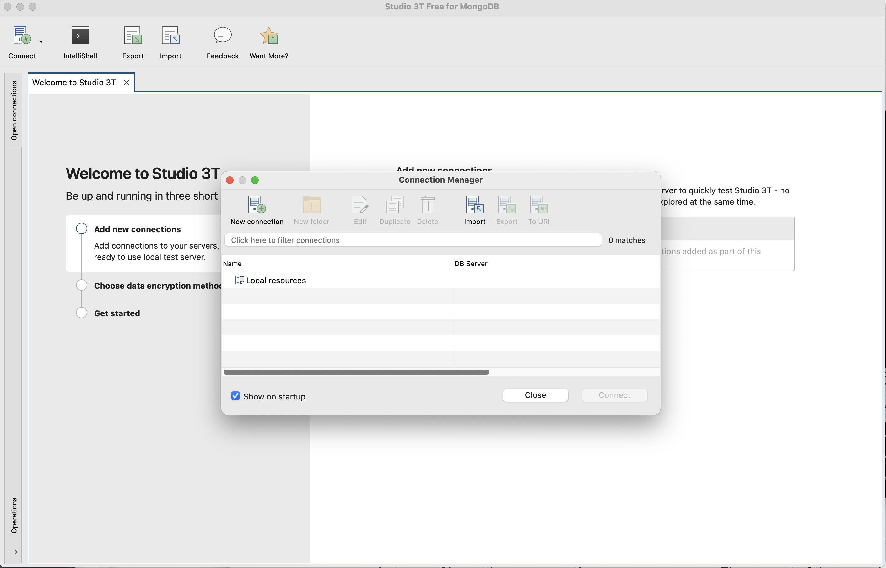
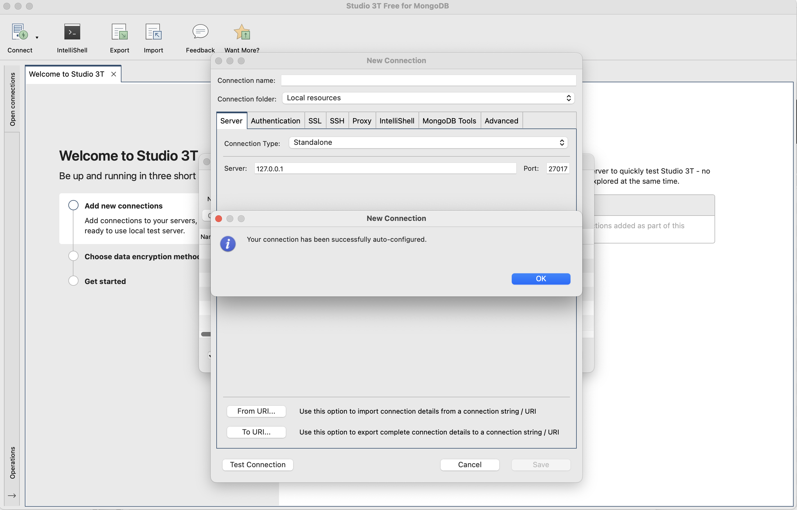
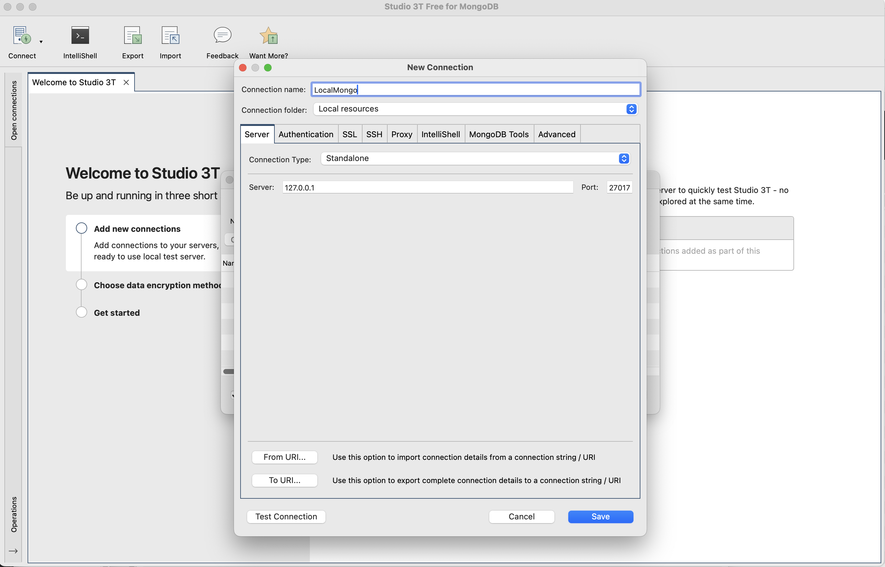
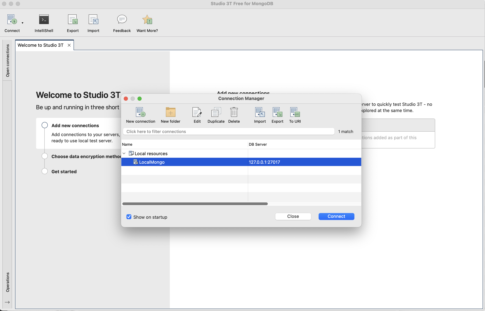

# Mongo + Robo 3T install

If you do not have MongoDB installed, visit the following site, locate the installation for your platform and install the MongoDB application:

- <https://www.mongodb.org>

A suitable distribution from here should suffice:

- <https://www.mongodb.com/download-center/community>

Additionally, install this graphical administration app for Mongo called Studio 3T:

- <https://robomongo.org>

Typically, to launch the mongodb database service on your platform, first create a directory somewhere to store the database itself:

~~~bash
mkdir db
~~~

Then enter the following command to launch the service:

~~~bash
mongod --dbpath db
~~~

Running the above should display startup log on the console:

~~~text
"t":{"$date":"2025-01-30T18:04:03.983+00:00"},"s":"I",  "c":"NETWORK",  "id":4915701, "ctx":"thread2","
msg":"Initialized wire specification","attr":{"spec":{"incomingExternalClient":{"minWireVersion":0,"
maxWireVersion":17},"incomingInternalClient":{"minWireVersion":0,"maxWireVersion":17},"outgoing":{"
minWireVersion":6,"maxWireVersion":17},"isInternalClient":true}}}
{"t":{"$date":"2025-01-30T18:04:03.984+00:00"},"s":"I",  "c":"CONTROL",  "id":23285,   "ctx":"thread2",
"msg":"Automatically disabling TLS 1.0, to force-enable TLS 1.0 specify --sslDisabledProtocols 'none'"
}...
~~~

Now launch Studio 3T, it may look like this

Press `New Connection` - and the paste in this connection string:

~~~
mongodb://127.0.0.1:27017/
~~~

The application should create and configure a connection.

This will establish a default connection to the service you just started. Give the connection a name:

Save the connection and "Connect"

You will be able to navigate the various databases you create, issuing simple queries and browsing the database structure and content.