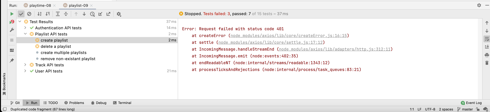
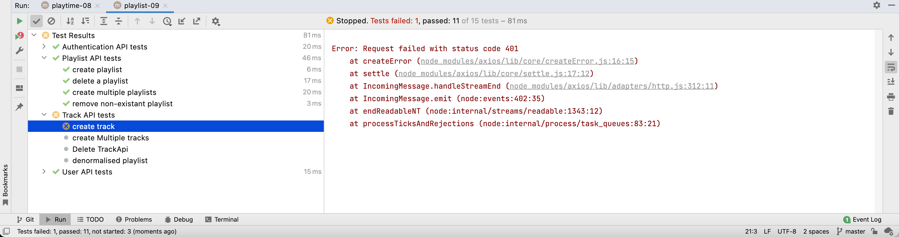
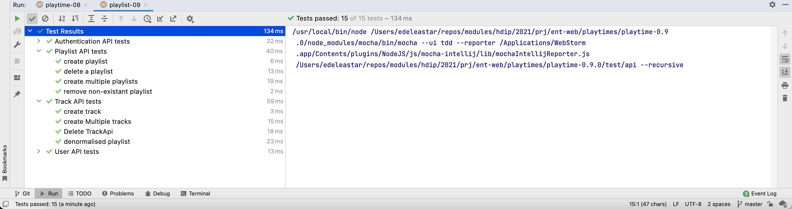

# Secure playlist & track APIs

Currently all playlist routes are marked as having no authentication:

~~~javascript
    auth: false,
~~~

Replace all these with:

~~~javascript
    auth: {
      strategy: "jwt",
    },
~~~

Many of our tests now fail:

This is because these endpoints are now expecting valid tokens.

In our setup for playlist-api-test, we can authenticate a user as part of the setup:

~~~javascript
  setup(async () => {
    await playtimeService.deleteAllPlaylists();
    await playtimeService.deleteAllUsers();
    user = await playtimeService.createUser(maggie);
    await playtimeService.authenticate(maggie);
    mozart.userid = user._id;
  });
~~~

This should trigger new bearer token, retrieved from the authenticate route, and automatically transmitted with each subsequent  request. All of the playlist tests now pass:

We need to be a bit more rigorous in the setup:

~~~javascript
  setup(async () => {
    playtimeService.clearAuth();
    user = await playtimeService.createUser(maggie);
    await playtimeService.authenticate(maggie);
    await playtimeService.deleteAllPlaylists();
    await playtimeService.deleteAllUsers();
    user = await playtimeService.createUser(maggie);
    await playtimeService.authenticate(maggie);
    mozart.userid = user._id;
  });
~~~

Now we have all tests passing:

Now try to secure all of the track-api, replacing all of the auth attributes as we have already done with playlist-api:

~~~javascript
    auth: {
      strategy: "jwt",
    },
~~~

Here is the revised setup for this to work:

### tracks-api-test.js

~~~javascript
  setup(async () => {
    playtimeService.clearAuth();
    user = await playtimeService.createUser(maggie);
    await playtimeService.authenticate(maggie);
    await playtimeService.deleteAllPlaylists();
    await playtimeService.deleteAllTracks();
    await playtimeService.deleteAllUsers();
    user = await playtimeService.createUser(maggie);
    await playtimeService.authenticate(maggie);
    mozart.userid = user._id;
    beethovenSonatas = await playtimeService.createPlaylist(mozart);
  });
~~~

All tests should continue to pass.