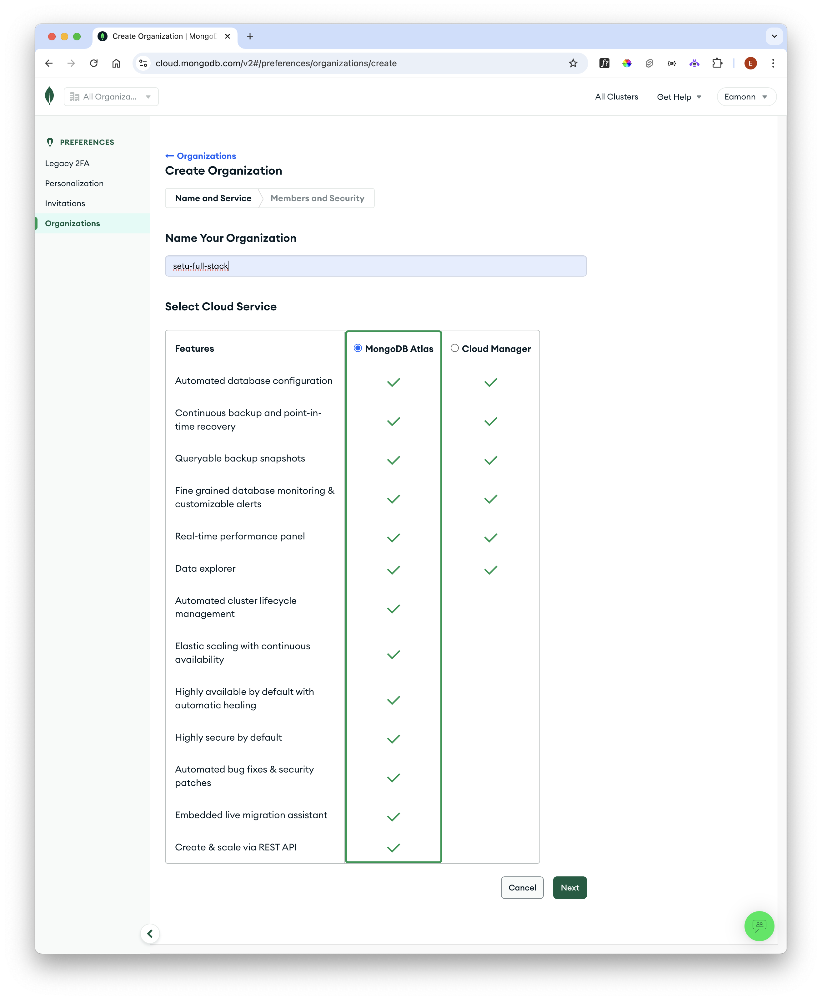
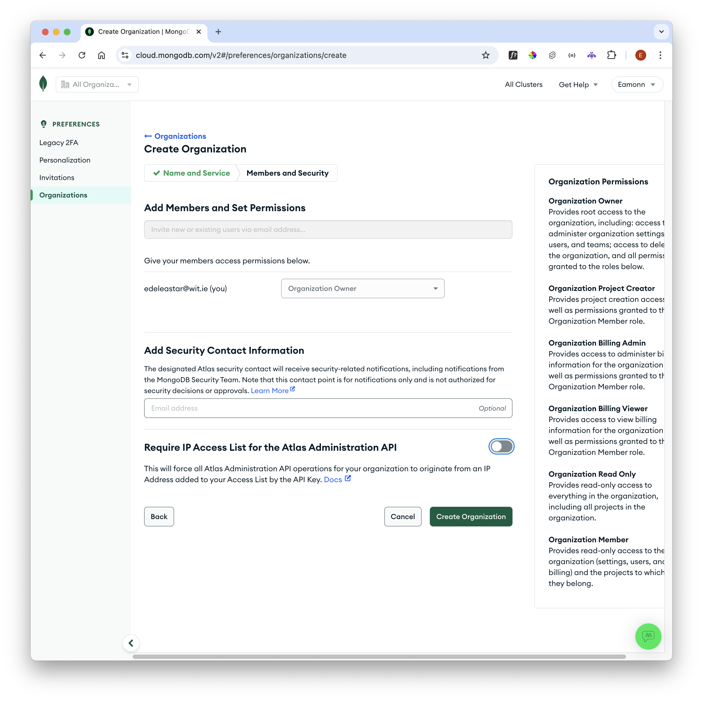
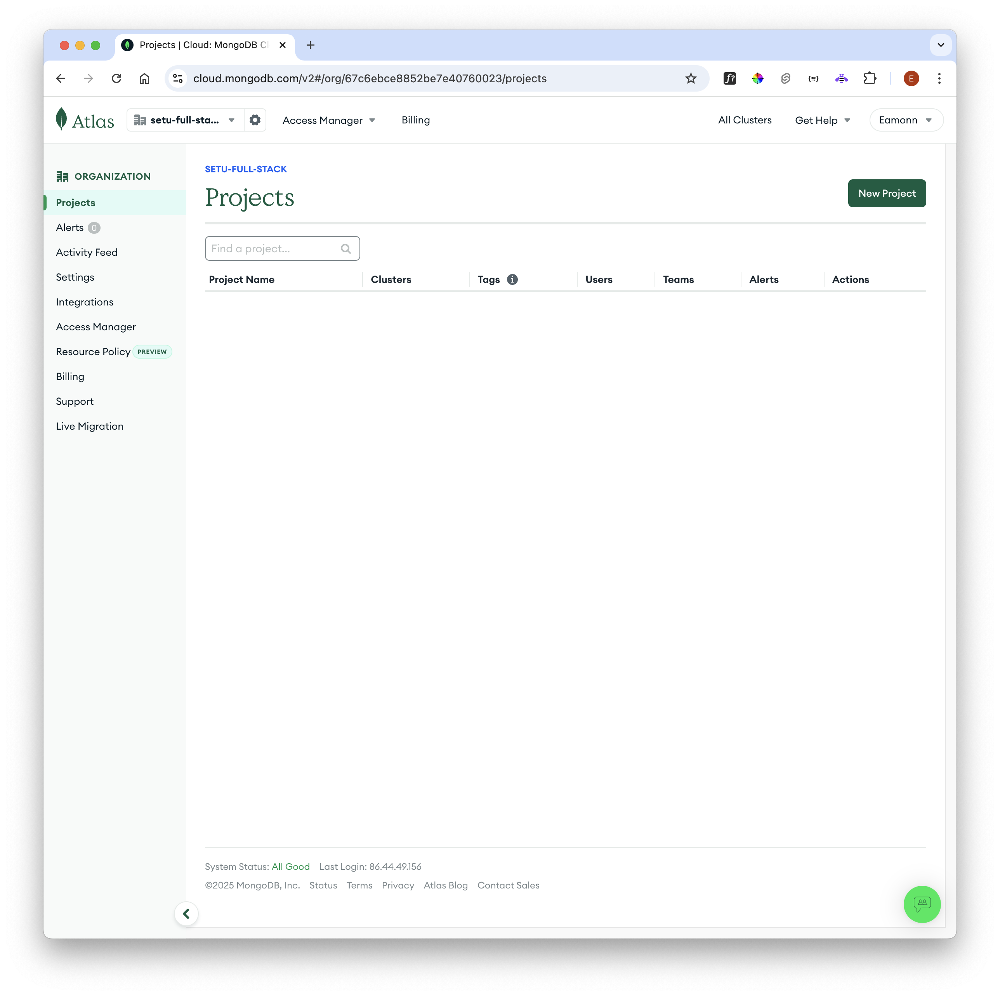
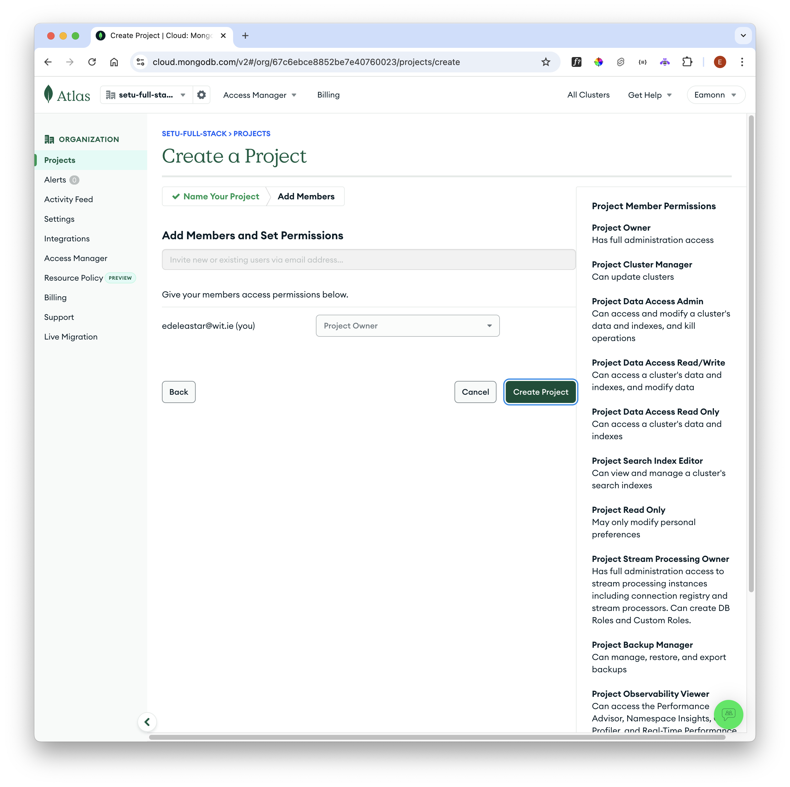
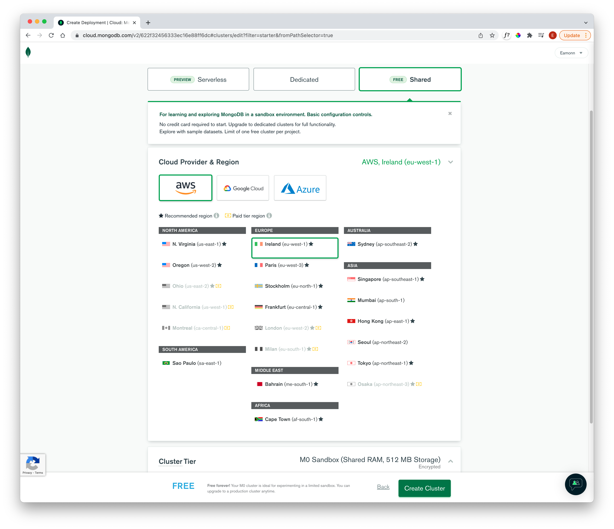
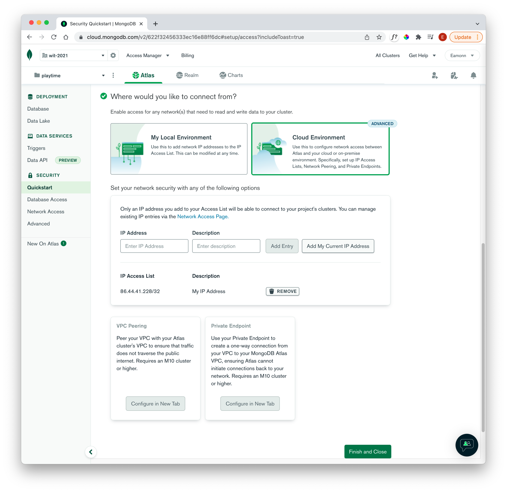

# Mongodb Cloud Atlas

Before deploying our application to a cloud service, we will first create a mongo database instance in the cloud. We will use the Atlas service:

Create a free account here:

- <https://www.mongodb.com/cloud/atlas>

First time you log in you will need to create an organisation:

Select the MongoDB Atlas service:

Give the organisation a name:

Navigate to the Projects view:

... and create a Project:

Give it a name:

And then create a database:

Select the Free service:

Select AWS and a local server:

Next we define a username/password for access to the database:

For the question `Where would you like to connect from?` - select `Cloud Environmemt`

Select `IP Access List` above, and add your own address. We will override this later.

Press `Continue`:

We should eventually arrive at the console for our database cluster:

