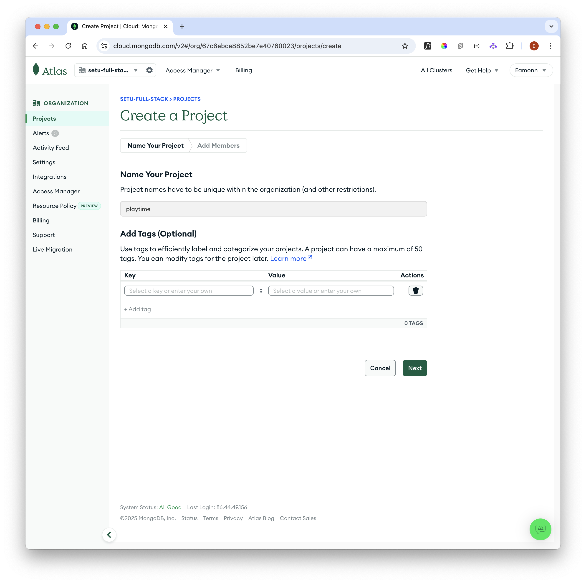

# Mongodb Cloud Atlas

Before deploying our application to a cloud service, we will first create a mongo database instance in the cloud. We will use the Atlas service:

Create a free account here:

- <https://www.mongodb.com/cloud/atlas>

First time you log in you will need to create an organisation:

Select the MongoDB Atlas service:

Give the organisation a name + disable the "Require IP Access List...." :

Navigate to the Projects view:

... and create a Project:

Give it a name:

Create the project:

Now create a Cluster - selecting the free option:

And then create a Deployment.

Select "Allow access from anywhere" and create a username/password for the database:

Make sure to select "Create Database User" and then press "Close"

