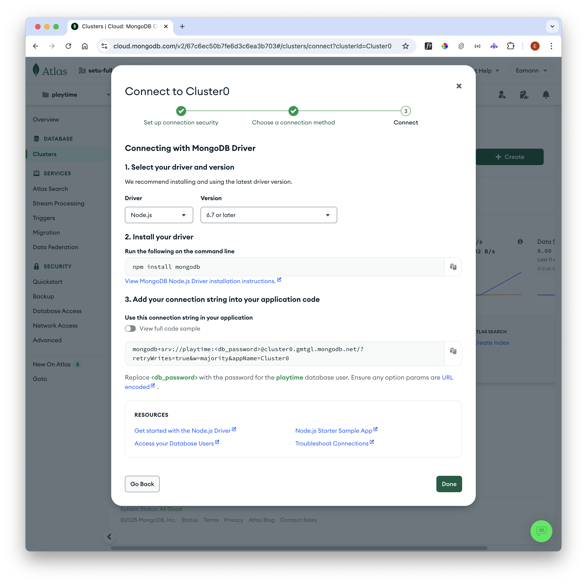

# Get Connection String

Back on the `Database` panel:

Select `Connect`:

Press `Connect Your Application`:

The connection string in the above is what we need. Copy this somewhere, as we will need it shortly.
