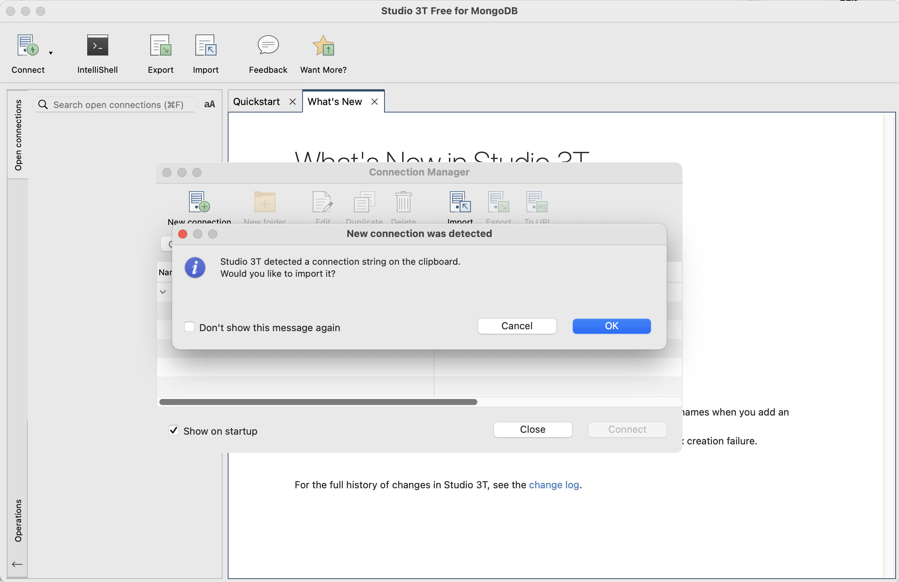
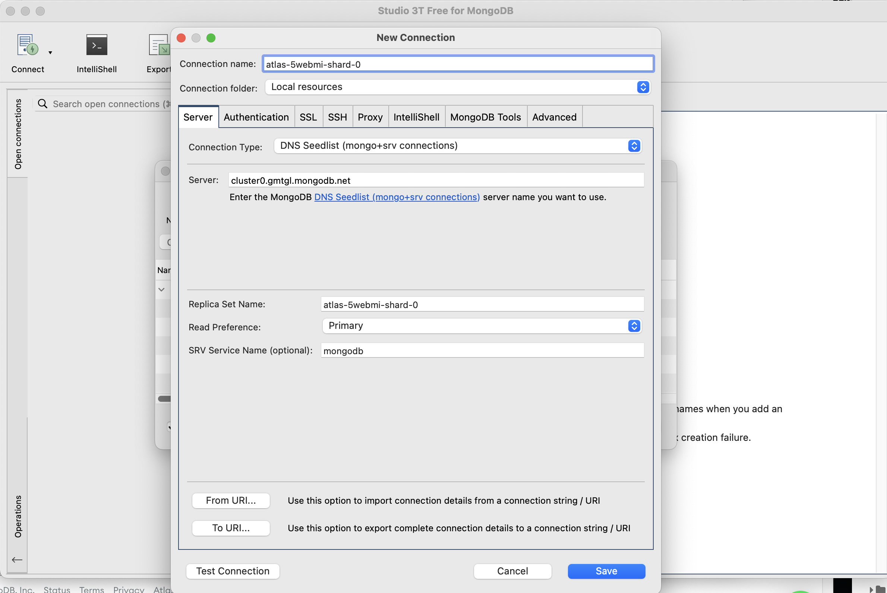
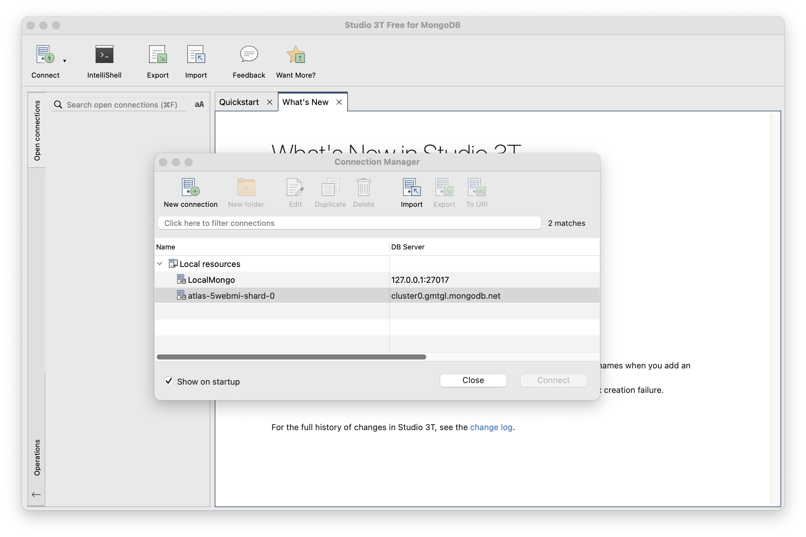
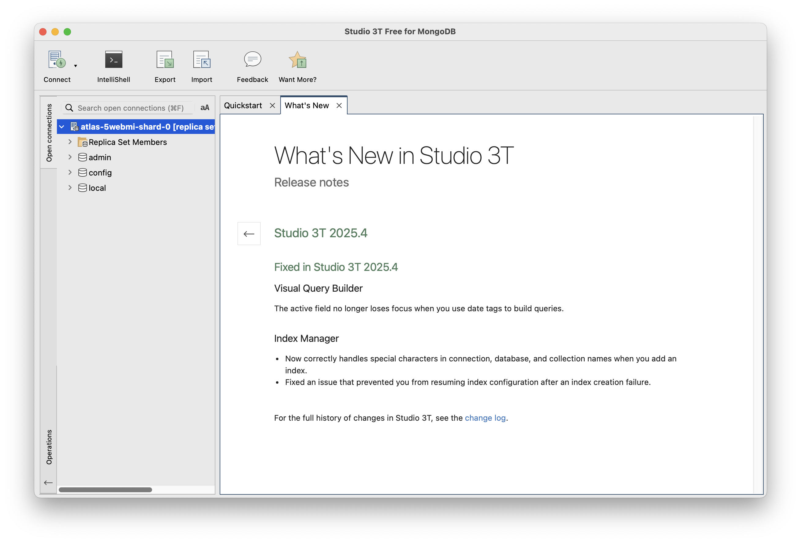

# Connecting Studio3T to Cloud Atlas

Before connecting our application to the Cloud Atlas database, we will first connect Studio 3T.  This will help verify that all is configured correctly.

Open Studio 3T  - it may detect that you have a connection string in the clipboard:

... select "ok"

Select Authentication panel, and reveal the password:

You will need to enter your password here - replacing the <db_password> entry and press save.

You should then be able to press 'Connect':

It should be connected now.
