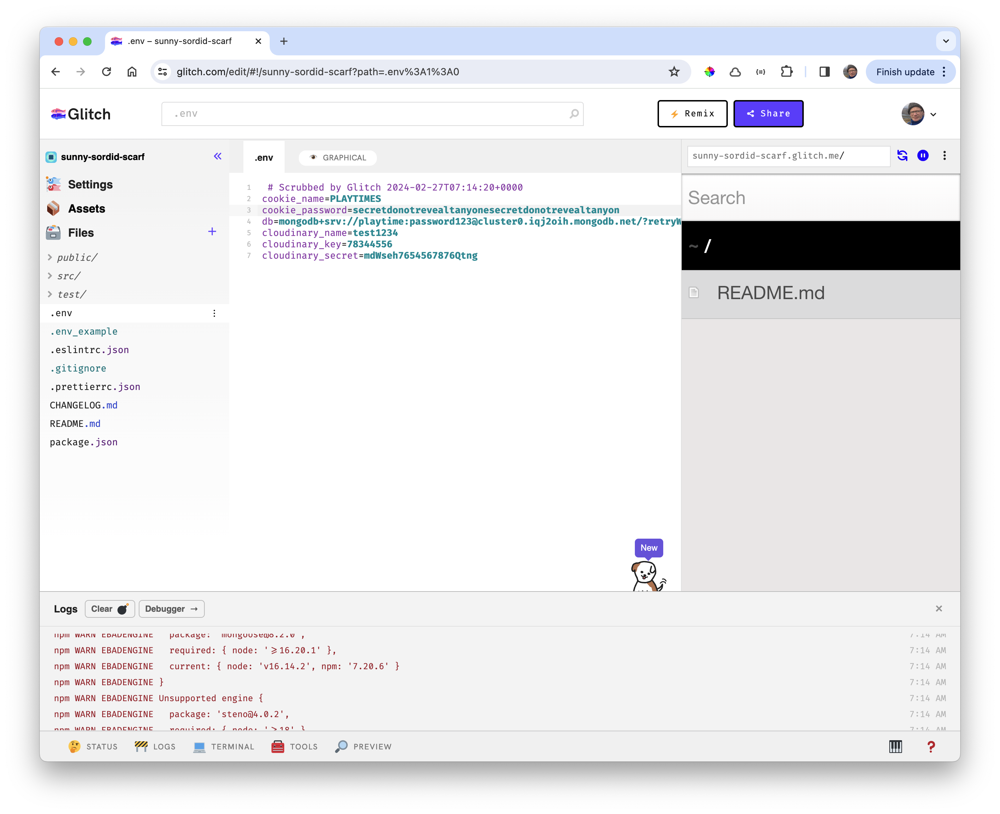

# Import the Application

Back on Glitch, import the project. Use your own project - or this copy here:

- <https://github.com/wit-hdip-comp-sci-2023/playtimes-10>

This may take a few minutes, and require more than one attempt. If you find the delays inconvenient, considering a temporary upgrade to your account. For 8 USD you can accelerate the performance of a number of projects:

Once the project is imported, open the Logs (button along the end of the screen):

There will be a variety or warnings/errors. Ignore these for the moment and open the .env :

Switch to PLAINTEXT, allowing you to directly paste in the .env file contents you verified in step 02

Once these values have been pasted in, the application should automatically try to restart:

