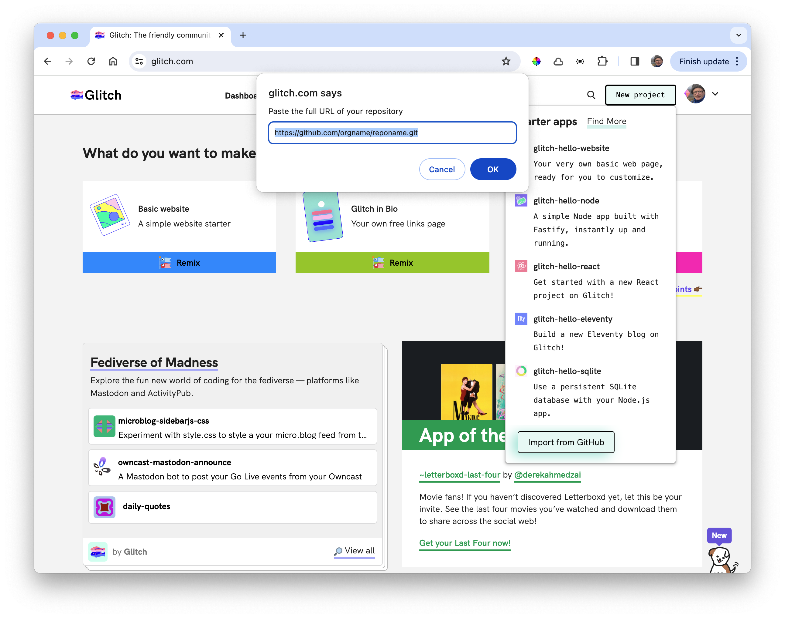

# Glitch

Visit Glitch and create an account:

- <https://glitch.com/>

And log in:

Create a New Project:

If you select 'Import from Github' you will be prompted for the project url:

Do not import just yet - press cancel - as we need make one adjustment to the project.

