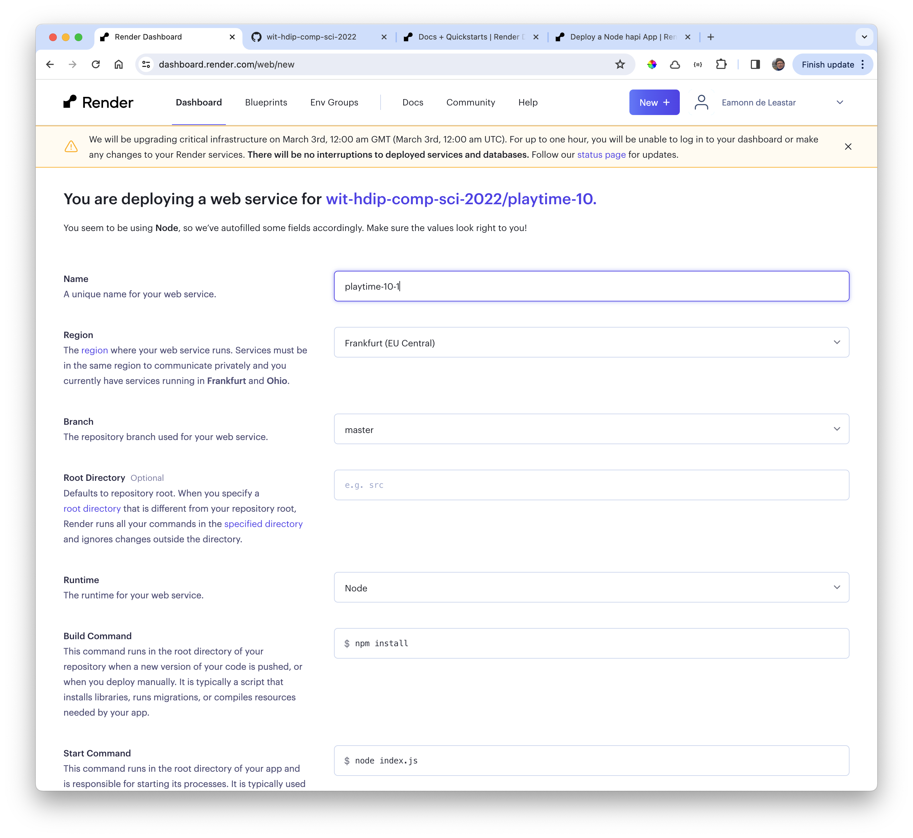
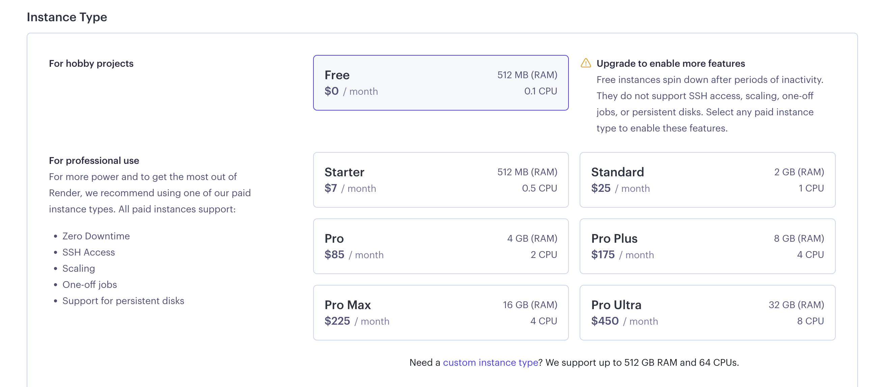
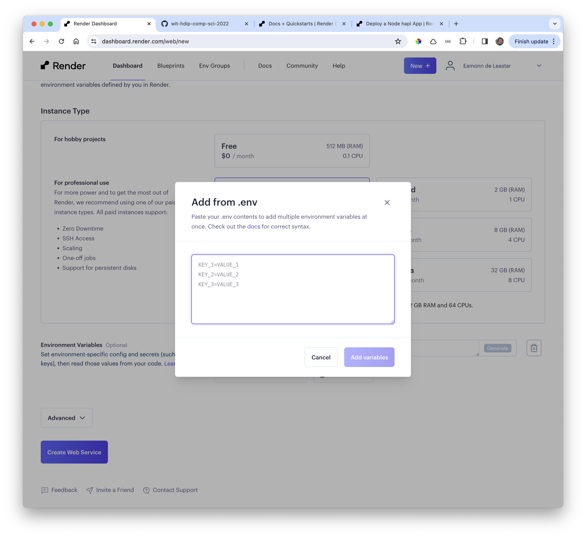

# Create the Application

In the render dashboard:

- <https://dashboard.render.com/>

... and create a new "Web Service". Select the first option (Connect to gtihub):

Locate the project via your GitHub account:

This will make available a configuration screen. Take note of the suggested unique name:

Change the start command form the default (shown above) to:

Select the instance type to Free:

Next, set up the environment variables - selecting add from .env:

Past in our values - and then press 'Create Web Service'
