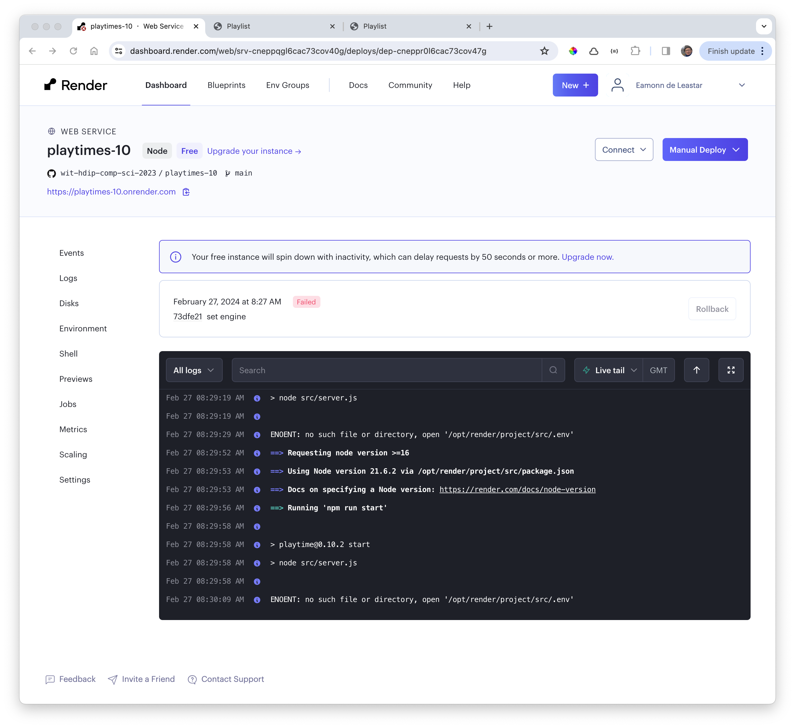
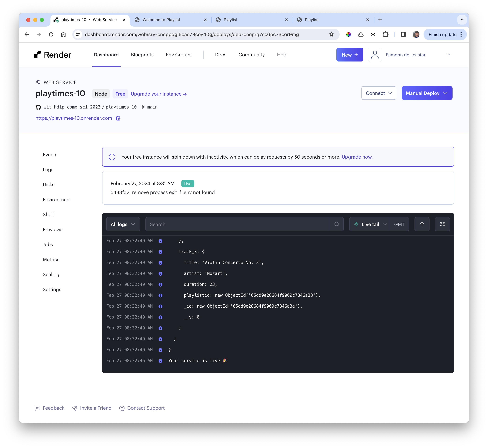

# Deployed

Our deploy will fail however - with the following error:

~~~bash
ENOENT: no such file or directory, open '/opt/render/project/src/.env'
~~~

We have install the .env variables directly into the configuration, replacing the .env file. However, our error checking in server. Is over zealous:

~~~javascript
const result = dotenv.config();
if (result.error) {
  console.log(result.error.message);
  process.exit(1);
}
~~~

Comment out the exit:

~~~javascript
const result = dotenv.config();
if (result.error) {
  console.log(result.error.message);
  // process.exit(1);
}
~~~

... push this change, and redeploy the latest commit:

This should eventually deploy successfully:

