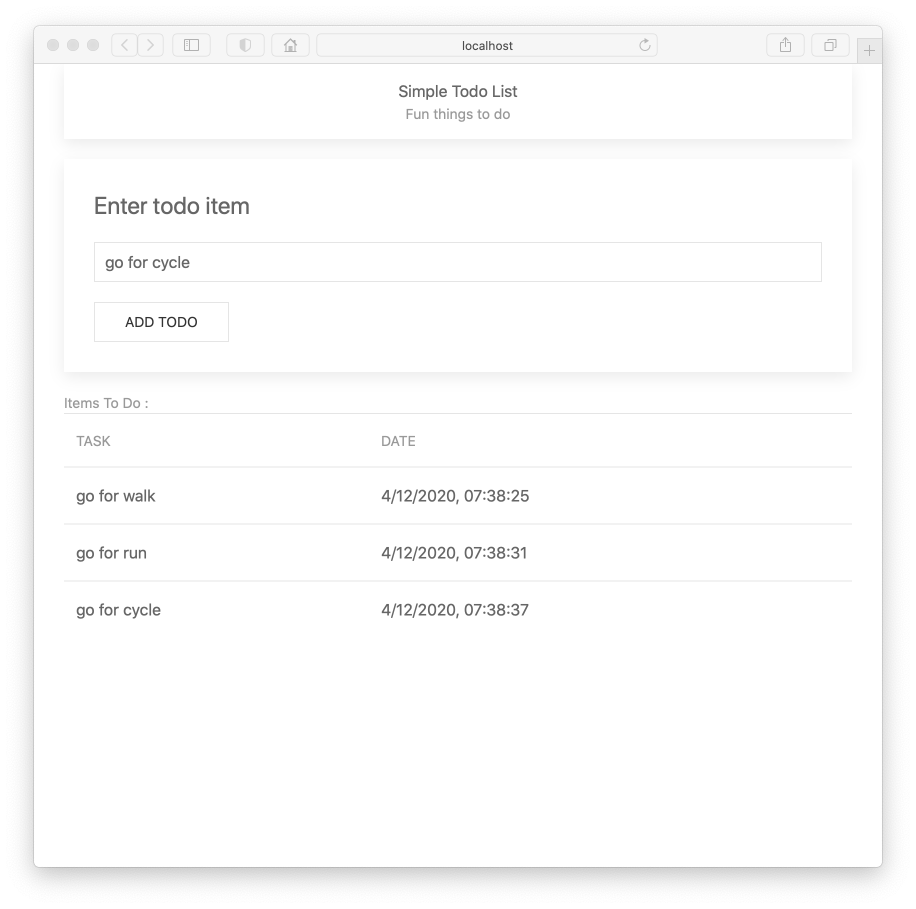

# Exercises

Lab so far:

- <https://github.com/wit-hdip-comp-sci-2021/todo-dom/releases/tag/part.1.end>

## Exercise 1

In Javascript, the current date is available via the Date object:

- [Date Object](https://developer.mozilla.org/en-US/docs/Web/JavaScript/Reference/Global_Objects/Date)

Extend the todo object to include the current date, and incorporate the date into a new column in the table. The application should look like this:

