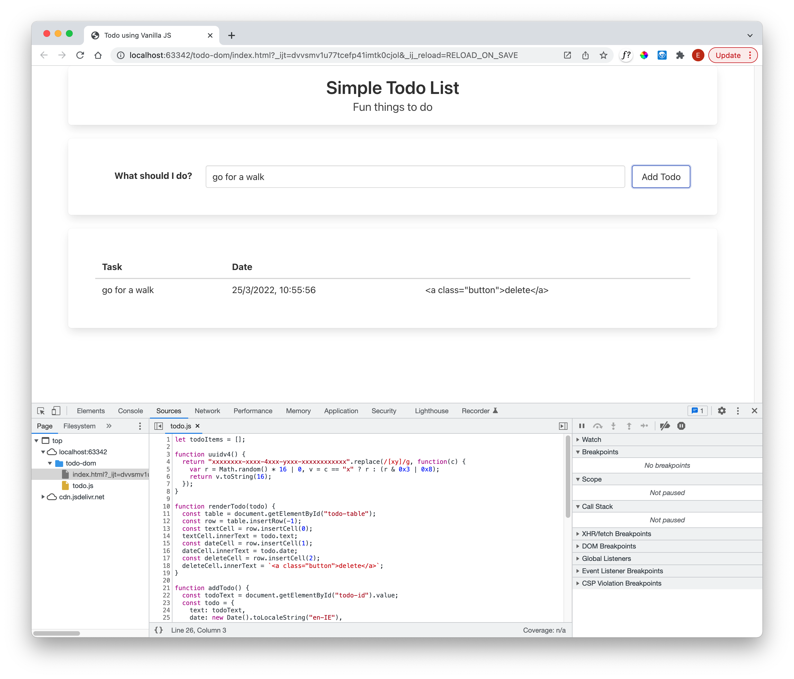

# Delete function 

First we can make space on the table for the button:

## index.html

~~~html
        <thead>
          <tr>
            <th>Task</th>
            <th>Date</th>
            <th></th>
          </tr>
        </thead>
~~~

.. and now we can extend the addTodo function to insert a delete button into the table, one button for each entry:

~~~javascript
function renderTodo(todo) {
  ...
  const deleteCell = row.insertCell(2);
  deleteCell.innerText = `<a class="button">delete</a>`;
}
~~~

If we try this out:

This is clearly not what we want. The issue is how we are adding the button to the table - we are using the `deleteCell.innerText` 

- [innerText](https://developer.mozilla.org/en-US/docs/Web/API/HTMLElement/innerText)

We should instead use `innerHTML`

- [innerHTML](https://developer.mozilla.org/en-US/docs/Web/API/Element/innerHTML)

This will ensure the browser parses the markup into the DOM, as opposed to just including the content as text. Change to:

~~~javascript
...
  deleteCell.innerHTML = `<a class="button">delete</a>`;
...
~~~

It should now render as:

