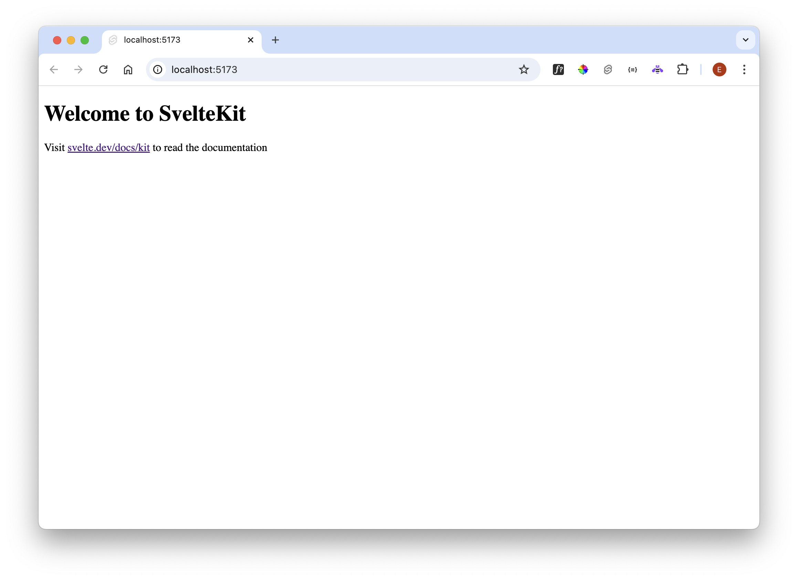
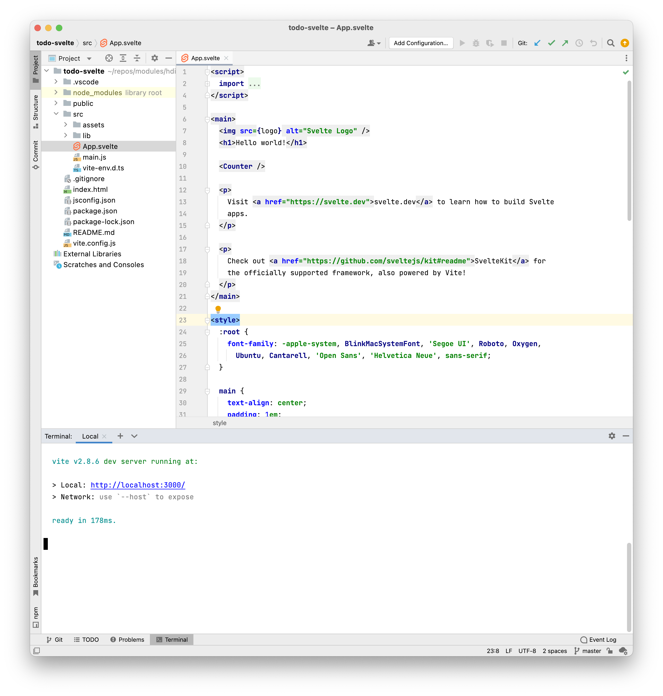

# Create App 

Open a shell an enter these commands:

~~~bash
npm init vite@latest
~~~

In the subsequent menus, select **svelte** and call the project todo-svelte. Use the arrow-keys to select the options as shown below:

~~~bash
Need to install the following packages:
  create-vite@4.0.0
Ok to proceed? (y) y
✔ Project name: … todo-svelte
✔ Select a framework: › svelte
✔ Select a variant: › javascript
~~~

Now we can run the application:

~~~bash
cd todo-svelte
npm install
npm run dev
~~~

This should respond with:

~~~bash
  vite v2.8.6 dev server running at:

  > Local: http://localhost:3000/
  > Network: use `--host` to expose

  ready in 274ms.
~~~

Browsing to:

- <http://localhost:3000>

Should yield:

You may also choose to open in WebStorm, and run the app from the embedded terminal:

In VSCode:

