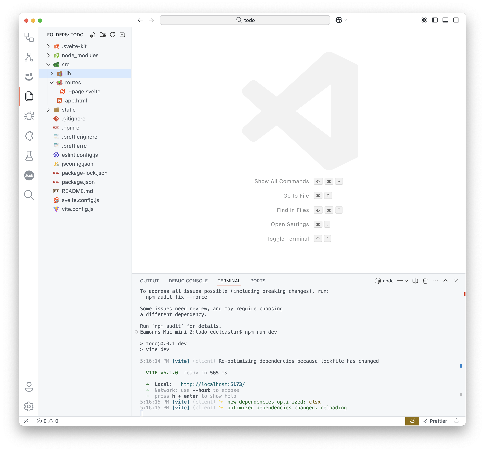

# Create App 

Open a shell an enter these commands:

~~~bash
npx sv create todo-svelte
~~~

In the subsequent menus, select **svelte** and call the project todo-svelte. Use the arrow-keys to select the options as shown below:

~~~bash
┌  Welcome to the Svelte CLI! (v0.6.21)
│
◆  Which template would you like?
│  ● SvelteKit minimal (barebones scaffolding for your new app)
│  ○ SvelteKit demo
│  ○ Svelte library
◆  Add type checking with Typescript?
│  ○ Yes, using Typescript syntax
│  ○ Yes, using Javascript with JSDoc comments
│  ● No
└◆  What would you like to add to your project? (use arrow keys / space bar)
│  ◼ prettier
│  ◼ eslint (linter - https://eslint.org)
│  ◻ vitest
│  ◻ playwright
│  ◻ tailwindcss
│  ◻ sveltekit-adapter
│  ◻ drizzle
│  ◻ lucia
│  ◻ mdsvex
│  ◻ paraglide
│  ◻ storybook
└◆  Which package manager do you want to install dependencies with?
│  ○ None
│  ● npm
│  ○ yarn
│  ○ pnpm
│  ○ bun
│  ○ deno
└◆  Successfully installed dependencies
│
◇  Successfully formatted modified files
│
◇  Project next steps ─────────────────────────────────────────────────────╮
│                                                                          │
│  1: cd todo                                                              │
│  2: git init && git add -A && git commit -m "Initial commit" (optional)  │
│  3: npm run dev -- --open                                                │
│                                                                          │
│  To close the dev server, hit Ctrl-C                                     │
│                                                                          │
│  Stuck? Visit us at https://svelte.dev/chat                              │
│                                                                          │
├──────────────────────────────────────────────────────────────────────────╯
│
└  You're all set!
~~~

Now we can run the application:

~~~bash
cd todo-svelte
npm run dev
~~~

This should respond with:

~~~bash
> todo@0.0.1 dev
> vite dev

17:10:27 [vite] (client) Forced re-optimization of dependencies

  VITE v6.1.0  ready in 1184 ms

  ➜  Local:   http://localhost:5173/
  ➜  Network: use --host to expose
  ➜  press h + enter to show help

~~~

Browsing to:

- <http://localhost:5173>

(The port number may vary)

...should yield:

You can also open the project and run In VSCode:

We might adjust the code format :

 ### .prettierrc

~~~json
{
  "useTabs": false,
  "singleQuote": false,
  //...
}
~~~

