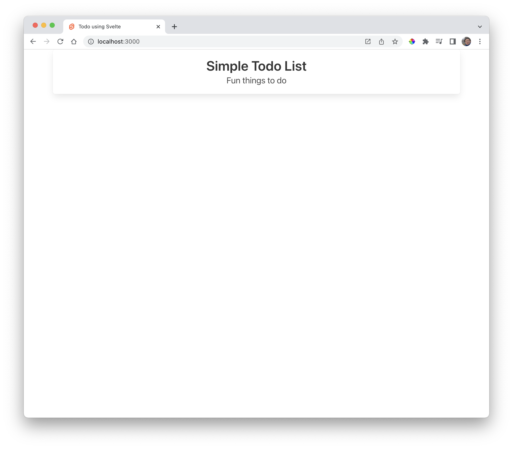
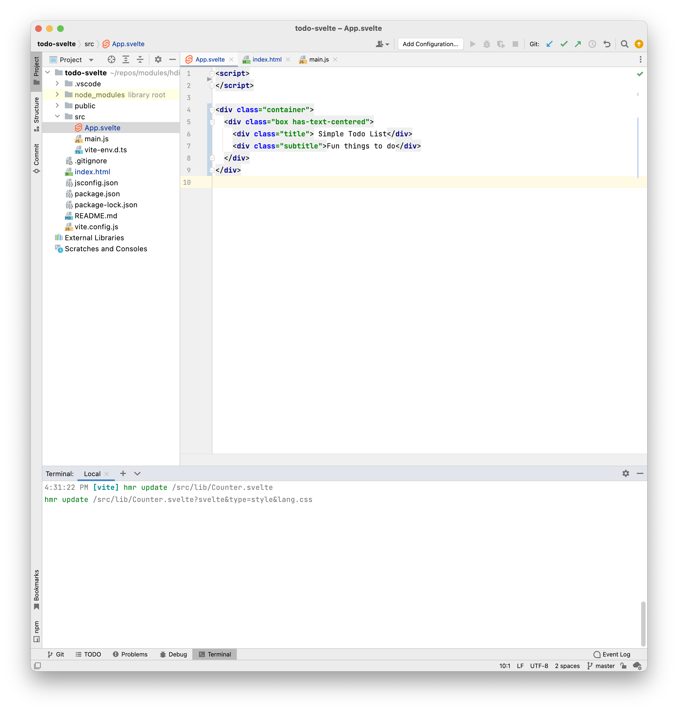

# Style

Open `index.html`, change the title and include the bulma framework:

### index.html

~~~html
<!DOCTYPE html>
<html lang="en">
  <head>
    <meta charset="UTF-8" />
    <link rel="icon" href="/favicon.ico" />
    <meta name="viewport" content="width=device-width, initial-scale=1.0" />
    <title> Todo using Svelte </title>
    <link rel="stylesheet" href="https://cdn.jsdelivr.net/npm/bulma@0.9.4/css/bulma.min.css">
  </head>
  <body>
    

    
  </body>
</html>
~~~

Also, replace the the `App.svelte`  with the following contents:

### App.svelte

~~~html

  

    
 Simple Todo List

    
Fun things to do

  

~~~

Also, remove the contents of app.css.

The should still be running running on:

- <http://localhost:5000>

Remove the assets and lib folders, simplifying the project:

