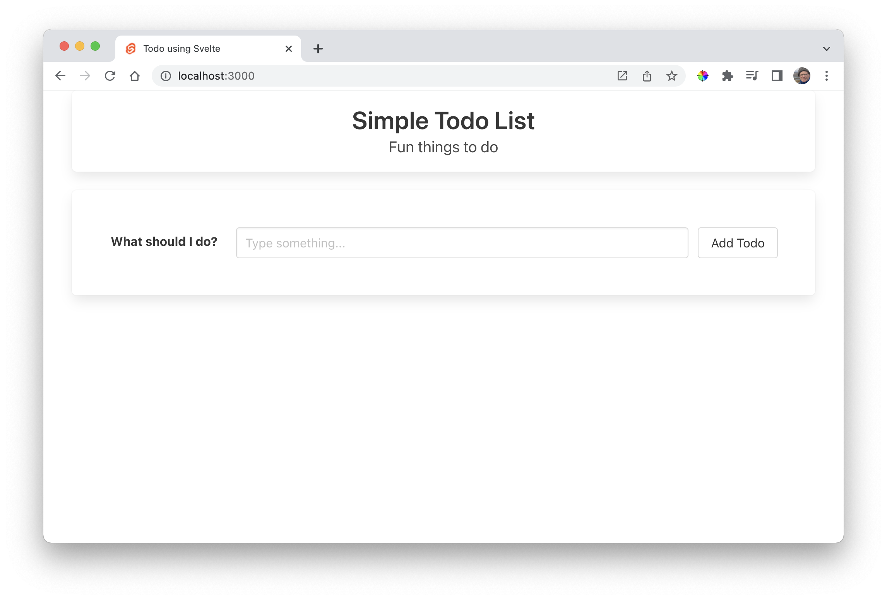
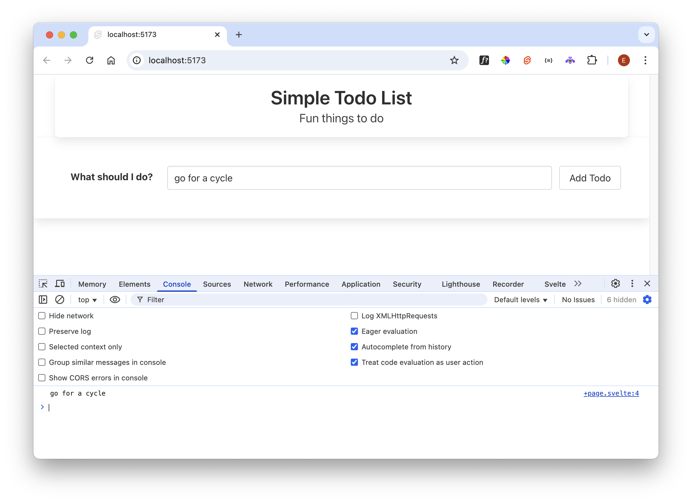

# Todo Form

Include this form in App.svelte, just below the header:

### App.svelte

~~~html
  

    

      

        <label for="todo" class="label">What should I do?</label>
      

      

        

          

            <input id="todo" class="input" type="text" placeholder="Type something...">
          

        

        <button class="button">Add Todo</button>
      

    

  

~~~

Just by saving the file the UX should automatically update:

Introduce the following Javascript into the `
~~~

Then, in the form we make the following adjustments to the `<input>` element:

~~~html
<input bind:value={todoText} id="todo" class="input" type="text" placeholder="Type something...">
~~~

The `bind` attribute ensures that the todoText variable will always contain the latest value entered into the field.

Now change `<button>` element:

~~~html
<button on:click={addTodo} class="button">Add Todo</button>
~~~

The `addTodo()` function will be called when the button is pressed. Try it now, and examine the developer console:

