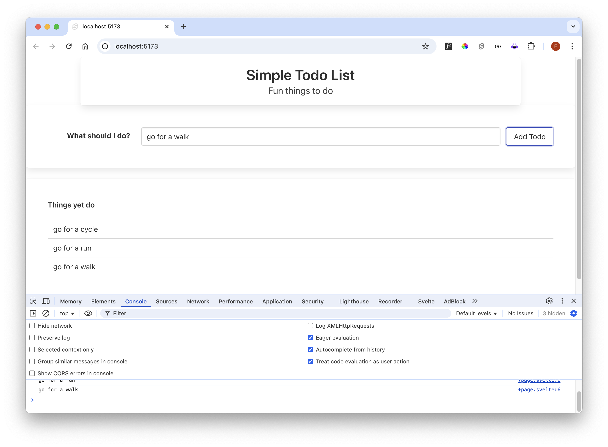

# Todo List

Introduce the table of todos:

~~~html
  

    
Things yet do

    <table class="table is-fullwidth">
      <thead>
        <th>Task</th>
      </thead>
      <tbody>
      </tbody>
    </table>
  

~~~

Change the `<script>` element to the following:

### src/App.svelte

~~~javascript
  let todoText = "";
  let todoItems = [];  

  function addTodo() {
    console.log(todoText)
    todoItems.push(todoText);
  }
~~~

Now append a `<tbody>` to the following:

~~~html
{#each todoItems as todo}
  <tr>
    <td> {todo} </td>
  </tr>
{/each}
~~~

The body of the table is looping though the `todoItems` array. Try this now - add some todo items....

... you will notice that the table does not seem to be updated.

Make the following change to the addTodo function:

~~~javascript
  function addTodo() {
    console.log(todoText);
    todoItems.push(todoText);
    todoItems = [...todoItems];
  }
~~~

Try it again - this time the table should be populated as you enter items:

The extra statement:

~~~javascript
todoItems = [...todoItems];
~~~

Is an example of a javascript [spread](https://developer.mozilla.org/en-US/docs/Web/JavaScript/Reference/Operators/Spread_syntax) operator - effectively we are copying the array over itself, assigning each value to itself. This may seem odd at first - see;

- <https://svelte.dev/tutorial/updating-arrays-and-objects>

for a quick explanation.

You only need to do this for arrays - if you are updating a single value then the UX will automatically display that without the above.

For instance, we might like to clear the input field when `ADD TODO` is pressed:

~~~javascript
  function addTodo() {
    console.log(todoText);
    todoItems.push(todoText);
    todoItems = [...todoItems];
    todoText = "";
  }
~~~

Add todos now - the Todo text should be cleared (and replaced with `Todo`) each time a new value is added.

