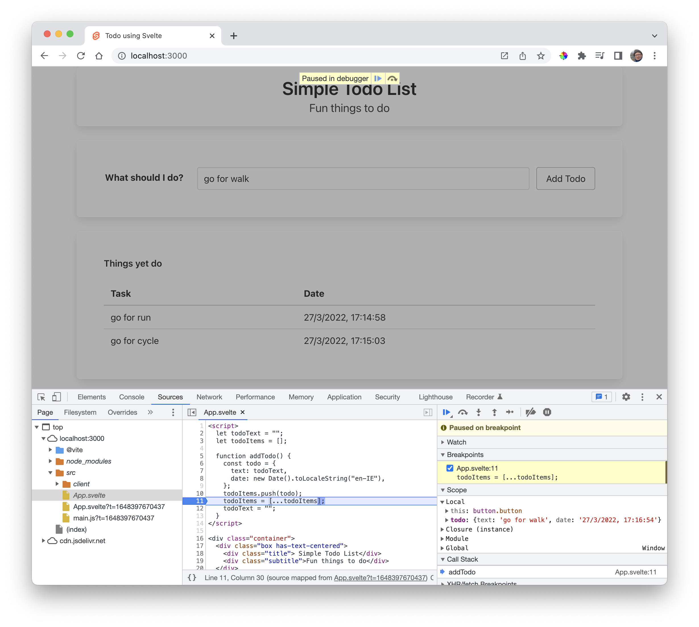

# Todo Object

This is an alternative `addTodo()` function:

~~~javascript
  function addTodo() {
    const todo = {
      text: todoText,
      date: new Date().toLocaleString("en-IE"),
    };
    todoItems.push(todo);
    todoItems = [...todoItems];
    todoText = "";
  }
~~~

In this version, we are storing the text + the current date.

Rework the table to display both values:

~~~html
  

    
Things yet do

    <table class="table is-fullwidth">
      <thead>
        <th>Task</th>
        <th>Date</th>
      </thead>
      <tbody>
        {#each todoItems as todo}
          <tr>
            <td> {todo.text} </td>
            <td> {todo.date} </td>
          </tr>
        {/each}
      </tbody>
    </table>
  

~~~

This should behave like this:

You can debug the application source:

Try setting some breakpoints as shown above and inspecting the data structures.