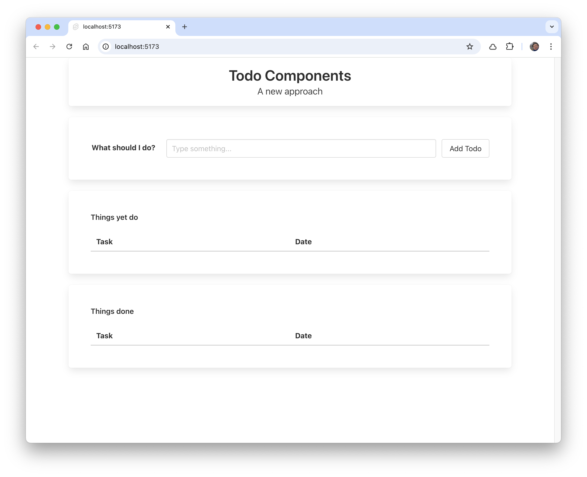

# Title Component

Create a new file in `lib` called `Title.svelte`

### lib/Title.svelte

~~~html
  <div class="box has-text-centered">
    <div class="title"> Simple Todo List</div>
    <div class="subtitle">Fun things to do</div>
  </div>
~~~

In routes/+page.svelte, import the component in the `<script>` section:

### routes/App.svelte

~~~javascript
  import Title from "$lib/Title.svelte";
~~~

Remove the title section from the html content and replace with the imported component:

~~~html
<div class="container">
  <Title />
  ...
~~~

The application should work as before - we have just factored out a simple component to improve readibility.

### Component Parameters

We might like to parameterise the component - passing title and subtitle values, thus making the Title component more generic. First, in `Title.svelte`, rework as follows:

### lib/Title.svelte

~~~html
<script>
  let { title = "Simple Todo List", subtitle = "Fun things to do" } = $props();
</script>

<div class="box has-text-centered">
  <div class="title">{title}</div>
  <div class="subtitle">{subtitle}</div>
</div>
~~~

The app should still be running without any change as we have provided default parameters.

We can override the default values:

### routes/+page.svelte

```html
  <Title title="Todo Components" subtitle="A new approach" />
```

The app should display these values in its Title now.


