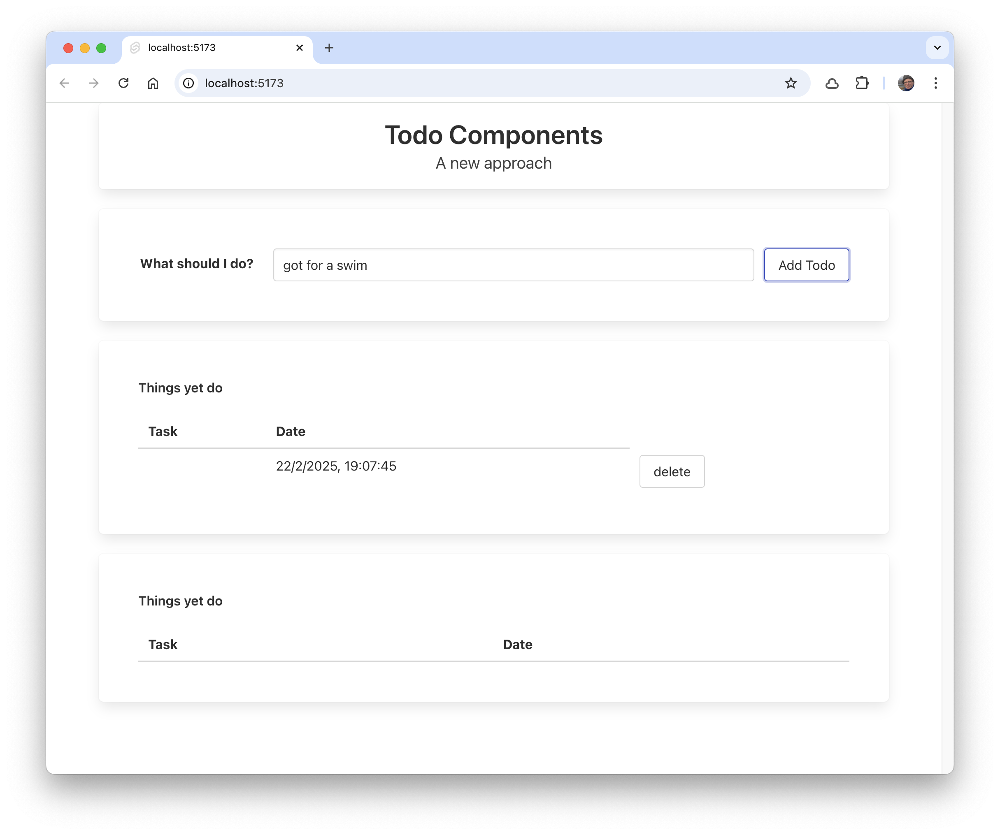
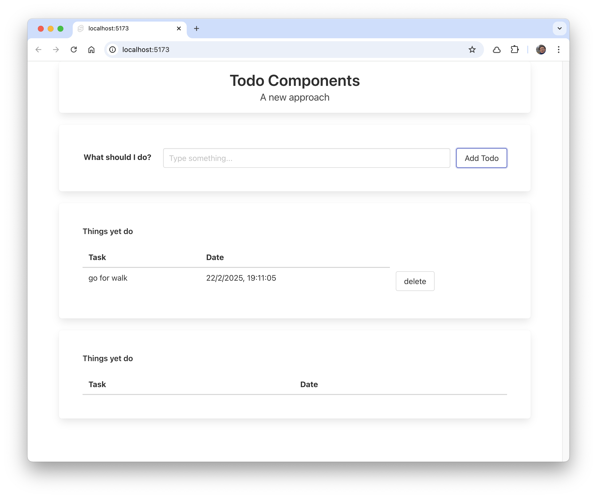

# AddTodo Form

Introduce this new component:

### lib/AddTodo.svelte

~~~html

  

    

      <label for="todo" class="label">What should I do?</label>
    

    

      

        

          <input
            bind:value={todoText}
            id="todo"
            class="input"
            type="text"
            placeholder="Type something..."
          />
        

      

      <button onclick={() => addTodo()} class="button">Add Todo</button>
    

  

~~~

Notice that addTodo and todoText are passed as parameters. In +page.svelte we can import an use this component:

### routes/+page.svelte

~~~html

  <Title title="Todo Components" subtitle="A new approach" />
  <AddTodo {addTodo} bind:todoText />
  <TodoList {todoItems} {deleteTodo} />
  <TodoList todoItems={doneItems} />

~~~

Running the app now - it doesn't quite work:

The Todo text is empty. Make one change how the property is declared 

### lib/AddTodo.svelte

~~~html

...
~~~

It should work as expected now:

 
