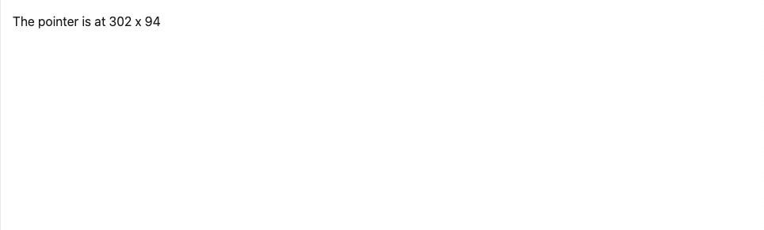
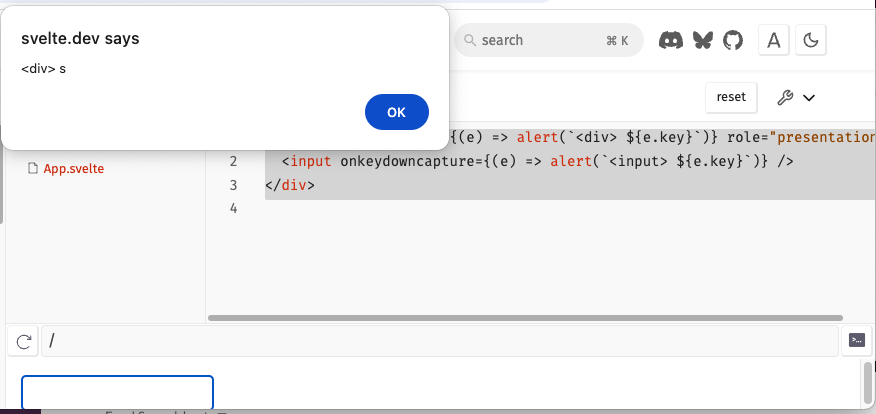
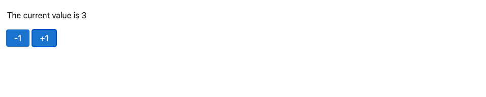
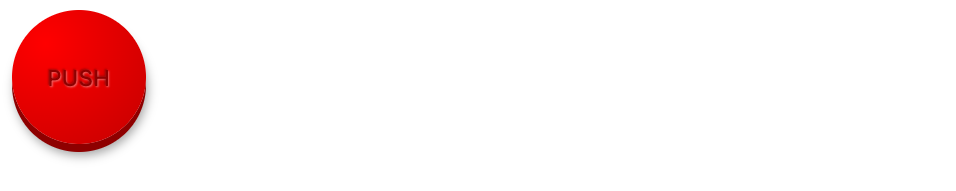

# Events

## DOM events

As we've briefly seen already, you can listen to any DOM event on an element (such as click or [pointermove](https://developer.mozilla.org/en-US/docs/Web/API/Element/pointermove_event)) with an `on<name>` function:

~~~svelte

  The pointer is at {Math.round(m.x)} x {Math.round(m.y)}

~~~

Like with any other property where the name matches the value, we can use the short form:

~~~svelte

  The pointer is at {Math.round(m.x)} x {Math.round(m.y)}

~~~

#### App.svelte

~~~svelte

  The pointer is at {Math.round(m.x)} x {Math.round(m.y)}

~~~

## Inline handlers

You can also declare event handlers inline:

#### App.svelte

~~~svelte

 {
    m.x = event.clientX;
    m.y = event.clientY;
  }}
>
  The pointer is at {Math.round(m.x)} x {Math.round(m.y)}

~~~

## Capturing

Normally, event handlers run during the [_bubbling_](https://developer.mozilla.org/en-US/docs/Learn/JavaScript/Building_blocks/Event_bubbling) phase. Notice what happens if you type something into the `<input>` in this example — the inner handler runs first, as the event 'bubbles' from the target up to the document, followed by the outer handler.

Sometimes, you want handlers to run during the _capture_ phase instead. Add `capture` to the end of the event name:

~~~svelte

 alert(`
 ${e.key}`)} role="presentation">
  <input onkeydowncapture={(e) => alert(`<input> ${e.key}`)} />

~~~

Now, the relative order is reversed. If both capturing and non-capturing handlers exist for a given event, the capturing handlers will run first.

### App.svelte

~~~svelte

 alert(`
 ${e.key}`)} role="presentation">
  <input onkeydowncapture={(e) => alert(`<input> ${e.key}`)} />

~~~

## Component events

You can pass event handlers to components like any other prop. In `Stepper.svelte`, add `increment` and `decrement` props...

~~~svelte

~~~

...and wire them up:

~~~svelte
<button onclick={decrement}>-1</button>
<button onclick={increment}>+1</button>
~~~

In `App.svelte`, define the handlers:

~~~svelte
<Stepper
  increment={() => value += 1}
  decrement={() => value -= 1}
/>
~~~

#### Stepper.svelte

~~~svelte

<button onclick={decrement}>-1</button>
<button onclick={increment}>+1</button>
~~~

#### App.svelte

~~~svelte

The current value is {value}

<Stepper
  increment={() => value += 1}
  decrement={() => value -= 1}
/>
~~~

## Spreading events

We can also [spread](spread-props) event handlers directly onto elements. Here, we've defined an `onclick` handler in `App.svelte` — all we need to do is pass the props to the `<button>` in `BigRedButton.svelte`:

~~~svelte
<button {...props}>
  Push
</button>
~~~

#### BigRedButton.svelte

~~~svelte

<button {...props}>
  Push
</button>

~~~

#### App.svelte

~~~svelte

<BigRedButton onclick={honk} />
~~~

