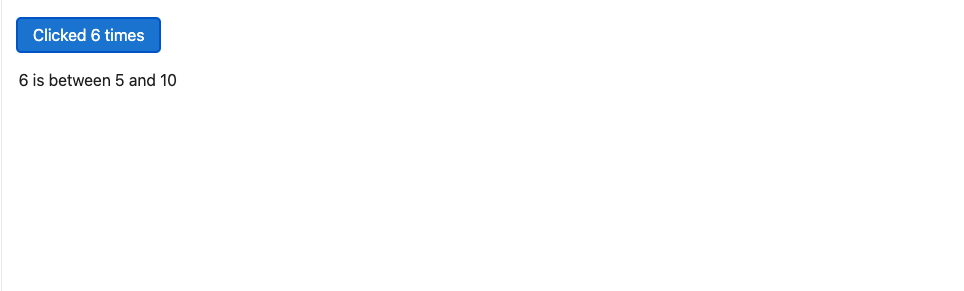
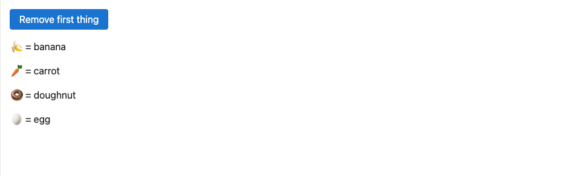
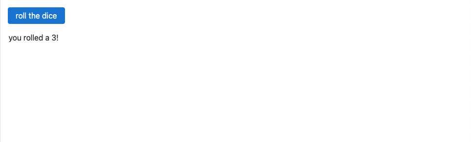

---
icon:
  type: logos:svelte-icon
---

# Introduction

An introduction to Svelte reporposed from [here](https://svelte.dev/tutorial/svelte/welcome-to-svelte).

Svelte is a tool for building web applications. Like other user interface frameworks, it allows you to build your app _declaratively_ out of components that combine markup, styles and behaviours.

These components are _compiled_ into small, efficient JavaScript modules that eliminate overhead traditionally associated with UI frameworks.

## Your first component

In Svelte, an application is composed from one or more _components_. A component is a reusable self-contained block of code that encapsulates HTML, CSS and JavaScript that belong together, written into a `.svelte` file. The `App.svelte` file, open in the code editor to the right, is a simple component.

### Adding data

A component that just renders some static markup isn't very interesting. Let's add some data.

First, add a script tag to your component and declare a `name` variable:

#### App.svelte

~~~html

<h1>Hello world!</h1>
~~~

Then, we can refer to `name` in the markup:

~~~html
<h1>Hello {name}!</h1>
~~~

Inside the curly braces, we can put any JavaScript we want. Try changing `name` to `name.toUpperCase()` for a shoutier greeting.

~~~html
<h1>Hello {name.toUpperCase()}!</h1>
~~~

#### App.svelte

~~~html

<h1>Hello {name.toUpperCase()}!</h1>
~~~

## Dynamic attributes

Just like you can use curly braces to control text, you can use them to control element attributes.

Our image is missing a `src` — let's add one:

~~~html

~~~

That's better. But if you hover over the `` in the editor, Svelte is giving us a warning:

~~~
`` element should have an alt attribute
~~~

When building web apps, it's important to make sure that they're _accessible_ to the broadest possible userbase, including people with (for example) impaired vision or motion, or people without powerful hardware or good internet connections. Accessibility (shortened to a11y) isn't always easy to get right, but Svelte will help by warning you if you write inaccessible markup.

In this case, we're missing the `alt` attribute that describes the image for people using screenreaders, or people with slow or flaky internet connections that can't download the image. Let's add one:

~~~html

~~~

We can use curly braces _inside_ attributes. Try changing it to `"{name} dances."` — remember to declare a `name` variable in the `

~~~

## Styling

Just like in HTML, you can add a `
~~~

Importantly, these rules are _scoped to the component_. You won't accidentally change the style of `
` elements elsewhere in your app, as we'll see in the next step.

#### App.svelte

~~~html

This is a paragraph.

~~~

## Nested components

It would be impractical to put your entire app in a single component. Instead, we can import components from other files and include them in our markup.

Add a `
~~~

...and include a `<Nested />` component:

~~~html

This is a paragraph.

<Nested />
~~~

Notice that even though `Nested.svelte` has a `
` element, the styles from `App.svelte` don't leak in.

> [!NOTE] Component names are capitalised, to distinguish them from HTML elements.

#### Nested.svelte

~~~html

This is another paragraph.

~~~

#### App.svelte

~~~html

This is a paragraph.

<Nested />

~~~

## HTML tags

Ordinarily, strings are inserted as plain text, meaning that characters like `<` and `>` have no special meaning.

But sometimes you need to render HTML directly into a component. For example, the words you're reading right now exist in a markdown file that gets included on this page as a blob of HTML.

In Svelte, you do this with the special `{@html ...}` tag:

~~~html

{@html string}

~~~

> [!NOTE] Important: Svelte doesn't perform any sanitization of the expression inside `{@html ...}` before it gets inserted into the DOM. This isn't an issue if the content is something you trust like an article you wrote yourself. However if it's some untrusted user content, e.g. a comment on an article, then it's critical that you manually escape it, otherwise you risk exposing your users to <a href="https://owasp.org/www-community/attacks/xss/" target="_blank">Cross-Site Scripting</a> (XSS) attacks.

#### App.svelte

~~~html

{@html string}

~~~

# Reactivity

## State

At the heart of Svelte is a powerful system of _reactivity_ for keeping the DOM in sync with your application state — for example, in response to an event.

Make the `count` declaration reactive by wrapping the value with `$state(...)`:

~~~js
let count = $state(0);
~~~

This is called a _rune_, and it's how you tell Svelte that `count` isn't an ordinary variable. Runes look like functions, but they're not — when you use Svelte, they're part of the language itself.

All that's left is to implement `increment`:

~~~js
function increment() {
  count += 1;
}
~~~

#### App.svelte

~~~html

<button onclick={increment}>
  Clicked {count}
  {count === 1 ? 'time' : 'times'}
</button>
~~~

## Deep state

As we saw in the previous exercise, state reacts to _reassignments_. But it also reacts to _mutations_ — we call this _deep reactivity_.

Make `numbers` a reactive array:

~~~js
let numbers = $state([1, 2, 3, 4]);
~~~

Now, when we change the array...

~~~js
function addNumber() {
  numbers[numbers.length] = numbers.length + 1;
}
~~~

...the component updates. Or better still, we can `push` to the array instead:

~~~js
function addNumber() {
  numbers.push(numbers.length + 1);
}
~~~

> [!NOTE] Deep reactivity is implemented using [proxies](https://developer.mozilla.org/en-US/docs/Web/JavaScript/Reference/Global_Objects/Proxy), and mutations to the proxy do not affect the original object.

#### App.svelte
~~~html

{numbers.join(' + ')} = ...

<button onclick={addNumber}>
  Add a number
</button>
~~~

## Derived state

Often, you will need to _derive_ state from other state. For this, we have the `$derived` rune:

~~~js
let numbers = $state([1, 2, 3, 4]);
let total = $derived(numbers.reduce((t, n) => t + n, 0));
~~~

We can now use this in our markup:

~~~html

{numbers.join(' + ')} = {total}

~~~

The expression inside the `$derived` declaration will be re-evaluated whenever its dependencies (in this case, just `numbers`) are updated. Unlike normal state, derived state is read-only.

## Inspecting state

It's often useful to be able to track the value of a piece of state as it changes over time.

Inside the `addNumber` function, we've added a `console.log` statement. But if you click the button and open the console drawer (using the button to the right of the URL bar), you'll see a warning, and a message saying the message could not be cloned.

That's because `numbers` is a reactive [proxy](https://developer.mozilla.org/en-US/docs/Web/JavaScript/Reference/Global_Objects/Proxy). There are a couple of things we can do. Firstly, we can create a non-reactive _snapshot_ of the state with `$state.snapshot(...)`:

~~~js
function addNumber() {
  numbers.push(numbers.length + 1);
  console.log($state.snapshot(numbers));
}
~~~

Alternatively, we can use the `$inspect` rune to automatically log a snapshot of the state whenever it changes. This code will automatically be stripped out of your production build:

~~~js
function addNumber() {
  numbers.push(numbers.length + 1);
  ---console.log($state.snapshot(numbers));---
}

$inspect(numbers);
~~~

You can customise how the information is displayed by using `$inspect(...).with(fn)` — for example, you can use `console.trace` to see where the state change originated from:

~~~js
$inspect(numbers).with(console.trace);
~~~

#### App.svelte
~~~html

{numbers.join(' + ')} = {total}

<button onclick={addNumber}>
  Add a number
</button>
~~~

#### Developer Console

## Effects

So far we've talked about reactivity in terms of state. But that's only half of the equation — state is only reactive if something is _reacting_ to it, otherwise it's just a sparkling variable.

The thing that reacts is called an _effect_. You've already encountered effects — the ones that Svelte creates on your behalf to update the DOM in response to state changes — but you can also create your own with the `$effect` rune.

> [!NOTE] Most of the time, you shouldn't. `$effect` is best thought of as an escape hatch, rather than something to use frequently. If you can put your side effects in an [event handler](dom-events), for example, that's almost always preferable.

Let's say we want to use `setInterval` to keep track of how long the component has been mounted. Create the effect:

~~~html

~~~

Click the 'speed up' button a few times and notice that `elapsed` ticks up faster, because we're calling `setInterval` each time `interval` gets smaller.

If we then click the 'slow down' button... well, it doesn't work. That's because we're not clearing out the old intervals when the effect updates. We can fix that by returning a cleanup function:

~~~js
$effect(() => {
  const id = setInterval(() => {
    elapsed += 1;
  }, interval);

 return () => {
    clearInterval(id);
  };
});
~~~

The cleanup function is called immediately before the effect function re-runs when `interval` changes, and also when the component is destroyed.

If the effect function doesn't read any state when it runs, it will only run once, when the component mounts.

> [!NOTE] Effects do not run during server-side rendering.

### App.svelte

~~~html

<button onclick={() => interval /= 2}>speed up</button>
<button onclick={() => interval *= 2}>slow down</button>

elapsed: {elapsed}

~~~

## Universal reactivity

In the preceding exercises, we used runes to add reactivity inside components. But we can also use runes _outside_ components, for example to share some global state.

The `<Counter>` components in this exercise are all importing the `counter` object from `shared.js`. But it's a normal object, and as such nothing happens when you click the buttons. Wrap the object in `$state(...)`:

~~~js
export const counter = $state({
  count: 0
});
~~~

This causes an error, because you can't use runes in normal `.js` files, only `.svelte.js` files. Let's fix that — rename the file to `shared.svelte.js`.

Then, update the import declaration in `Counter.svelte`:

~~~html

~~~

Now, when you click any button, all three update simultaneously.

> [!NOTE] You cannot export a `$state` declaration from a module if the declaration is reassigned (rather than just mutated), because the importers would have no way to know about it.

#### shared.svelte.ts

~~~javascript
export const counter = $state({
  count: 0
});
~~~

#### Counter.svelte

~~~html

<button onclick={() => counter.count += 1}>
  clicks: {counter.count}
</button>
~~~

#### App.svelte

~~~html

<Counter />
<Counter />
<Counter />
~~~

# Props

## Declaring props

So far, we've dealt exclusively with internal state — that is to say, the values are only accessible within a given component.

In any real application, you'll need to pass data from one component down to its children. To do that, we need to declare _properties_, generally shortened to 'props'. In Svelte, we do that with the `$props` rune. Edit the `Nested.svelte` component:

~~~html

~~~

#### Nested.svelte

~~~html

The answer is {answer}

~~~

#### App.svelte

~~~html

<Nested answer={42} />
~~~

## Default values

We can easily specify default values for props in `Nested.svelte`:

~~~html

~~~

If we now add a second component _without_ an `answer` prop, it will fall back to the default:

~~~html
<Nested answer={42}/>
<Nested />
~~~

#### Nested.svelte

~~~html

The answer is {answer}

~~~

#### App.svelte

~~~html

<Nested answer={42} />
<Nested />
~~~

## Spread props

In this exercise, in `App.svelte` we've forgotten to pass the `name` prop expected by `PackageInfo.svelte`, meaning the `<code>` element is empty and the npm link is broken.

We _could_ fix it by adding the prop...

~~~html
<PackageInfo
  name={pkg.name}
  version={pkg.version}
  description={pkg.description}
  website={pkg.website}
/>
~~~

...but since the properties of `pkg` correspond to the component's expected props, we can 'spread' them onto the component instead:

~~~html
<PackageInfo {...pkg} />
~~~

> [!NOTE] Conversely, in `PackageInfo.svelte` you can get an object containing all the props that were passed into a component using a rest property...
>
> ~~~js
> let { name, ...stuff } = $props();
> ~~~
>
> ...or by skipping [destructuring](https://developer.mozilla.org/en-US/docs/Web/JavaScript/Reference/Operators/Destructuring_assignment) altogether:
>
> ~~~js
> let stuff = $props();
> ~~~
>
> ...in which case you can access the properties by their object paths:
>
> ~~~js
> console.log(stuff.name, stuff.version, stuff.description, stuff.website);
> ~~~

#### Packageinfo.svelte

~~~html

  The <code>{name}</code> package is {description}. Download version {version} from
  <a href="https://www.npmjs.com/package/{name}">npm</a> and <a href={website}>learn more here</a>

~~~

#### App.svelte

~~~html

<PackageInfo {...pkg} />
~~~

# Logic

## If blocks

HTML doesn't have a way of expressing _logic_, like conditionals and loops. Svelte does.

To conditionally render some markup, we wrap it in an `if` block. Let's add some text that appears when `count` is greater than `10`:

~~~html
<button onclick={increment}>
  Clicked {count}
  {count === 1 ? 'time' : 'times'}
</button>

{#if count > 10}
  
{count} is greater than 10

{/if}
~~~

#### App.svelte

~~~html

<button onclick={increment}>
  Clicked {count}
  {count === 1 ? 'time' : 'times'}
</button>

{#if count > 10}
  
{count} is greater than 10

{/if}
~~~

## Else blocks

Just like in JavaScript, an `if` block can have an `else` block:

~~~html
{#if count > 10}
  
{count} is greater than 10

{:else}
  
{count} is between 0 and 10

{/if}
~~~

`{#...}` opens a block. `{/...}` closes a block. `{:...}` _continues_ a block. Congratulations — you've already learned almost all the syntax Svelte adds to HTML.

#### App.svelte

~~~html

<button onclick={increment}>
  Clicked {count}
  {count === 1 ? 'time' : 'times'}
</button>

{#if count > 10}
  
{count} is greater than 10

{:else}
  
{count} is between 0 and 10

{/if}
~~~

## Else-if blocks

Multiple conditions can be 'chained' together with `else if`:

~~~html

{#if count > 10}
  
{count} is greater than 10

{:else if count < 5}
  
{count} is less than 5

{:else}
  
{count} is between 5 and 10

{/if}
~~~

~~~html

<button onclick={increment}>
  Clicked {count}
  {count === 1 ? 'time' : 'times'}
</button>

{#if count > 10}
  
{count} is greater than 10

{:else if count < 5}
  
{count} is less than 5

{:else}
  
{count} is between 5 and 10

{/if}
~~~

## Each blocks

When building user interfaces you'll often find yourself working with lists of data. In this exercise, we've repeated the `<button>` markup multiple times — changing the colour each time — but there's still more to add.

Instead of laboriously copying, pasting and editing, we can get rid of all but the first button, then use an `each` block:

~~~html

  {#each colors as color}
    <button
      style="background: red"
      aria-label="red"
      aria-current={selected === 'red'}
      onclick={() => selected = 'red'}
    ></button>
  {/each}

~~~

> [!NOTE] The expression (`colors`, in this case) can be any iterable or array-like object — in other words, anything that works with [`Array.from`](https://developer.mozilla.org/en-US/docs/Web/JavaScript/Reference/Global_Objects/Array/from).

Now we need to use the `color` variable in place of `"red"`:

~~~html

  {#each colors as color}
    <button
      style="background: {color}"
      aria-label={color}
      aria-current={selected === color}
      onclick={() => selected = color}
    ></button>
  {/each}

~~~

You can get the current _index_ as a second argument, like so:

~~~html

  {#each colors as color, i}
    <button
      style="background: {color}"
      aria-label={color}
      aria-current={selected === color}
      onclick={() => selected = color}
    >{i + 1}</button>
  {/each}

~~~

### App.svelte

~~~html

<h1 style="color: {selected}">Pick a colour</h1>

  {#each colors as color, i}
    <button
      style="background: {color}"
      aria-label={color}
      aria-current={selected === color}
      onclick={() => selected = color}
    >{i + 1}</button>
  {/each}

~~~

## Keyed each blocks

By default, when you modify the value of an `each` block, it will add and remove DOM nodes at the _end_ of the block, and update any values that have changed. That might not be what you want.

It's easier to show why than to explain. Inside `Thing.svelte`, `name` is a dynamic prop but `emoji` is a constant.

Click the 'Remove first thing' button a few times, and notice what happens:

1. It removes the last component.
2. It then updates the `name` value in the remaining DOM nodes, but not the emoji.

> [!NOTE] If you're coming from React, this might seem strange, because you're used to the entire component re-rendering when state changes. Svelte works differently: the component 'runs' once, and subsequent updates are 'fine-grained'. This makes things faster and gives you more control.

One way to fix it would be to make `emoji` a [`$derived`](derived-state) value. But it makes more sense to remove the first `<Thing>` component altogether rather than remove the _last_ one and update all the others.

To do that, we specify a unique _key_ for each iteration of the `each` block:

~~~html
{#each things as thing (thing.id)}
  <Thing name={thing.name}/>
{/each}
~~~

> [!NOTE] You can use any object as the key, as Svelte uses a `Map` internally — in other words you could do `(thing)` instead of `(thing.id)`. Using a string or number is generally safer, however, since it means identity persists without referential equality, for example when updating with fresh data from an API server.

#### Thing.svelte

~~~html

{emoji} = {name}

~~~

#### App.svelte

~~~html

<button onclick={() => things.shift()}>
  Remove first thing
</button>

{#each things as thing (thing.id)}
  <Thing name={thing.name} />
{/each}
~~~

## Await blocks

Most web applications have to deal with asynchronous data at some point. Svelte makes it easy to _await_ the value of [promises](https://developer.mozilla.org/en-US/docs/Web/JavaScript/Guide/Using_promises) directly in your markup:

~~~html
{#await promise}
  
...rolling

{:then number}
  
you rolled a {number}!

{:catch error}
  
{error.message}

{/await}
~~~

> [!NOTE] Only the most recent `promise` is considered, meaning you don't need to worry about race conditions.

If you know that your promise can't reject, you can omit the `catch` block. You can also omit the first block if you don't want to show anything until the promise resolves:

~~~html
{#await promise then number}
  
you rolled a {number}!

{/await}
~~~

#### utils.js

~~~javascript
export async function roll() {
  // Fetch a random number from 1 to 6
  // (with a delay, so that we can see it)
  return new Promise((fulfil, reject) => {
    setTimeout(() => {
      // simulate a flaky network
      if (Math.random() < 0.3) {
        reject(new Error('Request failed'));
        return;
      }

      fulfil(Math.ceil(Math.random() * 6));
    }, 1000);
  });
}
~~~

#### App.svelte

~~~html

<button onclick={() => promise = roll()}>
  roll the dice
</button>

{#await promise}
  
...rolling

{:then number}
  
you rolled a {number}!

{:catch error}
  
{error.message}

{/await}
~~~

# Events

## DOM events

As we've briefly seen already, you can listen to any DOM event on an element (such as click or [pointermove](https://developer.mozilla.org/en-US/docs/Web/API/Element/pointermove_event)) with an `on<name>` function:

~~~html

  The pointer is at {Math.round(m.x)} x {Math.round(m.y)}

~~~

Like with any other property where the name matches the value, we can use the short form:

~~~html

  The pointer is at {Math.round(m.x)} x {Math.round(m.y)}

~~~

#### App.svelte

~~~html

  The pointer is at {Math.round(m.x)} x {Math.round(m.y)}

~~~

## Inline handlers

You can also declare event handlers inline:

#### App.svelte

~~~html

 {
    m.x = event.clientX;
    m.y = event.clientY;
  }}
>
  The pointer is at {Math.round(m.x)} x {Math.round(m.y)}

~~~

## Capturing

Normally, event handlers run during the [_bubbling_](https://developer.mozilla.org/en-US/docs/Learn/JavaScript/Building_blocks/Event_bubbling) phase. Notice what happens if you type something into the `<input>` in this example — the inner handler runs first, as the event 'bubbles' from the target up to the document, followed by the outer handler.

Sometimes, you want handlers to run during the _capture_ phase instead. Add `capture` to the end of the event name:

~~~html

 alert(`
 ${e.key}`)} role="presentation">
  <input onkeydowncapture={(e) => alert(`<input> ${e.key}`)} />

~~~

Now, the relative order is reversed. If both capturing and non-capturing handlers exist for a given event, the capturing handlers will run first.

### App.svelte

~~~html

 alert(`
 ${e.key}`)} role="presentation">
  <input onkeydowncapture={(e) => alert(`<input> ${e.key}`)} />

~~~

## Component events

You can pass event handlers to components like any other prop. In `Stepper.svelte`, add `increment` and `decrement` props...

~~~html

~~~

...and wire them up:

~~~html
<button onclick={decrement}>-1</button>
<button onclick={increment}>+1</button>
~~~

In `App.svelte`, define the handlers:

~~~html
<Stepper
  increment={() => value += 1}
  decrement={() => value -= 1}
/>
~~~

#### Stepper.svelte

~~~html

<button onclick={decrement}>-1</button>
<button onclick={increment}>+1</button>
~~~

#### App.svelte

~~~html

The current value is {value}

<Stepper
  increment={() => value += 1}
  decrement={() => value -= 1}
/>
~~~

## Spreading events

We can also [spread](spread-props) event handlers directly onto elements. Here, we've defined an `onclick` handler in `App.svelte` — all we need to do is pass the props to the `<button>` in `BigRedButton.svelte`:

~~~html
<button {...props}>
  Push
</button>
~~~

#### BigRedButton.svelte

~~~html

<button {...props}>
  Push
</button>

~~~

#### App.svelte

~~~html

<BigRedButton onclick={honk} />
~~~

# Bindings

## Text inputs

As a general rule, data flow in Svelte is _top down_ — a parent component can set props on a child component, and a component can set attributes on an element, but not the other way around.

Sometimes it's useful to break that rule. Take the case of the `<input>` element in this component — we _could_ add an `oninput` event handler that sets the value of `name` to `event.target.value`, but it's a bit... boilerplatey. It gets even worse with other form elements, as we'll see.

Instead, we can use the `bind:value` directive:

~~~html
<input bind:value={name}>
~~~

This means that not only will changes to the value of `name` update the input value, but changes to the input value will update `name`.

#### App.svelte

~~~html

<input bind:value={name} />

<h1>Hello {name}!</h1>
~~~

## Numeric inputs

In the DOM, every input value is a string. That's unhelpful when you're dealing with numeric inputs — `type="number"` and `type="range"` — as it means you have to remember to coerce `input.value` before using it.

With `bind:value`, Svelte takes care of it for you:

~~~html
<label>
  <input type="number" bind:value={a} min="0" max="10" />
  <input type="range" bind:value={a} min="0" max="10" />
</label>

<label>
  <input type="number" bind:value={b} min="0" max="10" />
  <input type="range" bind:value={b} min="0" max="10" />
</label>
~~~

#### App.svelte

~~~html

<label>
  <input type="number" bind:value={a} min="0" max="10" />
  <input type="range" bind:value={a} min="0" max="10" />
</label>

<label>
  <input type="number" bind:value={b} min="0" max="10" />
  <input type="range" bind:value={b} min="0" max="10" />
</label>

{a} + {b} = {a + b}

~~~

## Checkbox inputs

Checkboxes are used for toggling between states. Instead of binding to `input.value`, we bind to `input.checked`:

~~~html
<input type="checkbox" bind:checked={yes}>
~~~

#### App.svelte

~~~html

<label>
  <input type="checkbox" bind:checked={yes} />
  Yes! Send me regular email spam
</label>

{#if yes}
  

    Thank you. We will bombard your inbox and sell
    your personal details.
  

{:else}
  

    You must opt in to continue. If you're not
    paying, you're the product.
  

{/if}

<button disabled={!yes}>Subscribe</button>
~~~

## Select bindings

We can also use `bind:value` with `<select>` elements:

~~~html
<select
    bind:value={selected}
    onchange={() => answer = ''}
>
~~~

Note that the `<option>` values are objects rather than strings. Svelte doesn't mind.

> [!NOTE] Because we haven't set an initial value of `selected`, the binding will set it to the default value (the first in the list) automatically. Be careful though — until the binding is initialised, `selected` remains undefined, so we can't blindly reference e.g. `selected.id` in the template.

#### App.svelte

~~~html

<h2>Insecurity questions</h2>

<form onsubmit={handleSubmit}>
  <select
    bind:value={selected}
    onchange={() => (answer = '')}
  >
    {#each questions as question}
      <option value={question}>
        {question.text}
      </option>
    {/each}
  </select>

  <input bind:value={answer} />

  <button disabled={!answer} type="submit">
    Submit
  </button>
</form>

  selected question {selected
    ? selected.id
    : '[waiting...]'}

~~~

## Group inputs

If you have multiple `type="radio"` or `type="checkbox"` inputs relating to the same value, you can use `bind:group` along with the `value` attribute. Radio inputs in the same group are mutually exclusive; checkbox inputs in the same group form an array of selected values.

Add `bind:group={scoops}` to the radio inputs...

~~~html
<input
  type="radio"
  name="scoops"
  value={number}
  bind:group={scoops}
/>
~~~

...and `bind:group={flavours}` to the checkbox inputs:

~~~html
<input
  type="checkbox"
  name="flavours"
  value={flavour}
  bind:group={flavours}
/>
~~~

#### App.svelte

~~~html

<h2>Size</h2>

{#each [1, 2, 3] as number}
  <label>
    <input
      type="radio"
      name="scoops"
      value={number}
      bind:group={scoops}
    />

    {number} {number === 1 ? 'scoop' : 'scoops'}
  </label>
{/each}

<h2>Flavours</h2>

{#each ['cookies and cream', 'mint choc chip', 'raspberry ripple'] as flavour}
  <label>
    <input
      type="checkbox"
      name="flavours"
      value={flavour}
      bind:group={flavours}
    />

    {flavour}
  </label>
{/each}

{#if flavours.length === 0}
  
Please select at least one flavour

{:else if flavours.length > scoops}
  
Can't order more flavours than scoops!

{:else}
  

    You ordered {scoops} {scoops === 1 ? 'scoop' : 'scoops'}
    of {formatter.format(flavours)}
  

{/if}
~~~

## Select multiple

A `<select>` element can have a `multiple` attribute, in which case it will populate an array rather than selecting a single value.

Replace the checkboxes with a `<select multiple>`:

~~~html
<h2>Flavours</h2>

<select multiple bind:value={flavours}>
  {#each ['cookies and cream', 'mint choc chip', 'raspberry ripple'] as flavour}
   <option>{flavour}</option>
  {/each}
</select>
~~~

Note that we're able to omit the `value` attribute on the `<option>`, since the value is identical to the element's contents.

> [!NOTE] Press and hold the `control` key (or the `command` key on MacOS) to select multiple options.

#### App.svelte

~~~html

<h2>Size</h2>

{#each [1, 2, 3] as number}
  <label>
    <input
      type="radio"
      name="scoops"
      value={number}
      bind:group={scoops}
    />

    {number} {number === 1 ? 'scoop' : 'scoops'}
  </label>
{/each}

<h2>Flavours</h2>

<select multiple bind:value={flavours}>
  {#each ['cookies and cream', 'mint choc chip', 'raspberry ripple'] as flavour}
    <option>{flavour}</option>
  {/each}
</select>

{#if flavours.length === 0}
  
Please select at least one flavour

{:else if flavours.length > scoops}
  
Can't order more flavours than scoops!

{:else}
  

    You ordered {scoops} {scoops === 1 ? 'scoop' : 'scoops'}
    of {formatter.format(flavours)}
  

{/if}
~~~

## Textarea inputs

The `<textarea>` element behaves similarly to a text input in Svelte — use `bind:value`:

~~~html
<textarea bind:value={value}></textarea>
~~~

In cases like these, where the names match, we can also use a shorthand form:

~~~html
<textarea bind:value></textarea>
~~~

This applies to all bindings, not just `<textarea>` bindings.

#### App.svelte

~~~html

  input
  <textarea bind:value></textarea>

  output
  
{@html marked(value)}

~~~

# Classes & Styles

## The class attribute

Like any other attribute, you can specify classes with a JavaScript attribute. Here, we could add a `flipped` class to the card:

~~~html
<button
  class="card {flipped ? 'flipped' : ''}"
  onclick={() => flipped = !flipped}
>
~~~

This works as expected — if you click on the card now, it'll flip.

We can make it nicer though. Adding or removing a class based on some condition is such a common pattern in UI development that Svelte allows you to pass an object or array that is converted to a string by [clsx](https://github.com/lukeed/clsx).

~~~html
<button
  class={["card", { flipped }]}
  onclick={() => flipped = !flipped}
>
~~~

This means 'always add the `card` class, and add the `flipped` class whenever `flipped` is truthy'.

#### App.svelte

~~~html

  Flip the card
  <button
    class={["card", { flipped }]}
    onclick={() => flipped = !flipped}
  >
    

      ♠
    

    

      

    

  </button>

~~~

## The style directive

As with `class`, you can write your inline `style` attributes literally, because Svelte is really just HTML with fancy bits:

~~~html
<button
  class="card"
  style="transform: {flipped ? 'rotateY(0)' : ''}; --bg-1: palegoldenrod; --bg-2: black; --bg-3: goldenrod"
  onclick={() => flipped = !flipped}
>
~~~

When you have a lot of styles, it can start to look a bit wacky. We can tidy things up by using the `style:` directive:

~~~html
<button
  class="card"
 style:transform={flipped ? 'rotateY(0)' : ''}
  style:--bg-1="palegoldenrod"
  style:--bg-2="black"
  style:--bg-3="goldenrod"
  onclick={() => flipped = !flipped}
>
~~~

#### App.svelte

~~~html

  Flip the card
  <button
    class="card"
    style:transform={flipped ? 'rotateY(0)' : ''}
    style:--bg-1="palegoldenrod"
    style:--bg-2="black"
    style:--bg-3="goldenrod"
    onclick={() => flipped = !flipped}
  >
    

      ♠
    

    

      

    

  </button>

~~~

## Component styles

Often, you need to influence the styles inside a child component. Perhaps we want to make these boxes red, green and blue.

One way to do this is with the `:global` CSS modifier, which allows you to indiscriminately target elements inside other components:

~~~html

~~~

But there are lots of reasons _not_ to do that. For one thing, it's extremely verbose. For another, it's brittle — any changes to the implementation details of `Box.svelte` could break the selector.

Most of all though, it's rude. Components should be able to decide for themselves which styles can be controlled from 'outside', in the same way they decide which variables are exposed as props. `:global` should be used as an escape hatch — a last resort.

Inside `Box.svelte`, change `background-color` so that it is determined by a [CSS custom property](https://developer.mozilla.org/en-US/docs/Web/CSS/--*):

~~~html

~~~

Any parent element (such as `
`) can set the value of `--color`, but we can also set it on individual components:

~~~html

  <Box --color="red" />
  <Box --color="green" />
  <Box --color="blue" />

~~~

The values can be dynamic, like any other attribute.

> [!NOTE] This feature works by wrapping each component in an element with `display: contents`, where needed, and applying the custom properties to it. If you inspect the elements, you'll see markup like this:
>
> ~~~html
> <svelte-css-wrapper style="display: contents; --color: red;">
>   <!-- contents -->
> </svelte-css-wrapper>
> ~~~
>
> Because of `display: contents` this won't affect your layout, but the extra element _can_ affect selectors like `.parent > .child`.

### Box.svelte

~~~html

~~~

#### App.svelte

~~~html

  <Box --color="red" />
  <Box --color="green" />
  <Box --color="blue" />

~~~

# Actions

## The use directive

Actions are essentially element-level lifecycle functions. They're useful for things like:

- interfacing with third-party libraries
- lazy-loaded images
- tooltips
- adding custom event handlers

In this app, you can scribble on the `<canvas>`, and change colours and brush size via the menu. But if you open the menu and cycle through the options with the Tab key, you'll soon find that the focus isn't _trapped_ inside the modal.

We can fix that with an action. Import `trapFocus` from `actions.svelte.js`...

~~~html

~~~

...then add it to the menu with the `use:` directive:

~~~html

~~~

Let's take a look at the `trapFocus` function in `actions.svelte.js`. An action function is called with a `node` — the `
` in our case — when the node is mounted to the DOM. Inside the action, we have an [effect](effects).

First, we need to add an event listener that intercepts Tab key presses:

~~~js
$effect(() => {
  focusable()[0]?.focus();
  node.addEventListener('keydown', handleKeydown);
});
~~~

Second, we need to do some cleanup when the node is unmounted — removing the event listener, and restoring focus to where it was before the element mounted:

~~~js
$effect(() => {
  focusable()[0]?.focus();
  node.addEventListener('keydown', handleKeydown);

 return () => {
    node.removeEventListener('keydown', handleKeydown);
    previous?.focus();
  };
});
~~~

Now, when you open the menu, you can cycle through the options with the Tab key.

### actions.svelte.js

~~~javascript
export function trapFocus(node) {
  const previous = document.activeElement;

  function focusable() {
    return Array.from(node.querySelectorAll('button, [href], input, select, textarea, [tabindex]:not([tabindex="-1"])'));
  }

  function handleKeydown(event) {
    if (event.key !== 'Tab') return;

    const current = document.activeElement;

    const elements = focusable();
    const first = elements.at(0);
    const last = elements.at(-1)

    if (event.shiftKey && current === first) {
      last.focus();
      event.preventDefault();
    }

    if (!event.shiftKey && current === last) {
      first.focus();
      event.preventDefault();
    }
  }

  $effect(() => {
    focusable()[0]?.focus();
    node.addEventListener('keydown', handleKeydown);

    return () => {
      node.removeEventListener('keydown', handleKeydown);
      previous?.focus();
    };
  });
}
~~~

#### Canvas.svelte

~~~html

<canvas
  bind:this={canvas}
  onpointerdown={(e) => {
    coords = { x: e.offsetX, y: e.offsetY };

    context.fillStyle = color;
    context.beginPath();
    context.arc(coords.x, coords.y, size / 2, 0, 2 * Math.PI);
    context.fill();
  }}
  onpointerleave={() => {
    coords = null;
  }}
  onpointermove={(e) => {
    const previous = coords;

    coords = { x: e.offsetX, y: e.offsetY };

    if (e.buttons === 1) {
      e.preventDefault();

      context.strokeStyle = color;
      context.lineWidth = size;
      context.lineCap = 'round';
      context.beginPath();
      context.moveTo(previous.x, previous.y);
      context.lineTo(coords.x, coords.y);
      context.stroke();
    }
  }}
></canvas>

{#if coords}
  

{/if}

~~~

#### App.svelte

~~~html

  <Canvas color={selected} size={size} />

  {#if showMenu}
    
 {
        if (event.target === event.currentTarget) {
          showMenu = false;
        }
      }}
      onkeydown={(e) => {
        if (e.key === 'Escape') {
          showMenu = false;
        }
      }}
    >
      

        

          {#each colors as color}
            <button
              class="color"
              aria-label={color}
              aria-current={selected === color}
              style="--color: {color}"
              onclick={() => {
                selected = color;
              }}
            ></button>
          {/each}
        

        <label>
          small
          <input type="range" bind:value={size} min="1" max="50" />
          large
        </label>
      

    

  {/if}

  

    <button class="show-menu" onclick={() => showMenu = !showMenu}>
      {showMenu ? 'close' : 'menu'}
    </button>
  

~~~

## Adding parameters

Like transitions and animations, an action can take an argument, which the action function will be called with alongside the element it belongs to.

In this exercise, we want to add a tooltip to the `<button>` using the [`Tippy.js`](https://atomiks.github.io/tippyjs/) library. The action is already wired up with `use:tooltip`, but if you hover over the button (or focus it with the keyboard) the tooltip contains no content.

First, the action needs to accept a function that returns some options to pass to Tippy:

~~~js
function tooltip(node, fn) {
  $effect(() => {
    const tooltip = tippy(node, fn());

    return tooltip.destroy;
  });
}
~~~

> [!NOTE] We're passing in a function, rather than the options themselves, because the `tooltip` function does not re-run when the options change.

Then, we need to pass the options into the action:

~~~html
<button use:tooltip={() => ({ content })}>
  Hover me
</button>
~~~

> [!NOTE] In Svelte 4, actions returned an object with `update` and `destroy` methods. This still works but we recommend using `$effect` instead, as it provides more flexibility and granularity.

#### App.svelte

~~~html

<input bind:value={content} />

<button use:tooltip={() => ({ content })}>
  Hover me
</button>

~~~

# Transitions

## The transition directive

We can make more appealing user interfaces by gracefully transitioning elements into and out of the DOM. Svelte makes this very easy with the `transition` directive.

First, import the `fade` function from `svelte/transition`...

~~~html

~~~

...then add it to the `
` element:

~~~html

  Fades in and out

~~~

#### App.svelte

~~~html

<label>
  <input type="checkbox" bind:checked={visible} />
  visible
</label>

{#if visible}
  

    Fades in and out
  

{/if}
~~~

## Adding parameters

Transition functions can accept parameters. Replace the `fade` transition with `fly`...

~~~html

~~~

...and apply it to the `
` along with some options:

~~~html

  Flies in and out

~~~

Note that the transition is _reversible_ — if you toggle the checkbox while the transition is ongoing, it transitions from the current point, rather than the beginning or the end.

#### App.svelte

~~~html

<label>
  <input type="checkbox" bind:checked={visible} />
  visible
</label>

{#if visible}
  

    Flies in and out
  

{/if}
~~~

## In and out

Instead of the `transition` directive, an element can have an `in` or an `out` directive, or both together. Import `fade` alongside `fly`...

~~~js
import { fade, fly } from 'svelte/transition';
~~~

...then replace the `transition` directive with separate `in` and `out` directives:

~~~html

  Flies in, fades out

~~~

In this case, the transitions are _not_ reversed.

#### App.svelte

~~~html

<label>
  <input type="checkbox" bind:checked={visible} />
  visible
</label>

{#if visible}
  

    Flies in, fades out
  

{/if}
~~~

## Custom CSS transitions

The `svelte/transition` module has a handful of built-in transitions, but it's very easy to create your own. By way of example, this is the source of the `fade` transition:

~~~js
function fade(node, { delay = 0, duration = 400 }) {
  const o = +getComputedStyle(node).opacity;

  return {
    delay,
    duration,
    css: (t) => `opacity: ${t * o}`
  };
}
~~~

The function takes two arguments — the node to which the transition is applied, and any parameters that were passed in — and returns a transition object which can have the following properties:

- `delay` — milliseconds before the transition begins
- `duration` — length of the transition in milliseconds
- `easing` — a `p => t` easing function (see the chapter on [tweening](/tutorial/svelte/tweens))
- `css` — a `(t, u) => css` function, where `u === 1 - t`
- `tick` — a `(t, u) => {...}` function that has some effect on the node

The `t` value is `0` at the beginning of an intro or the end of an outro, and `1` at the end of an intro or beginning of an outro.

Most of the time you should return the `css` property and _not_ the `tick` property, as CSS animations run off the main thread to prevent jank where possible. Svelte 'simulates' the transition and constructs a CSS animation, then lets it run.

For example, the `fade` transition generates a CSS animation somewhat like this:

<!-- prettier-ignore-start -->
~~~css
0% { opacity: 0 }
10% { opacity: 0.1 }
20% { opacity: 0.2 }
/* ... */
100% { opacity: 1 }
~~~
<!-- prettier-ignore-end -->

We can get a lot more creative though. Let's make something truly gratuitous:

~~~html

~~~

Remember: with great power comes great responsibility.

#### App.svelte

~~~html

<label>
  <input type="checkbox" bind:checked={visible} />
  visible
</label>

{#if visible}
  

    transitions!
  

{/if}

~~~

## Custom JS transitions

While you should generally use CSS for transitions as much as possible, there are some effects that can't be achieved without JavaScript, such as a typewriter effect:

~~~js
function typewriter(node, { speed = 1 }) {
  const valid = node.childNodes.length === 1 && node.childNodes[0].nodeType === Node.TEXT_NODE;

  if (!valid) {
    throw new Error(`This transition only works on elements with a single text node child`);
  }

  const text = node.textContent;
  const duration = text.length / (speed * 0.01);

  return {
    duration,
    tick: (t) => {
      const i = Math.trunc(text.length * t);
      node.textContent = text.slice(0, i);
    }
  };
}
~~~

#### App.svelte

~~~html

<label>
  <input type="checkbox" bind:checked={visible} />
  visible
</label>

{#if visible}
  

    The quick brown fox jumps over the lazy dog
  

{/if}
~~~

## Transition events

It can be useful to know when transitions are beginning and ending. Svelte dispatches events that you can listen to like any other DOM event:

~~~html

 status = 'intro started'}
  onoutrostart={() => status = 'outro started'}
  onintroend={() => status = 'intro ended'}
  onoutroend={() => status = 'outro ended'}
>
  Flies in and out

~~~

#### App.svelte

~~~html

status: {status}

<label>
  <input type="checkbox" bind:checked={visible} />
  visible
</label>

{#if visible}
  
 status = 'intro started'}
    onoutrostart={() => status = 'outro started'}
    onintroend={() => status = 'intro ended'}
    onoutroend={() => status = 'outro ended'}
  >
    Flies in and out
  

{/if}
~~~

## Global transitions

Ordinarily, transitions will only play on elements when their direct containing block is added or destroyed. In the example here, toggling the visibility of the entire list does not apply transitions to individual list elements.

Instead, we'd like transitions to not only play when individual items are added and removed with the slider but also when we toggle the checkbox.

We can achieve this with a _global_ transition, which plays when _any_ block containing the transitions is added or removed:

~~~html

  {item}

~~~

#### App.svelte

~~~html

<label>
  <input type="checkbox" bind:checked={showItems} />
  show list
</label>

<label>
  <input type="range" bind:value={i} max="10" />
</label>

{#if showItems}
  {#each items.slice(0, i) as item}
    

      {item}
    

  {/each}
{/if}

~~~

> [!NOTE] In Svelte 3, transitions were global by default and you had to use the `|local` modifier to make them local.

## Key blocks

Key blocks destroy and recreate their contents when the value of an expression changes. This is useful if you want an element to play its transition whenever a value changes instead of only when the element enters or leaves the DOM.

Here, for example, we'd like to play the `typewriter` transition from `transition.js` whenever the loading message, i.e. `i` changes. Wrap the `
` element in a key block:

~~~html
{#key i}
  

    {messages[i] || ''}
  

{/key}
~~~

#### loading-messages.js

~~~javascript
// thanks to https://gist.github.com/meain/6440b706a97d2dd71574769517e7ed32
export const messages = [
  "reticulating splines...",
  "generating witty dialog...",
  "swapping time and space...",
  "640K ought to be enough for anybody",
  "checking the gravitational constant in your locale...",
  "keep calm and npm install",
  "counting backwards from Infinity",
  "I'm sorry Dave, I can't do that.",
  "adjusting flux capacitor...",
  "constructing additional pylons...",
  "rm -rf /",
];
~~~

#### transition.js

~~~javascript
export function typewriter(node, { speed = 1 }) {
  const valid = node.childNodes.length === 1 && node.childNodes[0].nodeType === Node.TEXT_NODE;

  if (!valid) {
    throw new Error(`This transition only works on elements with a single text node child`);
  }

  const text = node.textContent;
  const duration = text.length / (speed * 0.01);

  return {
    duration,
    tick: (t) => {
      const i = Math.trunc(text.length * t);
      node.textContent = text.slice(0, i);
    }
  };
}
~~~

#### App.svelte

~~~html

<h1>loading...</h1>

{#key i}
  

    {messages[i] || ''}
  

{/key}
~~~

