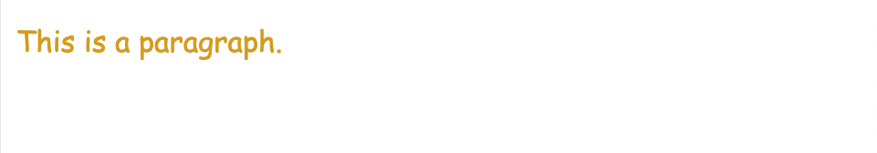
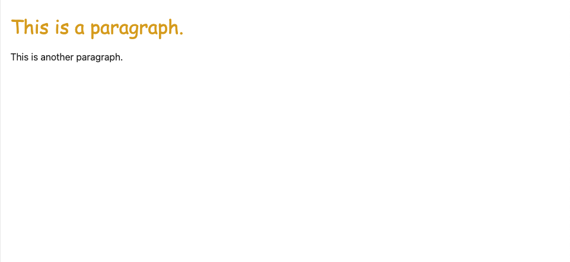
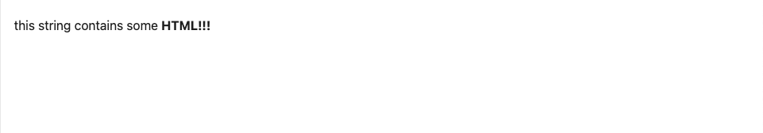

# Introduction

Svelte is a tool for building web applications. Like other user interface frameworks, it allows you to build your app _declaratively_ out of components that combine markup, styles and behaviours.

These components are _compiled_ into small, efficient JavaScript modules that eliminate overhead traditionally associated with UI frameworks.

## Your first component

In Svelte, an application is composed from one or more _components_. A component is a reusable self-contained block of code that encapsulates HTML, CSS and JavaScript that belong together, written into a `.svelte` file. The `App.svelte` file, open in the code editor to the right, is a simple component.

### Adding data

A component that just renders some static markup isn't very interesting. Let's add some data.

First, add a script tag to your component and declare a `name` variable:

#### App.svelte

~~~html

<h1>Hello world!</h1>
~~~

Then, we can refer to `name` in the markup:

~~~html
<h1>Hello {name}!</h1>
~~~

Inside the curly braces, we can put any JavaScript we want. Try changing `name` to `name.toUpperCase()` for a shoutier greeting.

~~~html
<h1>Hello {name.toUpperCase()}!</h1>
~~~

#### App.svelte

~~~html

<h1>Hello {name.toUpperCase()}!</h1>
~~~

## Dynamic attributes

Just like you can use curly braces to control text, you can use them to control element attributes.

Our image is missing a `src` — let's add one:

~~~html

~~~

That's better. But if you hover over the `` in the editor, Svelte is giving us a warning:

~~~
`` element should have an alt attribute
~~~

When building web apps, it's important to make sure that they're _accessible_ to the broadest possible userbase, including people with (for example) impaired vision or motion, or people without powerful hardware or good internet connections. Accessibility (shortened to a11y) isn't always easy to get right, but Svelte will help by warning you if you write inaccessible markup.

In this case, we're missing the `alt` attribute that describes the image for people using screenreaders, or people with slow or flaky internet connections that can't download the image. Let's add one:

~~~html

~~~

We can use curly braces _inside_ attributes. Try changing it to `"{name} dances."` — remember to declare a `name` variable in the `

~~~

## Styling

Just like in HTML, you can add a `
~~~

Importantly, these rules are _scoped to the component_. You won't accidentally change the style of `
` elements elsewhere in your app, as we'll see in the next step.

#### App.svelte

~~~html

This is a paragraph.

~~~

## Nested components

It would be impractical to put your entire app in a single component. Instead, we can import components from other files and include them in our markup.

Add a `
~~~

...and include a `<Nested />` component:

~~~html

This is a paragraph.

<Nested />
~~~

Notice that even though `Nested.svelte` has a `
` element, the styles from `App.svelte` don't leak in.

> [!NOTE] Component names are capitalised, to distinguish them from HTML elements.

#### Nested.svelte

~~~html

This is another paragraph.

~~~

#### App.svelte

~~~html

This is a paragraph.

<Nested />

~~~

## HTML tags

Ordinarily, strings are inserted as plain text, meaning that characters like `<` and `>` have no special meaning.

But sometimes you need to render HTML directly into a component. For example, the words you're reading right now exist in a markdown file that gets included on this page as a blob of HTML.

In Svelte, you do this with the special `{@html ...}` tag:

~~~html

{@html string}

~~~

> [!NOTE] Important: Svelte doesn't perform any sanitization of the expression inside `{@html ...}` before it gets inserted into the DOM. This isn't an issue if the content is something you trust like an article you wrote yourself. However if it's some untrusted user content, e.g. a comment on an article, then it's critical that you manually escape it, otherwise you risk exposing your users to <a href="https://owasp.org/www-community/attacks/xss/" target="_blank">Cross-Site Scripting</a> (XSS) attacks.

#### App.svelte

~~~html

{@html string}

~~~

