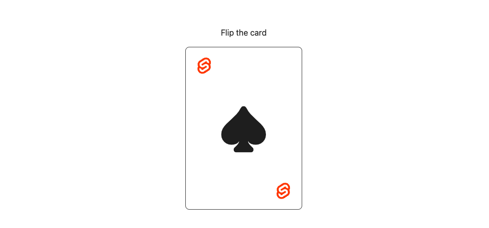
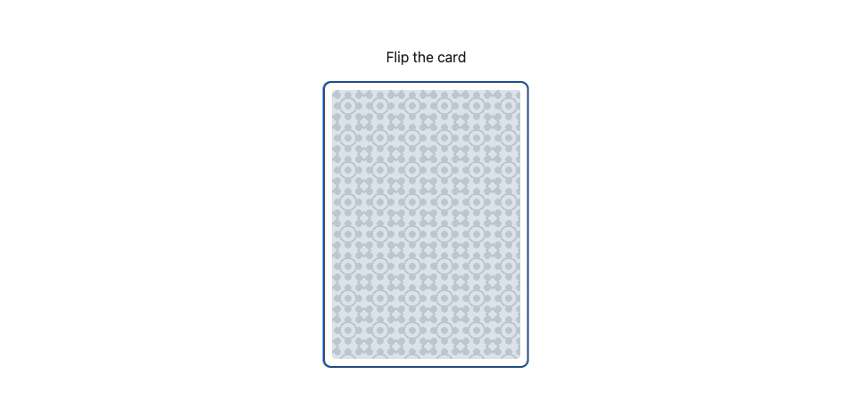
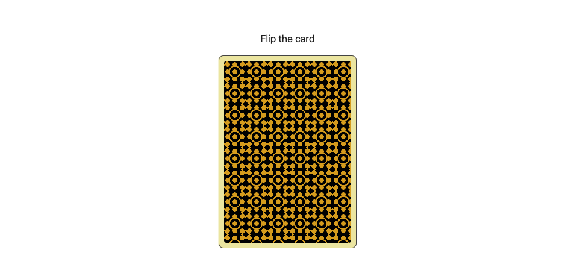
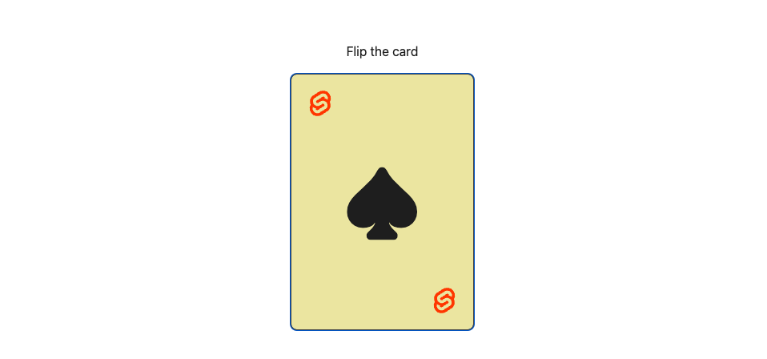
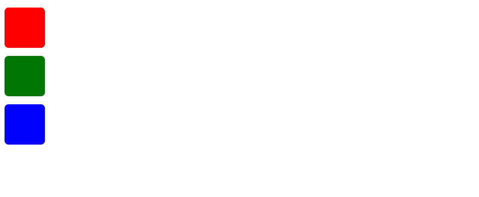

# Classes & Styles

## The class attribute

Like any other attribute, you can specify classes with a JavaScript attribute. Here, we could add a `flipped` class to the card:

~~~html
<button
  class="card {flipped ? 'flipped' : ''}"
  onclick={() => flipped = !flipped}
>
~~~

This works as expected — if you click on the card now, it'll flip.

We can make it nicer though. Adding or removing a class based on some condition is such a common pattern in UI development that Svelte allows you to pass an object or array that is converted to a string by [clsx](https://github.com/lukeed/clsx).

~~~html
<button
  class={["card", { flipped }]}
  onclick={() => flipped = !flipped}
>
~~~

This means 'always add the `card` class, and add the `flipped` class whenever `flipped` is truthy'.

#### App.svelte

~~~html

  Flip the card
  <button
    class={["card", { flipped }]}
    onclick={() => flipped = !flipped}
  >
    

      ♠
    

    

      

    

  </button>

~~~

## The style directive

As with `class`, you can write your inline `style` attributes literally, because Svelte is really just HTML with fancy bits:

~~~html
<button
  class="card"
  style="transform: {flipped ? 'rotateY(0)' : ''}; --bg-1: palegoldenrod; --bg-2: black; --bg-3: goldenrod"
  onclick={() => flipped = !flipped}
>
~~~

When you have a lot of styles, it can start to look a bit wacky. We can tidy things up by using the `style:` directive:

~~~html
<button
  class="card"
 style:transform={flipped ? 'rotateY(0)' : ''}
  style:--bg-1="palegoldenrod"
  style:--bg-2="black"
  style:--bg-3="goldenrod"
  onclick={() => flipped = !flipped}
>
~~~

#### App.svelte

~~~html

  Flip the card
  <button
    class="card"
    style:transform={flipped ? 'rotateY(0)' : ''}
    style:--bg-1="palegoldenrod"
    style:--bg-2="black"
    style:--bg-3="goldenrod"
    onclick={() => flipped = !flipped}
  >
    

      ♠
    

    

      

    

  </button>

~~~

## Component styles

Often, you need to influence the styles inside a child component. Perhaps we want to make these boxes red, green and blue.

One way to do this is with the `:global` CSS modifier, which allows you to indiscriminately target elements inside other components:

~~~html

~~~

But there are lots of reasons _not_ to do that. For one thing, it's extremely verbose. For another, it's brittle — any changes to the implementation details of `Box.svelte` could break the selector.

Most of all though, it's rude. Components should be able to decide for themselves which styles can be controlled from 'outside', in the same way they decide which variables are exposed as props. `:global` should be used as an escape hatch — a last resort.

Inside `Box.svelte`, change `background-color` so that it is determined by a [CSS custom property](https://developer.mozilla.org/en-US/docs/Web/CSS/--*):

~~~html

~~~

Any parent element (such as `
`) can set the value of `--color`, but we can also set it on individual components:

~~~html

  <Box --color="red" />
  <Box --color="green" />
  <Box --color="blue" />

~~~

The values can be dynamic, like any other attribute.

> [!NOTE] This feature works by wrapping each component in an element with `display: contents`, where needed, and applying the custom properties to it. If you inspect the elements, you'll see markup like this:
>
> ~~~html
> <svelte-css-wrapper style="display: contents; --color: red;">
>   <!-- contents -->
> </svelte-css-wrapper>
> ~~~
>
> Because of `display: contents` this won't affect your layout, but the extra element _can_ affect selectors like `.parent > .child`.

### Box.svelte

~~~html

~~~

#### App.svelte

~~~html

  <Box --color="red" />
  <Box --color="green" />
  <Box --color="blue" />

~~~

