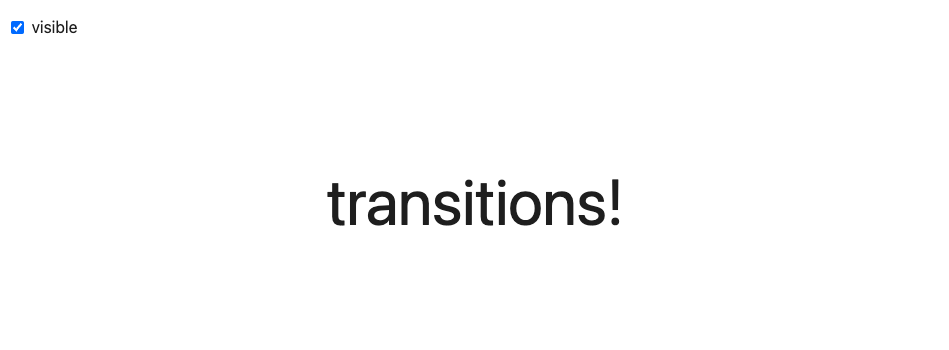
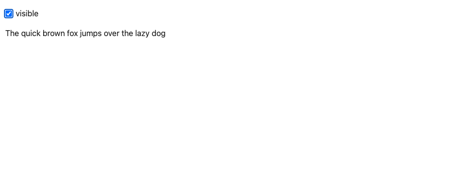
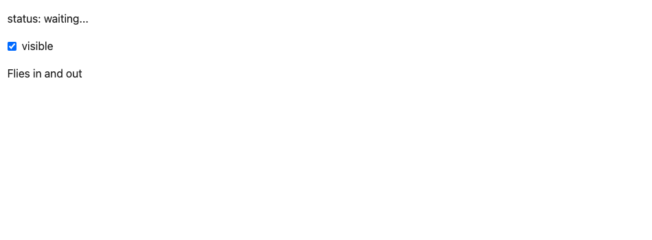
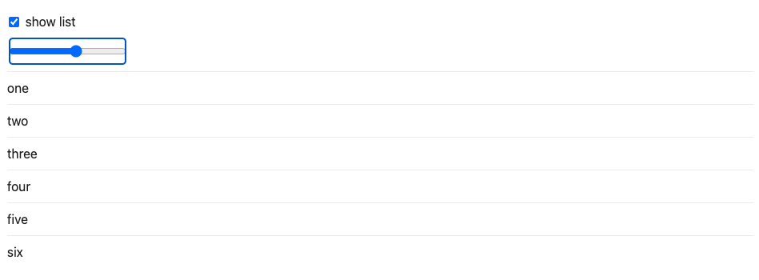
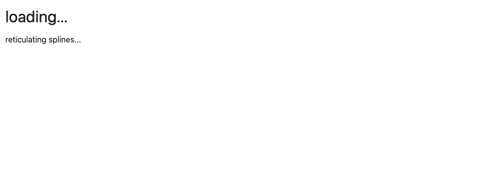

# Transitions

## The transition directive

We can make more appealing user interfaces by gracefully transitioning elements into and out of the DOM. Svelte makes this very easy with the `transition` directive.

First, import the `fade` function from `svelte/transition`...

~~~html

~~~

...then add it to the `
` element:

~~~html

  Fades in and out

~~~

#### App.svelte

~~~html

<label>
  <input type="checkbox" bind:checked={visible} />
  visible
</label>

{#if visible}
  

    Fades in and out
  

{/if}
~~~

## Adding parameters

Transition functions can accept parameters. Replace the `fade` transition with `fly`...

~~~html

~~~

...and apply it to the `
` along with some options:

~~~html

  Flies in and out

~~~

Note that the transition is _reversible_ — if you toggle the checkbox while the transition is ongoing, it transitions from the current point, rather than the beginning or the end.

#### App.svelte

~~~html

<label>
  <input type="checkbox" bind:checked={visible} />
  visible
</label>

{#if visible}
  

    Flies in and out
  

{/if}
~~~

## In and out

Instead of the `transition` directive, an element can have an `in` or an `out` directive, or both together. Import `fade` alongside `fly`...

~~~js
import { fade, fly } from 'svelte/transition';
~~~

...then replace the `transition` directive with separate `in` and `out` directives:

~~~html

  Flies in, fades out

~~~

In this case, the transitions are _not_ reversed.

#### App.svelte

~~~html

<label>
  <input type="checkbox" bind:checked={visible} />
  visible
</label>

{#if visible}
  

    Flies in, fades out
  

{/if}
~~~

## Custom CSS transitions

The `svelte/transition` module has a handful of built-in transitions, but it's very easy to create your own. By way of example, this is the source of the `fade` transition:

~~~js
function fade(node, { delay = 0, duration = 400 }) {
  const o = +getComputedStyle(node).opacity;

  return {
    delay,
    duration,
    css: (t) => `opacity: ${t * o}`
  };
}
~~~

The function takes two arguments — the node to which the transition is applied, and any parameters that were passed in — and returns a transition object which can have the following properties:

- `delay` — milliseconds before the transition begins
- `duration` — length of the transition in milliseconds
- `easing` — a `p => t` easing function (see the chapter on [tweening](/tutorial/svelte/tweens))
- `css` — a `(t, u) => css` function, where `u === 1 - t`
- `tick` — a `(t, u) => {...}` function that has some effect on the node

The `t` value is `0` at the beginning of an intro or the end of an outro, and `1` at the end of an intro or beginning of an outro.

Most of the time you should return the `css` property and _not_ the `tick` property, as CSS animations run off the main thread to prevent jank where possible. Svelte 'simulates' the transition and constructs a CSS animation, then lets it run.

For example, the `fade` transition generates a CSS animation somewhat like this:

<!-- prettier-ignore-start -->
~~~css
0% { opacity: 0 }
10% { opacity: 0.1 }
20% { opacity: 0.2 }
/* ... */
100% { opacity: 1 }
~~~
<!-- prettier-ignore-end -->

We can get a lot more creative though. Let's make something truly gratuitous:

~~~html

~~~

Remember: with great power comes great responsibility.

#### App.svelte

~~~html

<label>
  <input type="checkbox" bind:checked={visible} />
  visible
</label>

{#if visible}
  

    transitions!
  

{/if}

~~~

## Custom JS transitions

While you should generally use CSS for transitions as much as possible, there are some effects that can't be achieved without JavaScript, such as a typewriter effect:

~~~js
function typewriter(node, { speed = 1 }) {
  const valid = node.childNodes.length === 1 && node.childNodes[0].nodeType === Node.TEXT_NODE;

  if (!valid) {
    throw new Error(`This transition only works on elements with a single text node child`);
  }

  const text = node.textContent;
  const duration = text.length / (speed * 0.01);

  return {
    duration,
    tick: (t) => {
      const i = Math.trunc(text.length * t);
      node.textContent = text.slice(0, i);
    }
  };
}
~~~

#### App.svelte

~~~html

<label>
  <input type="checkbox" bind:checked={visible} />
  visible
</label>

{#if visible}
  

    The quick brown fox jumps over the lazy dog
  

{/if}
~~~

## Transition events

It can be useful to know when transitions are beginning and ending. Svelte dispatches events that you can listen to like any other DOM event:

~~~html

 status = 'intro started'}
  onoutrostart={() => status = 'outro started'}
  onintroend={() => status = 'intro ended'}
  onoutroend={() => status = 'outro ended'}
>
  Flies in and out

~~~

#### App.svelte

~~~html

status: {status}

<label>
  <input type="checkbox" bind:checked={visible} />
  visible
</label>

{#if visible}
  
 status = 'intro started'}
    onoutrostart={() => status = 'outro started'}
    onintroend={() => status = 'intro ended'}
    onoutroend={() => status = 'outro ended'}
  >
    Flies in and out
  

{/if}
~~~

## Global transitions

Ordinarily, transitions will only play on elements when their direct containing block is added or destroyed. In the example here, toggling the visibility of the entire list does not apply transitions to individual list elements.

Instead, we'd like transitions to not only play when individual items are added and removed with the slider but also when we toggle the checkbox.

We can achieve this with a _global_ transition, which plays when _any_ block containing the transitions is added or removed:

~~~html

  {item}

~~~

#### App.svelte

~~~html

<label>
  <input type="checkbox" bind:checked={showItems} />
  show list
</label>

<label>
  <input type="range" bind:value={i} max="10" />
</label>

{#if showItems}
  {#each items.slice(0, i) as item}
    

      {item}
    

  {/each}
{/if}

~~~

> [!NOTE] In Svelte 3, transitions were global by default and you had to use the `|local` modifier to make them local.

## Key blocks

Key blocks destroy and recreate their contents when the value of an expression changes. This is useful if you want an element to play its transition whenever a value changes instead of only when the element enters or leaves the DOM.

Here, for example, we'd like to play the `typewriter` transition from `transition.js` whenever the loading message, i.e. `i` changes. Wrap the `
` element in a key block:

~~~html
{#key i}
  

    {messages[i] || ''}
  

{/key}
~~~

#### loading-messages.js

~~~javascript
// thanks to https://gist.github.com/meain/6440b706a97d2dd71574769517e7ed32
export const messages = [
  "reticulating splines...",
  "generating witty dialog...",
  "swapping time and space...",
  "640K ought to be enough for anybody",
  "checking the gravitational constant in your locale...",
  "keep calm and npm install",
  "counting backwards from Infinity",
  "I'm sorry Dave, I can't do that.",
  "adjusting flux capacitor...",
  "constructing additional pylons...",
  "rm -rf /",
];
~~~

#### transition.js

~~~javascript
export function typewriter(node, { speed = 1 }) {
  const valid = node.childNodes.length === 1 && node.childNodes[0].nodeType === Node.TEXT_NODE;

  if (!valid) {
    throw new Error(`This transition only works on elements with a single text node child`);
  }

  const text = node.textContent;
  const duration = text.length / (speed * 0.01);

  return {
    duration,
    tick: (t) => {
      const i = Math.trunc(text.length * t);
      node.textContent = text.slice(0, i);
    }
  };
}
~~~

#### App.svelte

~~~html

<h1>loading...</h1>

{#key i}
  

    {messages[i] || ''}
  

{/key}
~~~

