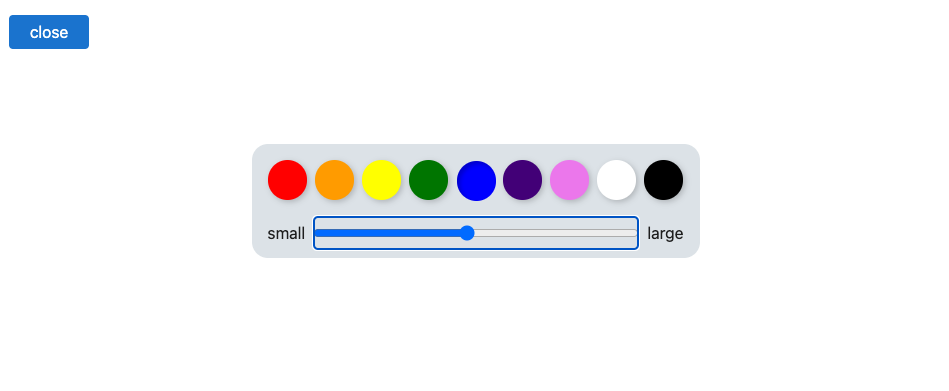
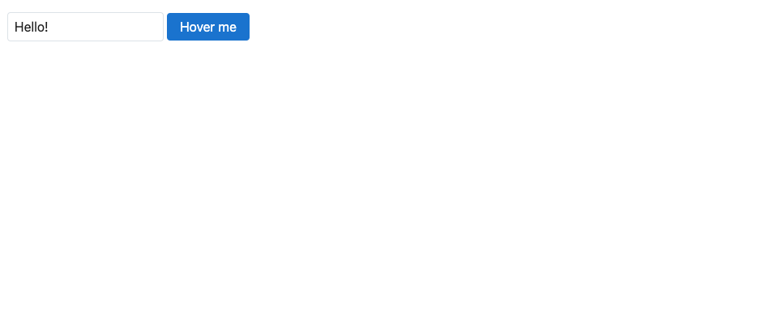

# Actions

## The use directive

Actions are essentially element-level lifecycle functions. They're useful for things like:

- interfacing with third-party libraries
- lazy-loaded images
- tooltips
- adding custom event handlers

In this app, you can scribble on the `<canvas>`, and change colours and brush size via the menu. But if you open the menu and cycle through the options with the Tab key, you'll soon find that the focus isn't _trapped_ inside the modal.

We can fix that with an action. Import `trapFocus` from `actions.svelte.js`...

~~~svelte

~~~

...then add it to the menu with the `use:` directive:

~~~svelte

~~~

Let's take a look at the `trapFocus` function in `actions.svelte.js`. An action function is called with a `node` — the `
` in our case — when the node is mounted to the DOM. Inside the action, we have an [effect](effects).

First, we need to add an event listener that intercepts Tab key presses:

~~~js
$effect(() => {
  focusable()[0]?.focus();
  node.addEventListener('keydown', handleKeydown);
});
~~~

Second, we need to do some cleanup when the node is unmounted — removing the event listener, and restoring focus to where it was before the element mounted:

~~~js
$effect(() => {
  focusable()[0]?.focus();
  node.addEventListener('keydown', handleKeydown);

 return () => {
    node.removeEventListener('keydown', handleKeydown);
    previous?.focus();
  };
});
~~~

Now, when you open the menu, you can cycle through the options with the Tab key.

### actions.svelte.js

~~~javascript
export function trapFocus(node) {
  const previous = document.activeElement;

  function focusable() {
    return Array.from(node.querySelectorAll('button, [href], input, select, textarea, [tabindex]:not([tabindex="-1"])'));
  }

  function handleKeydown(event) {
    if (event.key !== 'Tab') return;

    const current = document.activeElement;

    const elements = focusable();
    const first = elements.at(0);
    const last = elements.at(-1)

    if (event.shiftKey && current === first) {
      last.focus();
      event.preventDefault();
    }

    if (!event.shiftKey && current === last) {
      first.focus();
      event.preventDefault();
    }
  }

  $effect(() => {
    focusable()[0]?.focus();
    node.addEventListener('keydown', handleKeydown);

    return () => {
      node.removeEventListener('keydown', handleKeydown);
      previous?.focus();
    };
  });
}
~~~

#### Canvas.svelte

~~~svelte

<canvas
  bind:this={canvas}
  onpointerdown={(e) => {
    coords = { x: e.offsetX, y: e.offsetY };

    context.fillStyle = color;
    context.beginPath();
    context.arc(coords.x, coords.y, size / 2, 0, 2 * Math.PI);
    context.fill();
  }}
  onpointerleave={() => {
    coords = null;
  }}
  onpointermove={(e) => {
    const previous = coords;

    coords = { x: e.offsetX, y: e.offsetY };

    if (e.buttons === 1) {
      e.preventDefault();

      context.strokeStyle = color;
      context.lineWidth = size;
      context.lineCap = 'round';
      context.beginPath();
      context.moveTo(previous.x, previous.y);
      context.lineTo(coords.x, coords.y);
      context.stroke();
    }
  }}
></canvas>

{#if coords}
  

{/if}

~~~

#### App.svelte

~~~svelte

  <Canvas color={selected} size={size} />

  {#if showMenu}
    
 {
        if (event.target === event.currentTarget) {
          showMenu = false;
        }
      }}
      onkeydown={(e) => {
        if (e.key === 'Escape') {
          showMenu = false;
        }
      }}
    >
      

        

          {#each colors as color}
            <button
              class="color"
              aria-label={color}
              aria-current={selected === color}
              style="--color: {color}"
              onclick={() => {
                selected = color;
              }}
            ></button>
          {/each}
        

        <label>
          small
          <input type="range" bind:value={size} min="1" max="50" />
          large
        </label>
      

    

  {/if}

  

    <button class="show-menu" onclick={() => showMenu = !showMenu}>
      {showMenu ? 'close' : 'menu'}
    </button>
  

~~~

## Adding parameters

Like transitions and animations, an action can take an argument, which the action function will be called with alongside the element it belongs to.

In this exercise, we want to add a tooltip to the `<button>` using the [`Tippy.js`](https://atomiks.github.io/tippyjs/) library. The action is already wired up with `use:tooltip`, but if you hover over the button (or focus it with the keyboard) the tooltip contains no content.

First, the action needs to accept a function that returns some options to pass to Tippy:

~~~js
function tooltip(node, fn) {
  $effect(() => {
    const tooltip = tippy(node, fn());

    return tooltip.destroy;
  });
}
~~~

> [!NOTE] We're passing in a function, rather than the options themselves, because the `tooltip` function does not re-run when the options change.

Then, we need to pass the options into the action:

~~~svelte
<button use:tooltip={() => ({ content })}>
  Hover me
</button>
~~~

> [!NOTE] In Svelte 4, actions returned an object with `update` and `destroy` methods. This still works but we recommend using `$effect` instead, as it provides more flexibility and granularity.

#### App.svelte

~~~svelte

<input bind:value={content} />

<button use:tooltip={() => ({ content })}>
  Hover me
</button>

~~~

