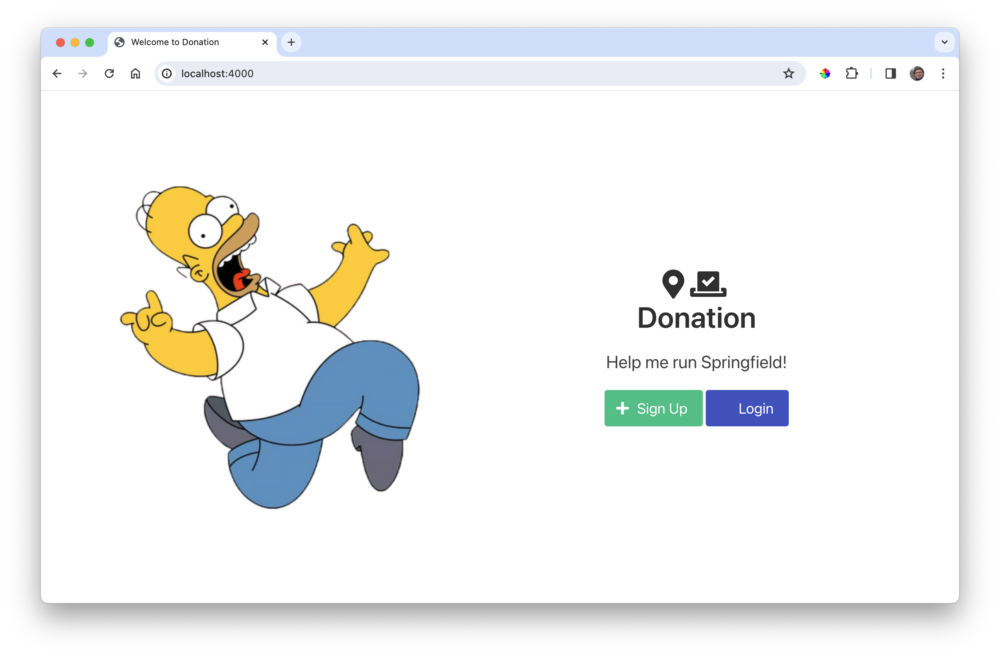

# UX

## Public

Greater a folder called **public** folder in the root of the project (in the parent or **src**), containing the following:

### public/style.css

~~~css
body {
  background: #e4e9f2;
  min-height: 100vh;
}
~~~

Download these images and also place them in public:

## Views

Bring in the following templates into the a views folder"

### views/Layout.hbs

~~~handlebars
<!DOCTYPE html>
<html>

<head>
  <title>{{title}}</title>
  <meta charset="UTF-8" />
  <link rel="stylesheet" href="https://cdn.jsdelivr.net/npm/bulma@1.0.0/css/bulma.min.css">
  <link rel="stylesheet" href="https://cdnjs.cloudflare.com/ajax/libs/font-awesome/5.15.1/css/all.min.css"
    integrity="sha512-+4zCK9k+qNFUR5X+cKL9EIR+ZOhtIloNl9GIKS57V1MyNsYpYcUrUeQc9vNfzsWfV28IaLL3i96P9sdNyeRssA=="
    crossorigin="anonymous" />
  <link href="https://fonts.googleapis.com/css?family=Open+Sans:400,600,300" rel="stylesheet" type="text/css" />
</head>

<body>
  

    {{{content}}}
  

</body>

</html>
~~~

### views/Main.hbs

~~~handlebars
<section class="hero is-fullheight is-default is-bold">
  

  

    

      

        

          <figure class="image">
            
          </figure>
        

        

          <h1 class="title is-2 mb-5">
            <i class="fas fa-map-marker-alt"></i><i class="fas fa-vote-yea"></i>
            
Donation

          </h1>
          <h2 class="subtitle is-4 mt-2">Help me run Springfield!</h2>
          

            <a class="button is-medium is-success" href="/signup">
              <i class="fas fa-plus"></i>Sign Up
            </a>
            <a class="button is-medium is-link" href="/login">
              <i class="fas fa-sign-in"></i>Login
            </a>
          

        

      

    

  

</section>
~~~

You should be able to run the application now:

~~~bash
npm run dev
~~~

Signup or Login will not work yet.
