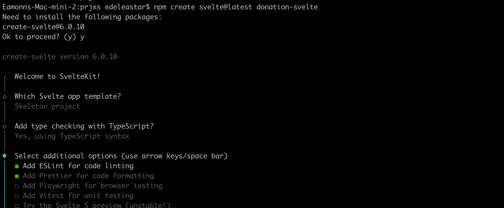
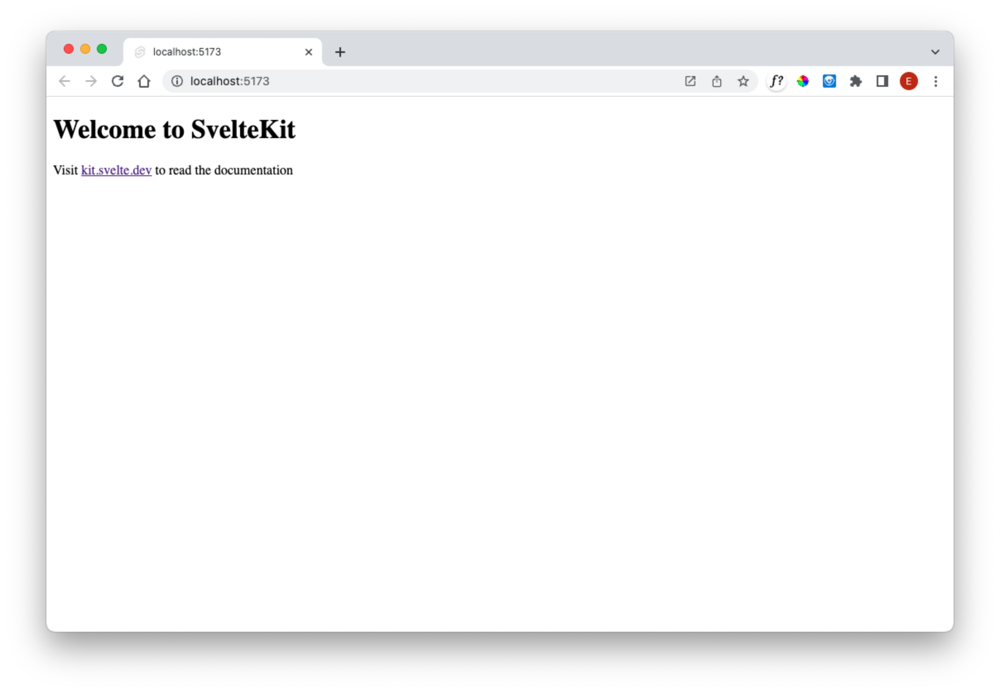

# Create

Open a shell an enter these commands:

~~~bash
npm create svelte@latest donation-svelte
~~~

In the subsequent menus, select the following options:

- Skeleton Project
- Yes, use TypeScript
- Add ESLint for code linting
- Add Prettier for code formatting

Making the above choices will trigger the following response:

~~~bash

┌  Welcome to SvelteKit!
│
◇  Which Svelte app template?
│  Skeleton project
│
◇  Add type checking with TypeScript?
│  Yes, using TypeScript syntax
│
◇  Select additional options (use arrow keys/space bar)
│  Add ESLint for code linting, Add Prettier for code formatting
│
└  Your project is ready!

✔ Typescript
  Inside Svelte components, use <script lang="ts">

✔ ESLint
  https://github.com/sveltejs/eslint-plugin-svelte

✔ Prettier
  https://prettier.io/docs/en/options.html
  https://github.com/sveltejs/prettier-plugin-svelte#options

Install community-maintained integrations:
  https://github.com/svelte-add/svelte-add

Next steps:
  1: cd donation-svelte
  2: npm install
  3: git init && git add -A && git commit -m "Initial commit" (optional)
  4: npm run dev -- --open

To close the dev server, hit Ctrl-C

Stuck? Visit us at https://svelte.dev/chat
~~~

Check that the package.json file looks like this:

~~~json

	"name": "donation-svelte",
	"version": "0.0.1",
	"private": true,
	"scripts": {
		"dev": "vite dev",
		"build": "vite build",
		"preview": "vite preview",
		"check": "svelte-kit sync && svelte-check --tsconfig ./tsconfig.json",
		"check:watch": "svelte-kit sync && svelte-check --tsconfig ./tsconfig.json --watch",
		"lint": "prettier --check . && eslint .",
		"format": "prettier --write ."
	},
	"devDependencies": {
		"@sveltejs/adapter-auto": "^3.0.0",
		"@sveltejs/kit": "^2.0.0",
		"@sveltejs/vite-plugin-svelte": "^3.0.0",
		"@types/eslint": "^8.56.0",
		"@typescript-eslint/eslint-plugin": "^7.0.0",
		"@typescript-eslint/parser": "^7.0.0",
		"eslint": "^8.56.0",
		"eslint-config-prettier": "^9.1.0",
		"eslint-plugin-svelte": "^2.35.1",
		"prettier": "^3.1.1",
		"prettier-plugin-svelte": "^3.1.2",
		"svelte": "^4.2.7",
		"svelte-check": "^3.6.0",
		"tslib": "^2.4.1",
		"typescript": "^5.0.0",
		"vite": "^5.0.3"
	},
	"type": "module"
}
~~~

We might like to update the modules at this stage. This tool here is useful for this:

- <https://www.npmjs.com/package/npm-check-updates>

When installed, this command will run the command to check the versions:

~~~bash
ncu
~~~

It will list the current versions + the latest:

~~~bash
 @sveltejs/adapter-auto             ^3.0.0  →   ^3.2.0
 @sveltejs/kit                      ^2.0.0  →   ^2.5.5
 @sveltejs/vite-plugin-svelte       ^3.0.0  →   ^3.0.2
 @types/eslint                     ^8.56.0  →  ^8.56.7
 @typescript-eslint/eslint-plugin   ^7.0.0  →   ^7.5.0
 @typescript-eslint/parser          ^7.0.0  →   ^7.5.0
 eslint                            ^8.56.0  →   ^9.0.0
 prettier                           ^3.1.1  →   ^3.2.5
 prettier-plugin-svelte             ^3.1.2  →   ^3.2.2
 svelte                             ^4.2.7  →  ^4.2.12
 svelte-check                       ^3.6.0  →   ^3.6.9
 tslib                              ^2.4.1  →   ^2.6.2
 typescript                         ^5.0.0  →   ^5.4.4
 vite                               ^5.0.3  →   ^5.2.8
~~~

If you wish to update everything, then try this command:

~~~
ncu -u
~~~

This will replace all old versions with the new ones. Updating patch and minor should be fine, but you may need to be cautious about major version changes. In particular, eslint:

~~~
 eslint                            ^8.56.0  →   ^9.0.0
~~~

Should probably remain at major version 8, as upgrading will cause transitive dependency warnings.

Now we can install and run the application:

~~~bash
cd donation-svelte
npm install
npm run dev
~~~

This should respond with:

~~~bash
> donation-svelte@0.0.1 dev
> vite dev

Forced re-optimization of dependencies

  VITE v4.5.1  ready in 1129 ms

  ➜  Local:   http://localhost:5173/
  ➜  Network: use --host to expose
  ➜  press h to show help
~~~

Browsing to:

- <http://localhost:5173/>

Should yield:

Lets bring in Bulma CSS to our header:

### /src/app.html

~~~html
<!doctype html>
<html lang="en">
  <head>
    <meta charset="utf-8" />
    <link rel="icon" href="%sveltekit.assets%/favicon.png" />
    <link rel="stylesheet" href="https://cdn.jsdelivr.net/npm/bulma@1.0.0/css/bulma.min.css" />
    <link
      rel="stylesheet"
      href="https://cdnjs.cloudflare.com/ajax/libs/font-awesome/5.15.1/css/all.min.css"
      integrity="sha512-+4zCK9k+qNFUR5X+cKL9EIR+ZOhtIloNl9GIKS57V1MyNsYpYcUrUeQc9vNfzsWfV28IaLL3i96P9sdNyeRssA=="
      crossorigin="anonymous"
    />
    <link href="https://fonts.googleapis.com/css?family=Open+Sans:400,600,300" rel="stylesheet" type="text/css" />
    <meta name="viewport" content="width=device-width" />
    %sveltekit.head%
  </head>

  <body data-sveltekit-preload-data="hover">
    
%sveltekit.body%

  </body>
</html>
~~~

### src/routes/+page.svelte

~~~html

Hello from Donation!

~~~

### Code Formatting

Prettier is set up as the default code formatter. For this lab we are using these settings (different from the defaults):

### .prettierrc

~~~json
{
  "useTabs": false,
  "singleQuote": false,
  "trailingComma": "none",
  "printWidth": 180,
  "plugins": ["prettier-plugin-svelte"],
  "overrides": [
    {
      "files": "*.svelte",
      "options": {
        "parser": "svelte"
      }
    }
  ]
}
~~~

