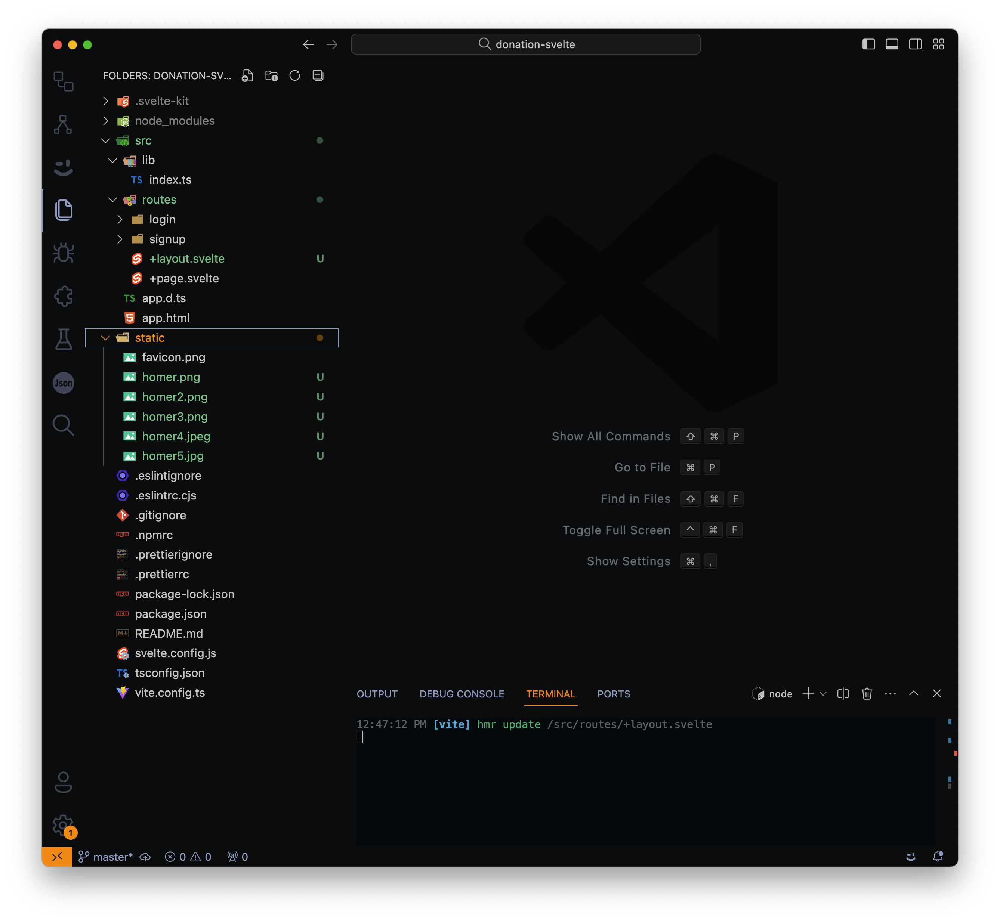
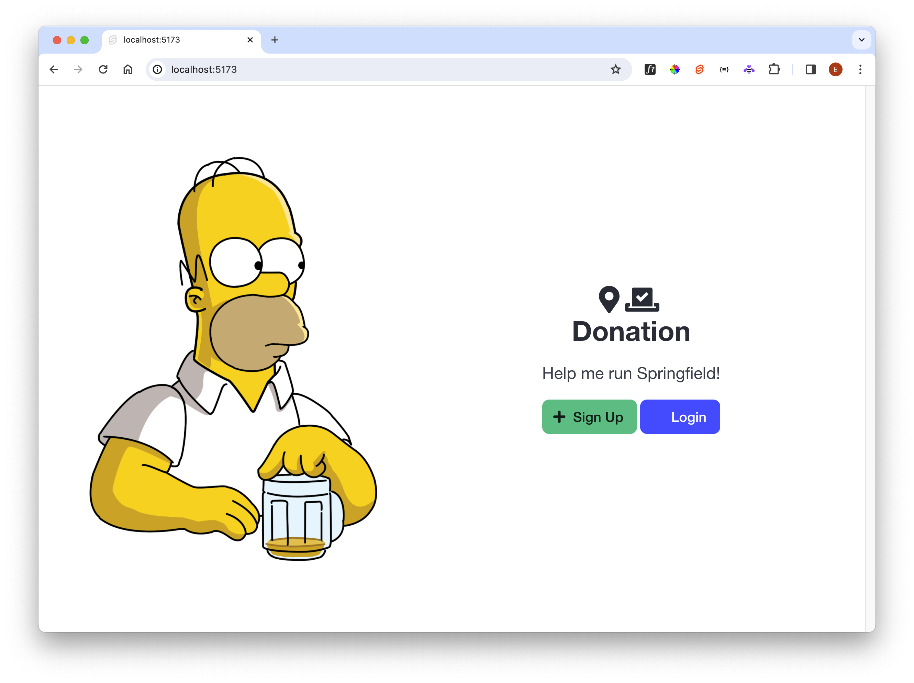

# Components

Bring in some static images from the hapi project, packaged here:

- [images.zip](/archives/images.zip)

Unzip these images into the static folder. The project should look like this :

Lets start by simplifying the layout again:

### src/routes/+layout.svelte

~~~html

  <slot />

~~~

Here is new content for the main page:

### src/routes/+page.svelte

~~~html
<section class="hero is-fullheight is-default is-bold">
  

  

    

      

        

          <figure class="image">
            
          </figure>
        

        

          <h1 class="title is-2 mb-5">
            <i class="fas fa-map-marker-alt"></i><i class="fas fa-vote-yea"></i>
            
Donation

          </h1>
          <h2 class="subtitle is-4 mt-2">Help me run Springfield!</h2>
          

            <a class="button is-medium is-success" href="/signup">
              <i class="fas fa-plus"></i>Sign Up
            </a>
            <a class="button is-medium is-link" href="/login">
              <i class="fas fa-sign-in"></i>Login
            </a>
          

        

      

    

  

</section>
~~~

If you have the app running, it should look like this now:

We can move this opening view to a component. Create a new folder in `Lib` called `ui`, and introduce this component:

### src/lib/ui/SplashScreen.svelte

~~~svelte
<section class="hero is-fullheight is-default is-bold">
  

  

    

      

        

          <figure class="image">
            
          </figure>
        

        

          <h1 class="title is-2 mb-5">
            <i class="fas fa-map-marker-alt"></i><i class="fas fa-vote-yea"></i>
            
Donation

          </h1>
          <h2 class="subtitle is-4 mt-2">Help me run Springfield!</h2>
          

            <a class="button is-medium is-success" href="/signup">
              <i class="fas fa-plus"></i>Sign Up
            </a>
            <a class="button is-medium is-link" href="/login">
              <i class="fas fa-sign-in"></i>Login
            </a>
          

        

      

    

  

</section>
~~~

The +page can be simplified:

### src/routes/+page.svelte

~~~svelte

<SplashScreen />
~~~

The login and sign up buttons are not working satisfactorily yet.
