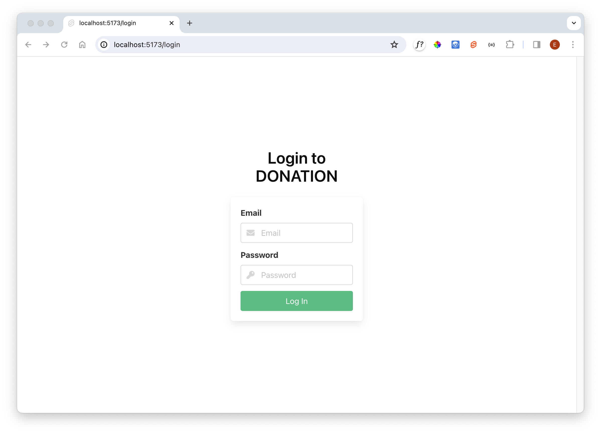
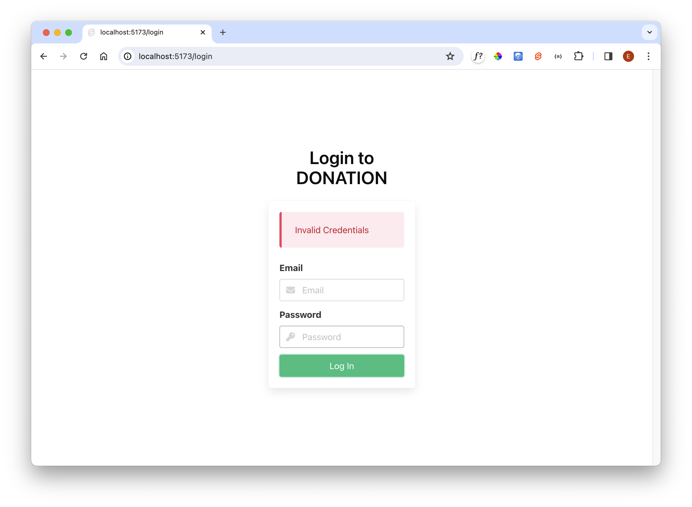

# Login

We need some form components for Login + Signup. First, some more components

### lib/ui/UserCredentials.svelte

~~~html

  <!-- svelte-ignore a11y-label-has-associated-control -->
  <label class="label">Email</label>
  

    <input bind:value={email} class="input" type="text" placeholder="Email" name="email" />
    
      <i class="fa fa-envelope"></i>
    
  

  <!-- svelte-ignore a11y-label-has-associated-control -->
  <label class="label">Password</label>
  

    <input bind:value={password} class="input" type="password" placeholder="Password" name="password" />
    
      <i class="fa fa-key"></i>
    
  

~~~

### lib/ui/UserDetails.svelte

~~~html

<!-- svelte-ignore a11y-label-has-associated-control -->
<label class="label">Name</label>

  

    

      

        <input bind:value={firstName} class="input" type="text" placeholder="First Name" name="firstName" />
        
          <i class="fa fa-id-card"></i>
        
      

    

    

      

        <input bind:value={lastName} class="input" type="text" placeholder="Last Name" name="lastName" />
        
          <i class="fa fa-id-card"></i>
        
      

    

  

~~~

### lib/ui/Message.svelte

~~~html

<article class="message is-danger">
  

    {message}
  

</article>
~~~

We can use the components in the routes. First bring in a form for logging in:

### src/routes/login/LoginForm.svelte

~~~html

{#if message}
  <Message {message} />
{/if}
<form on:submit|preventDefault={login}>
  <UserCredentials bind:email bind:password />
  <button class="button is-success is-fullwidth">Log In</button>
</form>
~~~

Now use this form in the login route page:

### src/routes/login/+page.svelte

~~~html

<section class="hero is-fullheight">
  

    

      

        <h3 class="title has-text-black has-text-centered">Login to DONATION</h3>
        

          <LoginForm />
        

      

    

  

</section>
~~~

The Login button from the home page should look like this:

At the moment any attempt to log in will fail:

