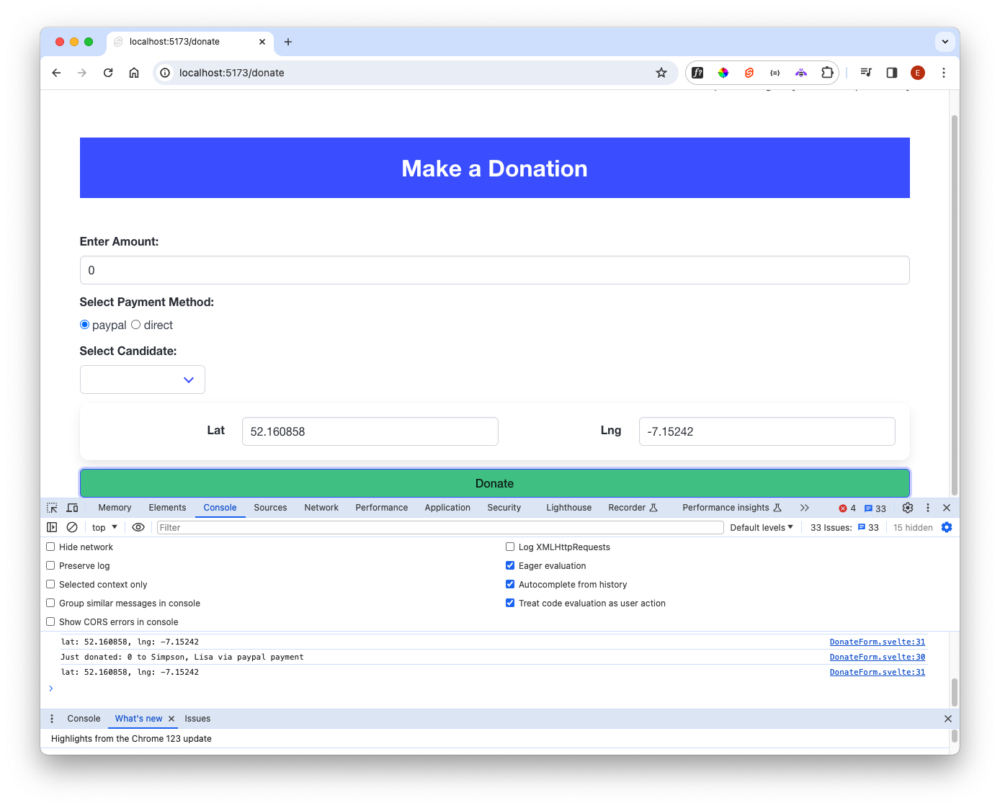

# Coordinates

The donation form should also accept lat/lng coordinates. We will keep this as a separate component:

### src/lib/ui/Coordinates.svelte

~~~html

  

    <label for="lng" class="label">Lat</label>
  

  

    

      

        <input id="lng" class="input" type="float" bind:value={lat} />
      

    

    

      <label for="lat" class="label">Lng</label>
    

    

      

        <input id="lat" class="input" type="float" bind:value={lng} />
      

    

  

~~~

In DonateForm, we can declare variable to hold the coordinates (with default values):

### src/routes/donate/DonateForm.svelte

~~~typescript
  //...
  import Coordinates from "$lib/ui/Coordinates.svelte";
  //...
  let lat = 52.160858;
  let lng = -7.15242;
  //...
  async function donate() {
    console.log(`Just donated: ${amount} to ${selectedCandidate} via ${selectedMethod} payment`);
    console.log(`lat: ${lat}, lng: ${lng}`);
  }
  //...
~~~

Then place the component onto the page:

~~~html
//...
  <Coordinates bind:lat bind:lng />
//...
~~~

