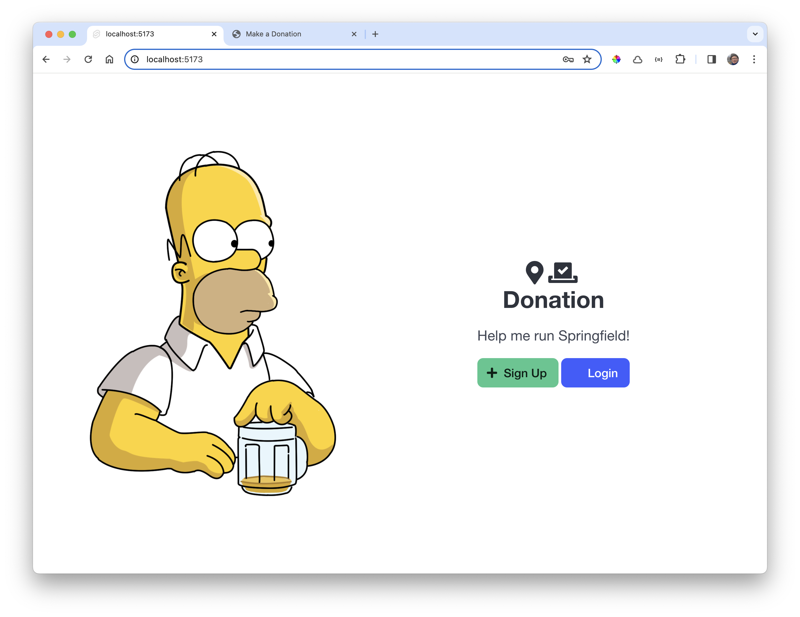

# Svelte: Logging in

We already have a login form:

Currently it is not connected to the Donation API:

~~~html

{#if message}
  <Message {message} />
{/if}
<form on:submit|preventDefault={login}>
  <UserCredentials bind:email bind:password />
  <button class="button is-success is-fullwidth">Log In</button>
</form>
~~~

Now we can implement the login() method to use the donationService object to access the API of the Hapi application:

### src/lib/routes/login/LoginForm.ts

~~~html

{#if message}
  <Message {message} />
{/if}
<form on:submit|preventDefault={login}>
  <UserCredentials bind:email bind:password />
  <button class="button is-success is-fullwidth">Log In</button>
</form>
~~~

The logged in user details can be displayed in the main menu:

### src/lib/ui/menu.svelte

~~~html
...
    <a class="navbar-item" href="/logout"> Logout [{$currentSession.name}]</a>
...
~~~

... and logging out can clear the current session, and redirecting to the start page:

### src/routes/logout/+page.svelte

~~~html

~~~

Try this now and see if you can successfully log in (make sure to have the Hapi app running on the appropriate port). If you are logged in, then you should see the logged in users name on the menu bar:

Logging out should also work:

