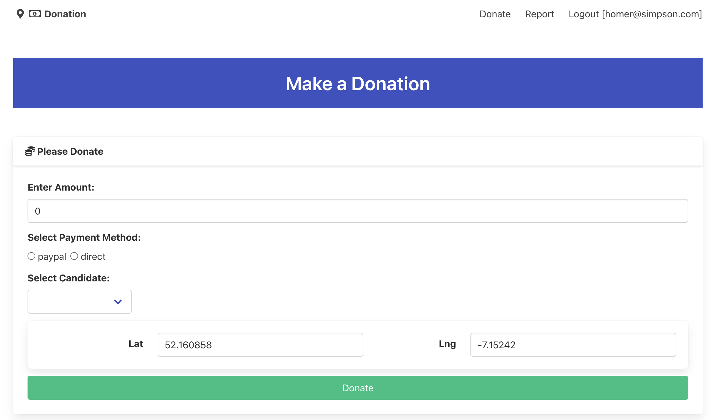

# Svelte: Donation Infrastructure 

Back in the front end svelte app, we have already scaffolded up the donate form:

Before implementing donate in this form, first bring in types for Candidate & Donation:

### src/lib/services/donation-types.ts

~~~typescript
export interface Candidate {
  firstName: string;
  lastName: string;
  office: string;
  _id: string;
}

export interface Donation {
  amount: number;
  method: string;
  candidate: Candidate | string;
  donor: User | string;
  lat: number;
  lng: number;
}
~~~

We can now extend the donationService object to support new donation services: 

### src/lib/services/donation-service.ts

~~~typescript
//...
import type { Candidate, Donation } from "$lib/types/donation-types";
//...

  async donate(donation: Donation, session: Session) {
    try {
      axios.defaults.headers.common["Authorization"] = "Bearer " + session.token;
      const response = await axios.post(this.baseUrl + "/api/candidates/" + donation.candidate + "/donations", donation);
      return response.status == 200;
    } catch (error) {
      return false;
    }
  },

  async getCandidates(session: Session): Promise<Candidate[]> {
    try {
      axios.defaults.headers.common["Authorization"] = "Bearer " + session.token;
      const response = await axios.get(this.baseUrl + "/api/candidates");
      return response.data;
    } catch (error) {
      return [];
    }
  },

  async getDonations(session: Session): Promise<Donation[]> {
    try {
      axios.defaults.headers.common["Authorization"] = "Bearer " + session.token;
      const response = await axios.get(this.baseUrl + "/api/donations");
      return response.data;
    } catch (error) {
      return [];
    }
  }  
~~~

This provides the infrastructure for donation services we will engage in the front end (next steps).

