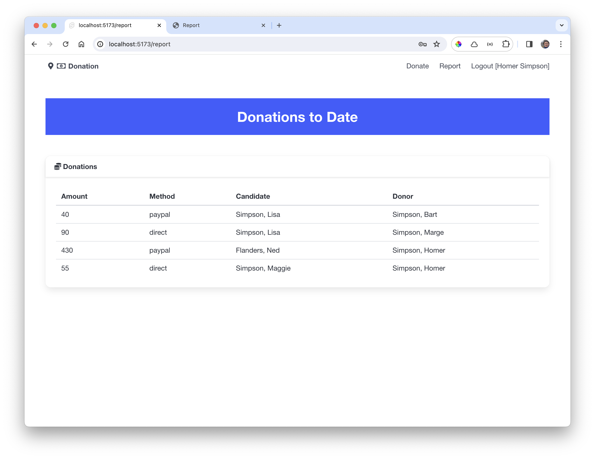

# Svelte: Listing Donations

Currently the report view list of donations is hard coded. We can revise this now, refactoring DonationList to accept the list as a property:

### src/lib/ui/DonationList.svelte

~~~html

<table class="table is-fullwidth">
  <thead>
    <th>Amount</th>
    <th>Method</th>
    <th>Candidate</th>
    <th>Donor</th>
  </thead>
  <tbody>
    {#each donations as donation}
      <tr>
        <td>
          {donation.amount}
        </td>
        <td>
          {donation.method}
        </td>
        <td>
          {#if typeof donation.candidate !== "string"}
            {donation.candidate.lastName}, {donation.candidate.firstName}
          {/if}
        </td>
        <td>
          {#if typeof donation.donor !== "string"}
            {donation.donor.lastName}, {donation.donor.firstName}
          {/if}
        </td>
      </tr>
    {/each}
  </tbody>
</table>
~~~

Now we can rework the report view to retrieve the latest donations and send them to the DonationList:

### src/routes/report/+page.svelte

~~~html

<Card title="Donations">
  <DonationList {donations} />
</Card>
~~~

Try this now - we should expect the latest donations to be displayed.

You may notice that you will frequently need to log in freshly again, as the session lifetime seems to be limited. We will address this challenge in the next lab.

