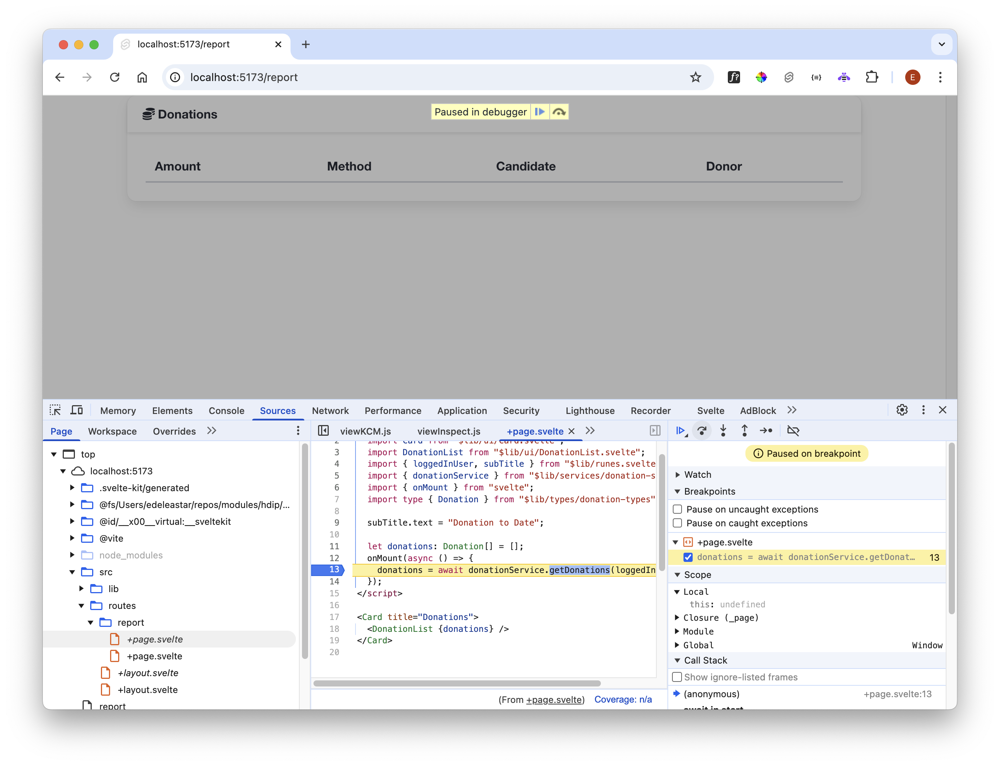
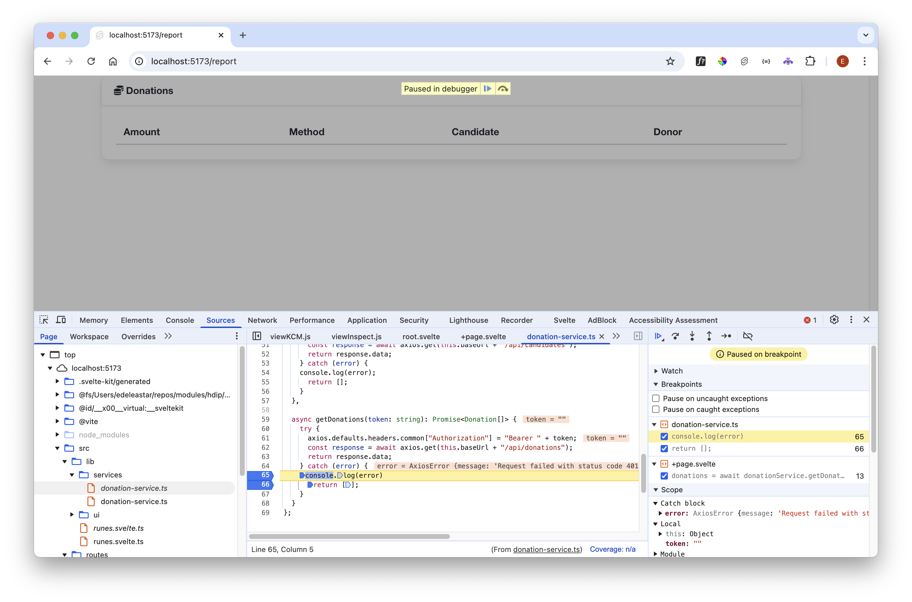

# Session State

With the Svelte app, try the following experiment:

- Log in
- Visit the report view:

- Refresh the page

  

  Our application seems to have failed. We can attempt to debug the app to see what is happening. Open the developer tools and locate the source for the report view:

  

  In the above we have dropped a breakpoint on line 13. Refresh and we hit the breakpoint:

  

  Single stepping forward, we see the source of the problem:

  

  Notice that session is undefined (bottom right of the debug pane above).

  Svelte stores are entirely transient - a page refresh will reset all state, clearing out their contents. We could accept this - asking the user to never refresh! Or we can attempt to somehow cater for this common situation.

  
