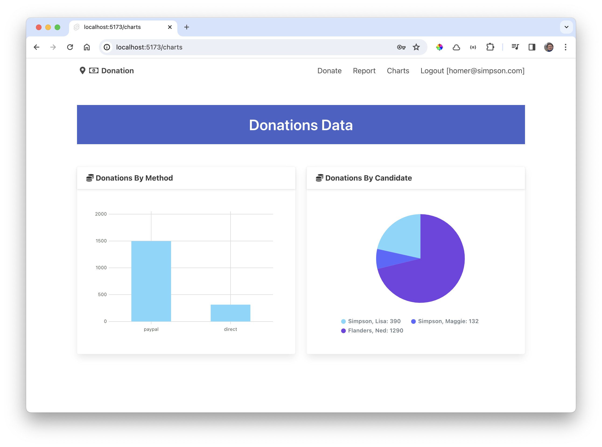

# Donation Utilities

The chart page is becoming complex and continues to have some type errors (which we have turned off). We will refactor the computation of the data set into separate modules. First, define a type for the series data:

### src/lib/types/donation-types.ts

~~~typescript
export interface DataSet {
  labels: string[];
  datasets: [{ values: number[] }];
}
~~~

A new utility module can encapsulate the generation of the Datasets for the chart component:

### src/lib/services/donation-utils.ts

~~~typescript
import type { Candidate, DataSet, Donation } from "$lib/types/donation-types";

export function generateByMethod(donationList: Donation[]): DataSet {
  const totalByMethod: DataSet = {
    labels: ["paypal", "direct"],
    datasets: [
      {
        values: [0, 0]
      }
    ]
  };

  donationList.forEach((donation) => {
    if (donation.method == "paypal") {
      totalByMethod.datasets[0].values[0] += donation.amount;
    } else if (donation.method == "direct") {
      totalByMethod.datasets[0].values[1] += donation.amount;
    }
  });

  return totalByMethod;
}

export function generateByCandidate(donationList: Donation[], candidates: Candidate[]): DataSet {
  const donationsByCandidate: DataSet = {
    labels: [],
    datasets: [
      {
        values: [0, 0]
      }
    ]
  };

  donationsByCandidate.labels = [];
  candidates.forEach((candidate) => {
    donationsByCandidate.labels.push(`${candidate.lastName}, ${candidate.firstName}`);
    donationsByCandidate.datasets[0].values.push(0);
  });

  candidates.forEach((candidate, i) => {
    donationList.forEach((donation) => {
      if (typeof donation.candidate !== "string") {
        if (donation.candidate._id == candidate._id) {
          donationsByCandidate.datasets[0].values[i] += donation.amount;
        }
      }
    });
  });

  return donationsByCandidate;
}
~~~

This allows us to simplify the charts page significantly:

### src/routes/charts/+page.svelte

~~~typescript

  

    <Card title="Donations By Method">
      <Chart data={totalByMethod} type="bar" />
    </Card>
  

  

    <Card title="Donations By Method">
      <Chart data={donationsByCandidate} type="pie" />
    </Card>
  

~~~

The page should work as before:

