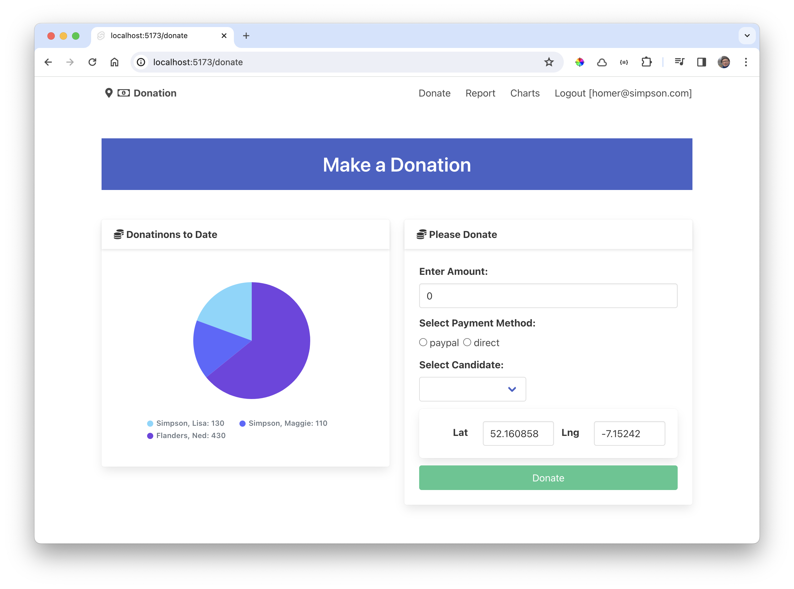

# Donate Route

Now that we have chart components defined, lets replace the table on the Donate page with a chart:

### src/routes/donate/+page.svelte

~~~html

  

    <Card title="Donations to Date">
      <Chart data={donationsByCandidate} type="bar" />
    </Card>
  

  

    <Card title="Please Donate">
      <DonateForm {candidateList} />
    </Card>
  

~~~

Perhaps a bar chart might work better:

~~~html
      <Chart data={data.byCandidate} type="bar" />
~~~

