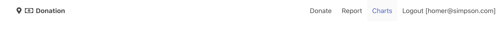
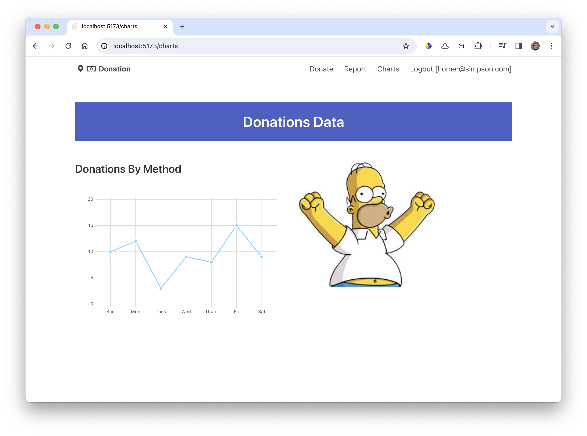

# Charts Page

Introduce an additional menu option:

### src/ui/Menu.svete

~~~html
...
       <a class="navbar-item" href="/charts"> Charts </a>
...
~~~

This is a new page:

### routes/charts/+page.svelte

~~~html

  

    <h1 class="title is-4">Donations to date</h1>
    <Chart data={chartData} type="line" />
  

  

    
  

~~~

The app now displays a simple chart:

