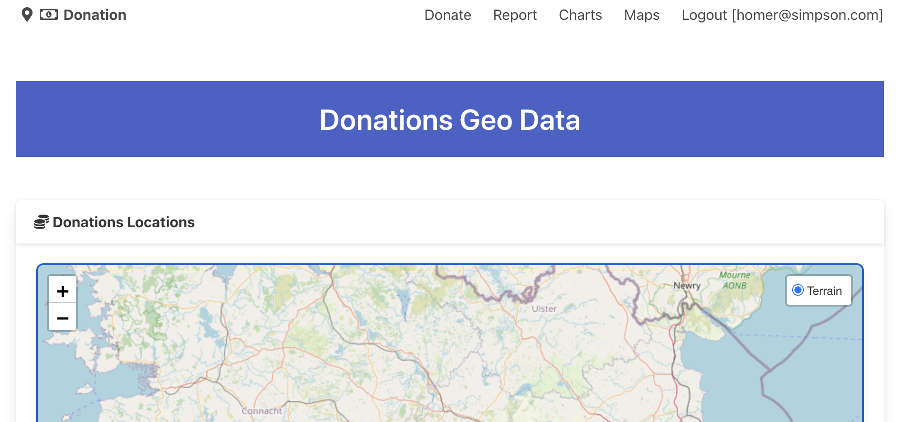

# Layers

We currently have a single layer defined for the map:

### src/lib/ui/LeafletMap.svelte

~~~typescript
    baseLayers = {
      Terrain: L.tileLayer("https://{s}.tile.openstreetmap.org/{z}/{x}/{y}.png", {
        maxZoom: 17,
        attribution:
          'Map data: &copy; <a href="https://www.openstreetmap.org/copyright">OpenStreetMap</a> contributors, <a href="http://viewfinderpanoramas.org">SRTM</a> | Map style: &copy; <a href="https://opentopomap.org">OpenTopoMap</a> (<a href="https://creativecommons.org/licenses/by-sa/3.0/">CC-BY-SA</a>)'
      })
    };
~~~

The name of this layer is visible when we select the layer control on the map:



Introduce an additional layer:

```typescript
    baseLayers = {
      Terrain: L.tileLayer("https://{s}.tile.openstreetmap.org/{z}/{x}/{y}.png", {
        maxZoom: 17,
        attribution:
          'Map data: &copy; <a href="https://www.openstreetmap.org/copyright">OpenStreetMap</a> contributors, <a href="http://viewfinderpanoramas.org">SRTM</a> | Map style: &copy; <a href="https://opentopomap.org">OpenTopoMap</a> (<a href="https://creativecommons.org/licenses/by-sa/3.0/">CC-BY-SA</a>)'
      }),
      Satellite: L.tileLayer("https://server.arcgisonline.com/ArcGIS/rest/services/World_Imagery/MapServer/tile/{z}/{y}/{x}", {
        attribution: "Tiles &copy; Esri &mdash; Source: Esri, i-cubed, USDA, USGS, AEX, GeoEye, Getmapping, Aerogrid, IGN, IGP, UPR-EGP, and the GIS User Community"
      })
    };
```


You can find a range of layers here:

- <https://leaflet-extras.github.io/leaflet-providers/preview/>
