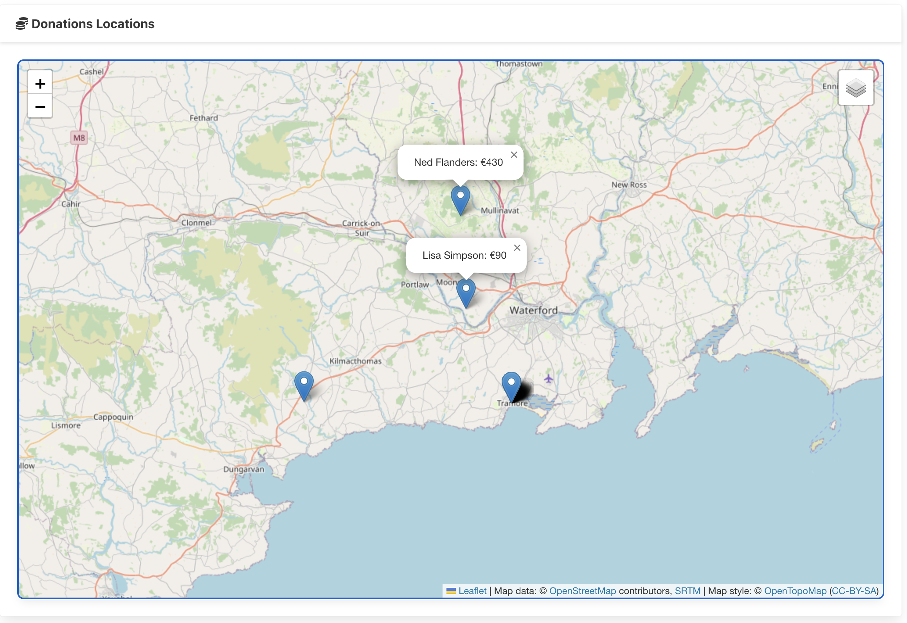

# Popups

Popups can provide additional information on markers

This is a revision of the relevant LeafletMap function:

### src/lib/ui/LeafletMap.svelte

~~~typescript
  export function addMarker(lat: number, lng: number, popupText: string) {
    const marker = L.marker([lat, lng]).addTo(imap);
    const popup = L.popup({ autoClose: false, closeOnClick: false });
    popup.setContent(popupText);
    marker.bindPopup(popup);
  }
~~~

... and we provide the additional text when we add the marker:

### src/routes/maps/+page.svelte

~~~typescript
  onMount(async () => {
    const donations = await donationService.getDonations(get(currentSession));
    donations.forEach((donation: Donation) => {
      if (typeof donation.candidate !== "string") {
        const popup = `${donation.candidate.firstName} ${donation.candidate.lastName}: €${donation.amount}`;
        map.addMarker(donation.lat, donation.lng, popup);
      }
    });
  });
~~~

## MoveTo

To keep the a specific marker in focus, add this method the LeafletMap:

### src/lib/ui/LeafletMap.svelte

~~~typescript
  export function moveTo(lat: number, lng: number) {
    imap.flyTo({ lat: lat, lng: lng });
  }
~~~

Modify the route to invoke this method on the last donation location:

### src/routes/maps/+page.svelte

~~~typescript
  onMount(async () => {
    const donations = await donationService.getDonations(get(currentSession));
    donations.forEach((donation: Donation) => {
      if (typeof donation.candidate !== "string") {
        const popup = `${donation.candidate.firstName} ${donation.candidate.lastName}: €${donation.amount}`;
        map.addMarker(donation.lat, donation.lng, popup);
      }
    });
    const lastDonation = donations[donations.length - 1];
    if (lastDonation) map.moveTo(lastDonation.lat, lastDonation.lng);
  });
~~~

Verify that the map will centre on the last donation added.
