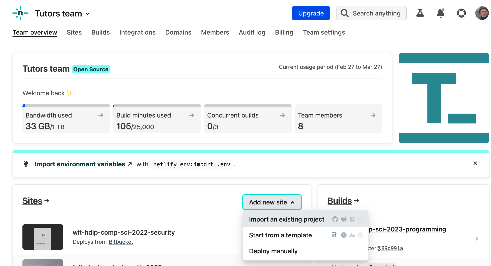

# SvelteKit

Before preparing the Svelte application for deployment, you will need to have donation-hapi deployed. These labs here will guide you through the process:

- <https://reader.tutors.dev/topic/wit-hdip-comp-sci-2-2022-full-stack-1/topic-10-seeding>

Once this app is deployed, and you have a url. Change your app to use this (instead of localhost):

### services/donation-service.svelte

~~~javascript
...
export const donationService = {
	//	baseUrl: "http://localhost:4000",
	baseUrl: "https://YOUR_DONATION_SERVICE_URL",
...  
~~~

Be sure to remove any trailing **'/'** if present.

## Netlify

Netlify have full documentation on SvelteKit deployment:

- <https://docs.netlify.com/integrations/frameworks/sveltekit/>

A successful deployment can usually be accomplished with these three steps:

#### 1: Install adapter

On the command line, enter:

~~~bash
npm install -D @sveltejs/adapter-netlify@next
~~~

#### 2: Configure adapter

Your project already has a svelte.config.js file, we just need to import the adapter we just installed:

##### svelte.config.js

~~~javascript
//import adapter from '@sveltejs/adapter-auto';
import adapter from "@sveltejs/adapter-netlify";
import { vitePreprocess } from "@sveltejs/kit/vite";

/** @type {import('@sveltejs/kit').Config} */
const config = {
	// Consult https://kit.svelte.dev/docs/integrations#preprocessors
	// for more information about preprocessors
	preprocess: vitePreprocess(),

	kit: {
		adapter: adapter()
	}
};

export default config;
~~~

#### 3: Include TOML file

If we include this file in our project, the Netlify will know how to build the app:

##### netlify.toml

~~~toml
[build]
  command = "npm run build"
  publish = "build"
~~~

#### 4: Create Netlify app and link to source repo

Finally, create a new project on Netlify via the 'Add new site' => 'Import an existing project'

The above settings should enable the project to build and deploy successfully. The deployment logs, which are visible every time you deploy, are quite verbose but should look something like this:

~~~bash
5:59:34 PM: Build ready to start
5:59:35 PM: build-image version: 7fd17ad8d79d1952d384fb389d8e787becff0260 (focal)
5:59:35 PM: buildbot version: 7fd17ad8d79d1952d384fb389d8e787becff0260
5:59:36 PM: Fetching cached dependencies
5:59:36 PM: Failed to fetch cache, continuing with build
5:59:36 PM: Starting to prepare the repo for build
5:59:36 PM: No cached dependencies found. Cloning fresh repo
5:59:36 PM: git clone --filter=blob:none https://github.com/wit-hdip-comp-sci-2022/donation-svelte-5
5:59:36 PM: Preparing Git Reference refs/heads/master
5:59:37 PM: Parsing package.json dependencies
5:59:38 PM: Starting build script
5:59:38 PM: Installing dependencies
5:59:38 PM: Python version set to 2.7
5:59:38 PM: v16.19.1 is already installed.
5:59:39 PM: Now using node v16.19.1 (npm v8.19.3)
5:59:39 PM: Enabling Node.js Corepack
5:59:39 PM: Started restoring cached build plugins
5:59:39 PM: Finished restoring cached build plugins
5:59:39 PM: Attempting Ruby version 2.7.2, read from environment
5:59:39 PM: Using Ruby version 2.7.2
5:59:39 PM: Using PHP version 8.0
5:59:39 PM: Started restoring cached corepack dependencies
5:59:39 PM: Finished restoring cached corepack dependencies
5:59:39 PM: No npm workspaces detected
5:59:39 PM: Started restoring cached node modules
5:59:39 PM: Finished restoring cached node modules
5:59:40 PM: Installing npm packages using npm version 8.19.3
5:59:43 PM: added 221 packages, and audited 222 packages in 3s
5:59:43 PM: 43 packages are looking for funding
5:59:43 PM:   run `npm fund` for details
5:59:43 PM: 2 high severity vulnerabilities
5:59:43 PM: To address all issues, run:
5:59:43 PM:   npm audit fix
5:59:43 PM: Run `npm audit` for details.
5:59:43 PM: npm packages installed
5:59:43 PM: Started restoring cached go cache
5:59:43 PM: Finished restoring cached go cache
5:59:43 PM: go version go1.19.7 linux/amd64
5:59:43 PM: Detected 1 framework(s)
5:59:43 PM: "svelte-kit" at version "1.2.3"
5:59:43 PM: Section completed: initializing
5:59:45 PM: ​
5:59:45 PM:   Netlify Build                                                 
5:59:45 PM: ────────────────────────────────────────────────────────────────
5:59:45 PM: ​
5:59:45 PM: ❯ Version
5:59:45 PM:   @netlify/build 29.6.4
5:59:45 PM: ​
5:59:45 PM: ❯ Flags
5:59:45 PM:   baseRelDir: true
5:59:45 PM:   buildId: 640a1e86c0875b0d2f14fdbb
5:59:45 PM:   deployId: 640a1e86c0875b0d2f14fdbd
5:59:45 PM: ​
5:59:45 PM: ❯ Current directory
5:59:45 PM:   /opt/build/repo
5:59:45 PM: ​
5:59:45 PM: ❯ Config file
5:59:45 PM:   /opt/build/repo/netlify.toml
5:59:45 PM: ​
5:59:45 PM: ❯ Context
5:59:45 PM:   production
5:59:45 PM: ​
5:59:45 PM:   1. build.command from netlify.toml                            
5:59:45 PM: ────────────────────────────────────────────────────────────────
5:59:45 PM: ​
5:59:45 PM: $ npm run build
5:59:45 PM: > donation-svelte@0.5.0 build
5:59:45 PM: > vite build
5:59:46 PM: vite v4.0.4 building for production...
5:59:46 PM: transforming...
5:59:47 PM: ✓ 118 modules transformed.
5:59:47 PM: 5:59:47 PM [vite-plugin-svelte] dom compile done.
5:59:47 PM: package        	files	 time	   avg
5:59:47 PM: donation-svelte	   24	0.42s	17.3ms
5:59:48 PM: rendering chunks...
5:59:48 PM: vite v4.0.4 building SSR bundle for production...
5:59:48 PM: transforming...
5:59:48 PM: ✓ 69 modules transformed.
5:59:48 PM: 5:59:48 PM [vite-plugin-svelte] ssr compile done.
5:59:48 PM: package        	files	  time	  avg
5:59:48 PM: donation-svelte	   24	68.7ms	2.9ms
5:59:48 PM: rendering chunks...
5:59:48 PM: .svelte-kit/output/server/vite-manifest.json                     4.10 kB
5:59:48 PM: .svelte-kit/output/server/chunks/stores.js                       0.18 kB
5:59:48 PM: .svelte-kit/output/server/internal.js                            0.20 kB
5:59:48 PM: .svelte-kit/output/server/entries/pages/_layout.svelte.js        0.27 kB
5:59:48 PM: .svelte-kit/output/server/entries/pages/logout/_page.svelte.js   0.45 kB
5:59:48 PM: .svelte-kit/output/server/chunks/WelcomeNavigator.js             0.52 kB
5:59:48 PM: .svelte-kit/output/server/entries/fallbacks/error.svelte.js      0.83 kB
5:59:48 PM: .svelte-kit/output/server/entries/pages/_page.svelte.js          0.86 kB
5:59:48 PM: .svelte-kit/output/server/chunks/MainNavigator.js                0.92 kB
5:59:48 PM: .svelte-kit/output/server/chunks/index.js                        1.32 kB
5:59:48 PM: .svelte-kit/output/server/entries/pages/map/_page.svelte.js      1.37 kB
5:59:48 PM: .svelte-kit/output/server/entries/pages/charts/_page.svelte.js   1.38 kB
5:59:48 PM: .svelte-kit/output/server/entries/pages/report/_page.svelte.js   1.51 kB
5:59:48 PM: .svelte-kit/output/server/entries/pages/login/_page.svelte.js    1.64 kB
5:59:48 PM: .svelte-kit/output/server/chunks/Header.js                       1.66 kB
5:59:48 PM: .svelte-kit/output/server/entries/pages/signup/_page.svelte.js   2.29 kB
5:59:48 PM: .svelte-kit/output/server/chunks/donation-service.js             2.30 kB
5:59:48 PM: .svelte-kit/output/server/chunks/index2.js                       3.78 kB
5:59:48 PM: .svelte-kit/output/server/entries/pages/donate/_page.svelte.js   3.79 kB
5:59:48 PM: .svelte-kit/output/server/chunks/server-internal.js              4.64 kB
5:59:48 PM: .svelte-kit/output/server/chunks/DonationsByCandidate.js         4.81 kB
5:59:48 PM: .svelte-kit/output/server/index.js                              77.67 kB
5:59:49 PM: Run npm run preview to preview your production build locally.
5:59:49 PM: computing gzip size...
5:59:49 PM: .svelte-kit/output/client/_app/version.json                                                  0.03 kB
5:59:49 PM: .svelte-kit/output/client/vite-manifest.json                                                 8.24 kB
5:59:49 PM: .svelte-kit/output/client/_app/immutable/assets/leaflet-src-11c63404.css                    15.59 kB │ gzip:  6.45 kB
5:59:49 PM: .svelte-kit/output/client/_app/immutable/chunks/1-35d66e3d.js                                0.09 kB │ gzip:  0.10 kB
5:59:49 PM: .svelte-kit/output/client/_app/immutable/chunks/2-1c3826b0.js                                0.10 kB │ gzip:  0.10 kB
5:59:49 PM: .svelte-kit/output/client/_app/immutable/chunks/0-fe887393.js                                0.10 kB │ gzip:  0.10 kB
5:59:49 PM: .svelte-kit/output/client/_app/immutable/chunks/7-485445be.js                                0.10 kB │ gzip:  0.10 kB
5:59:49 PM: .svelte-kit/output/client/_app/immutable/chunks/5-17f8dda4.js                                0.10 kB │ gzip:  0.11 kB
5:59:49 PM: .svelte-kit/output/client/_app/immutable/chunks/9-1347d4ba.js                                0.10 kB │ gzip:  0.11 kB
5:59:49 PM: .svelte-kit/output/client/_app/immutable/chunks/6-f7a99c78.js                                0.10 kB │ gzip:  0.11 kB
5:59:49 PM: .svelte-kit/output/client/_app/immutable/chunks/3-336a060d.js                                0.10 kB │ gzip:  0.10 kB
5:59:49 PM: .svelte-kit/output/client/_app/immutable/chunks/4-af693d8f.js                                0.10 kB │ gzip:  0.11 kB
5:59:49 PM: .svelte-kit/output/client/_app/immutable/chunks/8-5824ac4f.js                                0.10 kB │ gzip:  0.10 kB
5:59:49 PM: .svelte-kit/output/client/_app/immutable/chunks/stores-a8ada72b.js                           0.10 kB │ gzip:  0.11 kB
5:59:49 PM: .svelte-kit/output/client/_app/immutable/chunks/navigation-da660b06.js                       0.20 kB │ gzip:  0.16 kB
5:59:49 PM: .svelte-kit/output/client/_app/immutable/components/pages/logout/_page.svelte-b161402f.js    0.32 kB │ gzip:  0.23 kB
5:59:49 PM: .svelte-kit/output/client/_app/immutable/components/pages/_layout.svelte-debb9f00.js         0.81 kB │ gzip:  0.52 kB
5:59:49 PM: .svelte-kit/output/client/_app/immutable/chunks/WelcomeNavigator-21ff7837.js                 0.97 kB │ gzip:  0.52 kB
5:59:49 PM: .svelte-kit/output/client/_app/immutable/components/error.svelte-56a185d9.js                 0.98 kB │ gzip:  0.58 kB
5:59:49 PM: .svelte-kit/output/client/_app/immutable/components/pages/_page.svelte-34dcb404.js           1.77 kB │ gzip:  0.91 kB
5:59:49 PM: .svelte-kit/output/client/_app/immutable/chunks/MainNavigator-3ad43021.js                    1.80 kB │ gzip:  0.76 kB
5:59:49 PM: .svelte-kit/output/client/_app/immutable/chunks/singletons-b7296633.js                       2.16 kB │ gzip:  1.15 kB
5:59:49 PM: .svelte-kit/output/client/_app/immutable/components/pages/charts/_page.svelte-51ffbc82.js    2.65 kB │ gzip:  1.20 kB
5:59:49 PM: .svelte-kit/output/client/_app/immutable/chunks/Header-7f4912a4.js                           3.30 kB │ gzip:  1.46 kB
5:59:49 PM: .svelte-kit/output/client/_app/immutable/components/pages/map/_page.svelte-d1977746.js       3.85 kB │ gzip:  1.85 kB
5:59:49 PM: .svelte-kit/output/client/_app/immutable/components/pages/report/_page.svelte-a95194b3.js    4.24 kB │ gzip:  1.82 kB
5:59:49 PM: .svelte-kit/output/client/_app/immutable/components/pages/login/_page.svelte-7bfd7ea8.js     4.28 kB │ gzip:  1.84 kB
5:59:49 PM: .svelte-kit/output/client/_app/immutable/components/pages/signup/_page.svelte-c3995569.js    5.73 kB │ gzip:  2.26 kB
5:59:49 PM: .svelte-kit/output/client/_app/immutable/chunks/index-9b095d42.js                            8.31 kB │ gzip:  3.36 kB
5:59:49 PM: .svelte-kit/output/client/_app/immutable/components/pages/donate/_page.svelte-9da8d912.js    8.73 kB │ gzip:  3.43 kB
5:59:49 PM: .svelte-kit/output/client/_app/immutable/chunks/donation-service-91207297.js                29.58 kB │ gzip: 11.67 kB
5:59:49 PM: .svelte-kit/output/client/_app/immutable/start-f7160cd1.js                                  29.61 kB │ gzip: 10.98 kB
5:59:49 PM: .svelte-kit/output/client/_app/immutable/chunks/DonationsByCandidate-4ffd6a9b.js            80.03 kB │ gzip: 19.89 kB
5:59:49 PM: .svelte-kit/output/client/_app/immutable/chunks/leaflet-src-e518801b.js                    148.78 kB │ gzip: 43.02 kB
5:59:49 PM: 
5:59:49 PM: > Using @sveltejs/adapter-netlify
5:59:49 PM:   ✔ done
5:59:49 PM: ​
5:59:49 PM: (build.command completed in 3.9s)
5:59:49 PM: ​
5:59:49 PM:   2. Functions bundling                                         
5:59:49 PM: ────────────────────────────────────────────────────────────────
5:59:49 PM: ​
5:59:49 PM: Packaging Functions from .netlify/functions-internal directory:
5:59:49 PM:  - render.mjs
5:59:49 PM: ​
5:59:50 PM: ​
5:59:50 PM: (Functions bundling completed in 835ms)
5:59:50 PM: ​
5:59:50 PM:   3. Deploy site                                                
5:59:50 PM: ────────────────────────────────────────────────────────────────
5:59:50 PM: ​
5:59:50 PM: Starting to deploy site from 'build'
5:59:50 PM: Calculating files to upload
5:59:50 PM: 2 new files to upload
5:59:50 PM: 1 new functions to upload
5:59:56 PM: Section completed: deploying
5:59:56 PM: Site deploy was successfully initiated
5:59:56 PM: ​
5:59:56 PM: (Deploy site completed in 6.7s)
5:59:56 PM: Starting post processing
5:59:56 PM: ​
5:59:56 PM:   Netlify Build Complete                                        
5:59:56 PM: ────────────────────────────────────────────────────────────────
5:59:57 PM: Post processing - HTML
5:59:56 PM: ​
5:59:56 PM: (Netlify Build completed in 11.5s)
5:59:57 PM: Caching artifacts
5:59:57 PM: Started saving node modules
5:59:57 PM: Post processing - header rules
5:59:57 PM: Finished saving node modules
5:59:57 PM: Started saving build plugins
5:59:57 PM: Finished saving build plugins
5:59:57 PM: Post processing - redirect rules
5:59:57 PM: Started saving corepack cache
5:59:57 PM: Finished saving corepack cache
5:59:57 PM: Started saving pip cache
5:59:57 PM: Finished saving pip cache
5:59:57 PM: Started saving emacs cask dependencies
5:59:57 PM: Finished saving emacs cask dependencies
5:59:57 PM: Started saving maven dependencies
5:59:57 PM: Post processing done
5:59:57 PM: Finished saving maven dependencies
5:59:57 PM: Started saving boot dependencies
5:59:57 PM: Finished saving boot dependencies
5:59:57 PM: Section completed: postprocessing
5:59:57 PM: Started saving rust rustup cache
5:59:57 PM: Finished saving rust rustup cache
5:59:57 PM: Started saving go dependencies
5:59:57 PM: Finished saving go dependencies
5:59:57 PM: Build script success
5:59:57 PM: Section completed: building
5:59:58 PM: Uploading Cache of size 93.2MB
5:59:58 PM: Site is live ✨
5:59:58 PM: Section completed: cleanup
5:59:58 PM: Finished processing build request in 22.955s
~~~

