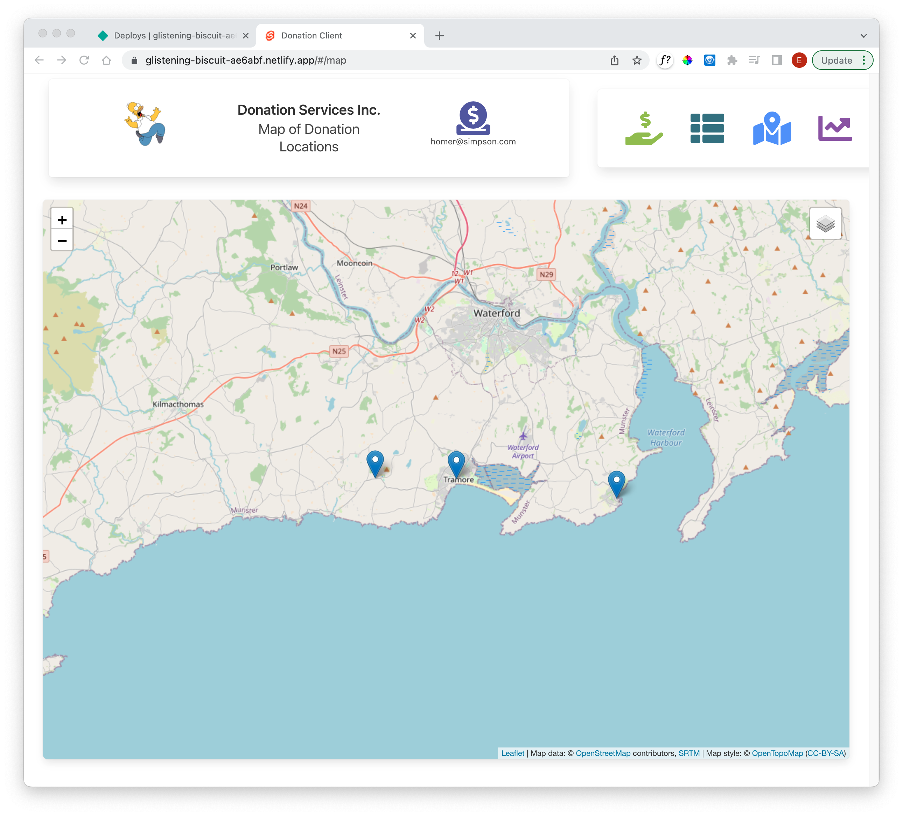

# Leaflet Deployment Fix

On the deployed app, the leaflet map seems to malfunction when deployed as it cannot seem to find its marker assets:

 We will workaround this by moving some of the leaflet assets directly into our application. This will involve the following steps:

- Copy the leaflet image assets (the markers) into our application's public folder
- Copy leaflet.css into our public folder
- Override the leaflet.css include to load from our application

### Leaflet  Assets

These can be located in the node_modules folder:

Copy the dist/images folder + leaflet.css directly into the **static** folder in the project:

Currently, we import the leaflet css directly in the DonatonMap component:

### DonationMap.svelte

~~~html
<script>
  import 'leaflet/dist/leaflet.css';
~~~

Remove this now:

~~~html
<script>
  // import 'leaflet/dist/leaflet.css';
~~~

Then in app.html, explicitly include the leaflet.css file in the head section:

~~~html
	<link rel="stylesheet" href="/leaflet.css">
~~~

Before deploying, make sure to rebuild the app:

~~~bash
npm run build
~~~

Deploy the app again, verifying that the map markers appear correctly:

