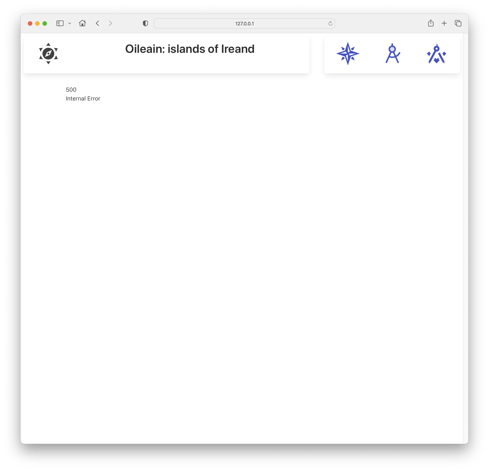

# Layout, Header, Map

Introduce the following component into a new 'lib' folder:

### lib/Header.svelte

~~~html

	

		

			

				<Icon icon="mdi:sun-compass" width="64" />
			

			

				
Oileain: islands of Ireand

			

		

	

	

		

			<a href="/" class="column">
				<Icon icon="mdi:compass-rose" width="64" />
			</a>
			<a href="/explorer" class="column">
				<Icon icon="ph:compass-tool-duotone" width="64" />
			</a>
			<a href="/navigator/Great-Saltee-Island" class="column">
				<Icon icon="mdi:ruler-square-compass" width="64" />
			</a>
		

	

~~~

This is a new main layout:

### Routes/+layout.svelte

~~~html

<Header />

	

		

			<slot />
		

	

~~~

Place a map on the home page:

### Routes/+page.svelte

~~~html

<LeafletMap height={85} />
~~~

You may notice that the first time the page loads you may get an error:

Pressing the first icon will load the page correctly. The reason for the initial error is related to Server Side Rendering (SSR), which will not be feasible (on the first attempt) with SSR enabled. The error is from leaflet - which is expecting a live browser environment when it loads:

~~~bash
ReferenceError: window is not defined
~~~

To fix this, introduce the following

### routes/+page.ts

~~~typescript
export const ssr = false;
~~~

This disables SSR for the home page.