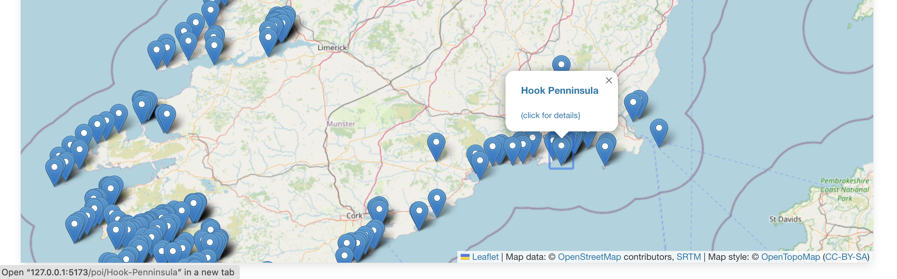
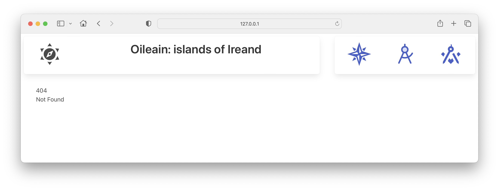

# Home page

We would like to display a marker for each island in the API:

In SvelteKit, we can load data (from a database or an API) in the page endpoint:

- +page.ts

This demonstrates the separation of concerns principle in action, with the accompanying +page.svelte now focused solely on rendering the display. Try this:

### routes/+page.ts

~~~typescript
import type { PageLoad } from "./$types";
import { oileainService } from "../services/oileain-service";
export const ssr = false;

export const load: PageLoad = async ({ params }) => {
	await oileainService.getCoasts();
	return {
		markerLayers: oileainService.markerLayers
	};
};
~~~

This module defines a load function, whose task is to load/fetch information for the accompanying view. If first requests all coastal data:

~~~type
	await oileainService.getCoasts();
~~~

And then returns the markerLayers, which should be initialised now by getCoasts():

~~~typescript
	return {
		markerLayers: oileainService.markerLayers
	};
~~~

Rework the view now like this:

### routes/+page.svelte

~~~html

<LeafletMap height={85} markerLayers={data.markerLayers} />
~~~

Here we are able to access the information returned from the load function via the 'data' object.

~~~html
<LeafletMap height={85} markerLayers={data.markerLayers} />
~~~

The map should display a marker for all island now.

If you click on a marker, you will see a popup:

This will display a panel, which has a link - for example:

~~~bash
http://127.0.0.1:5173/poi/Hook-Penninsula
~~~

This will not load at the moment:

