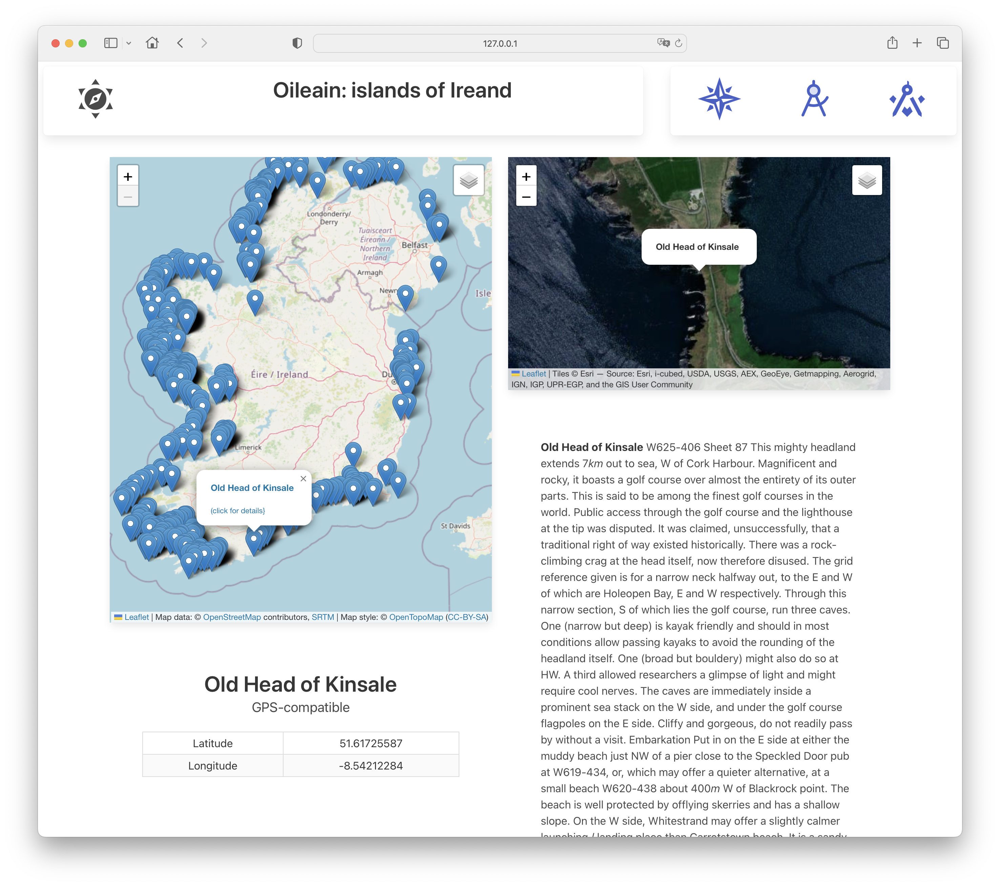
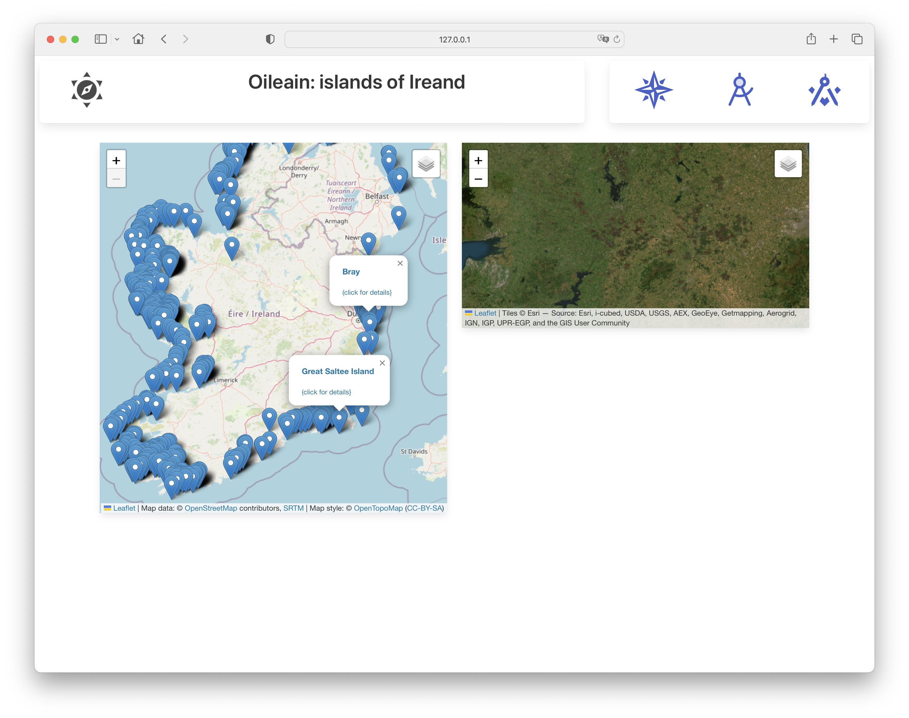

# Explorer

We call this the 'Explorer' view -

It shows the map of all islands on the left. Clicking on a marker will cause the island details to appear on the right.

First, a new component to display just the latitude/longitude:

### lib/IslandLatLng.svelte

~~~html

<section class="section">
	<h1 class="title">{@html island.name}</h1>
	<h2 class="subtitle">GPS-compatible</h2>
	

		<table class="table is-bordered is-striped is-narrow is-hoverable is-fullwidth">
			<tbody>
				<tr>
					<td>Latitude</td>
					<td>{island.coordinates.geo.lat}</td>
				</tr>
				<tr>
					<td>Longitude</td>
					<td>{island.coordinates.geo.long}</td>
				</tr>
			</tbody>
		</table>
	

</section>
~~~

Define the new route/page:

### routes/explorer/+page.ts

~~~typescript
import type { PageLoad } from "./$types";
import { oileainService } from "../../services/oileain-service";
export const ssr = false;

export const load: PageLoad = async ({ params }) => {
	await oileainService.getCoasts();
	return {
		markerLayers: oileainService.markerLayers
	};
};
~~~

This will retrieve all coasts

### routes/explorer/page.svelte

~~~html

	

		<LeafletMap id="map-main" zoom={7} height={60} markerLayers={data.markerLayers} />
		{#if island}
			<IslandLatLng {island} />
		{/if}
	

	

		<LeafletMap id="map-secondary" height={30} activeLayer="Satellite" />
		{#if island}
			<IslandDescription {island} />
		{/if}
	

~~~

This version does not respond to marker selects yet, just displaying the all Ireland map:

- http://127.0.0.1:5173/explorer

Click on the link within a popup should take you to the Point of Interest page however, but but just clicking on the markers has no effect.

This version of the page should now have the markers operational:

### routes/explores/+page.svelte

~~~html

	

		<LeafletMap id="map-main" zoom={7} height={60} markerLayers={data.markerLayers} />
		{#if island}
			<IslandLatLng {island} />
		{/if}
	

	

		<LeafletMap id="map-secondary" height={30} activeLayer="Satellite" bind:this={navigator} />
		{#if island}
			<IslandDescription {island} />
		{/if}
	

~~~

In this above, we listen for marker select events, navigating the right hand leaflet map to the selected island when a event is detected.

