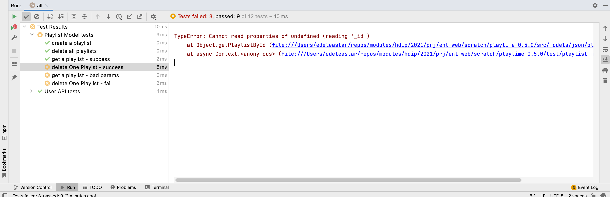

# Exercise 2

Using the users tests as an example, devise a set of tests for the playlist datastore.

## Solution

First we expand the fixtures to include some test playlists:

### fixtures.js

~~~javascript
export const maggie = {
  firstName: "Maggie",
  lastName: "Simpson",
  email: "maggie@simpson.com",
  password: "secret"
};

export const testUsers = [
  {
    firstName: "Homer",
    lastName: "Simpson",
    email: "homer@simpson.com",
    password: "secret"
  },
  {
    firstName: "Marge",
    lastName: "Simpson",
    email: "marge@simpson.com",
    password: "secret"
  },
  {
    firstName: "Bart",
    lastName: "Simpson",
    email: "bart@simpson.com",
    password: "secret"
  }
];

export const mozart = {
  title: "Mozart Favourites"
};

export const testPlaylists = [
  {
    title: "Beethoven Sonatas"
  },
  {
    title: "Beethoven Concertos"
  },
  {
    title: "Beethoven Symphonies"
  }
];
~~~

Here is a set of tests for Playlists - largely based on the approach used to test users in the last lab:

### playlist-model-test.js

~~~javascript
import { assert } from "chai";
import { db } from "../src/models/db.js";
import { testPlaylists, mozart } from "./fixtures.js";

suite("Playlist Model tests", () => {

  setup(async () => {
    db.init("json");
    await db.playlistStore.deleteAllPlaylists();
    for (let i = 0; i < testPlaylists.length; i += 1) {
      // eslint-disable-next-line no-await-in-loop
      testPlaylists[i] = await db.playlistStore.addPlaylist(testPlaylists[i]);
    }
  });

  test("create a playlist", async () => {
    const playlist = await db.playlistStore.addPlaylist(mozart);
    assert.equal(mozart, playlist);
    assert.isDefined(playlist._id);
  });

  test("delete all playlists", async () => {
    let returnedPlaylists = await db.playlistStore.getAllPlaylists();
    assert.equal(returnedPlaylists.length, 3);
    await db.playlistStore.deleteAllPlaylists();
    returnedPlaylists = await db.playlistStore.getAllPlaylists();
    assert.equal(returnedPlaylists.length, 0);
  });

  test("get a playlist - success", async () => {
    const playlist = await db.playlistStore.addPlaylist(mozart);
    const returnedPlaylist = await db.playlistStore.getPlaylistById(playlist._id);
    assert.equal(mozart, playlist);
  });

  test("delete One Playist - success", async () => {
    const id = testPlaylists[0]._id;
    await db.playlistStore.deletePlaylistById(id);
    const returnedPlaylists = await db.playlistStore.getAllPlaylists();
    assert.equal(returnedPlaylists.length, testPlaylists.length - 1);
    const deletedPlaylist = await db.playlistStore.getPlaylistById(id);
    assert.isNull(deletedPlaylist);
  });

  test("get a playlist - bad params", async () => {
    assert.isNull(await db.playlistStore.getPlaylistById(""));
    assert.isNull(await db.playlistStore.getPlaylistById());
  });

  test("delete One Playlist - fail", async () => {
    await db.playlistStore.deletePlaylistById("bad-id");
    const allPlaylists = await db.playlistStore.getAllPlaylists();
    assert.equal(testPlaylists.length, allPlaylists.length);
  });
});
~~~

However, a number of tests will fail:

The failing tests have usefully surfaced some bugs in playlist-json-store. 

## Playlist Model Test Failures

#### delete One Playlist - fail

This test failure is the result of a bug in `deletePlaylistById()`

~~~javascript
  async deletePlaylistById(id) {
    await db.read();
    const index = db.data.playlists.findIndex((playlist) => playlist._id === id);
    db.data.playlists.splice(index, 1);
    await db.write();
  },
~~~

Contrast this implementation with the current version. This fixes some of the tests.

To have all the test pass, one more fix to playlistJsonStore is needed:

~~~javascript
  async deletePlaylistById(id) {
    await db.read();
    const index = db.data.playlists.findIndex((playlist) => playlist._id === id);
    if (index !== -1) db.data.playlists.splice(index, 1);
    await db.write();
  },
~~~

#### delete One Playlist - Success

This test is failing because of a bug in the getPlaylistById method:

~~~javascript
  async getPlaylistById(id) {
    await db.read();
    const list = db.data.playlists.find((playlist) => playlist._id === id);
    list.tracks = await trackJsonStore.getTracksByPlaylistId(list._id);
    return list;
  },
~~~

This is a revision:

~~~javascript
  async getPlaylistById(id) {
    await db.read();
    let list = db.data.playlists.find((playlist) => playlist._id === id);
    if (list) {
      list.tracks = await trackJsonStore.getTracksByPlaylistId(list._id);
    } else {
      list = null;
    }
    return list;
  },
~~~

Can you see the bug in the first version?

All tests Playlist Model Tests should pass now. 

### track-mem-store.js

Although we do not have any tests for this object yet, we can surmise some error like those above lurk in here as well. Compare these methods with the current ones:

~~~javascript
  async getTrackById(id) {
    let foundTrack = tracks.find((track) => track._id === id);
    if (!foundTrack) {
      foundTrack = null;
    }
    return foundTrack;
  },

  async getPlaylistTracks(playlistId) {
    let foundTracks = tracks.filter((track) => track.playlistid === playlistId);
    if (!foundTracks) {
      foundTracks = null;
    }
    return foundTracks;
  },

  async deleteTrack(id) {
    const index = tracks.findIndex((track) => track._id === id);
    if (index !== -1) tracks.splice(index, 1);
  },
~~~

Replace with the above now.

### track-json-store.js

A similar set of errors are in our current track json implementation. Here is a replacement to fix these:

~~~javascript
import { v4 } from "uuid";
import { db } from "./store-utils.js";

export const trackJsonStore = {
  async getAllTracks() {
    await db.read();
    return db.data.tracks;
  },

  async addTrack(playlistId, track) {
    await db.read();
    track._id = v4();
    track.playlistid = playlistId;
    db.data.tracks.push(track);
    await db.write();
    return track;
  },

  async getTracksByPlaylistId(id) {
    await db.read();
    let foundTracks = db.data.tracks.filter((track) => track.playlistid === id);
    if (!foundTracks) {
      foundTracks = null;
    }
    return foundTracks;
  },

  async getTrackById(id) {
    await db.read();
    let foundTrack = db.data.tracks.find((track) => track._id === id);
    if (!foundTrack) {
      foundTrack = null;
    }
    return foundTrack;
  },

  async getPlaylistTracks(playlistId) {
    await db.read();
    let foundTracks = tracks.filter((track) => track.playlistid === playlistId);
    if (!foundTracks) {
      foundTracks = null;
    }
    return foundTracks;
  },

  async deleteTrack(id) {
    await db.read();
    const index = db.data.tracks.findIndex((track) => track._id === id);
    if (index !== -1) db.data.tracks.splice(index, 1);
    await db.write();
  },

  async deleteAllTracks() {
    db.data.tracks = [];
    await db.write();
  },

  async updateTrack(track, updatedTrack) {
    track.title = updatedTrack.title;
    track.artist = updatedTrack.artist;
    track.duration = updatedTrack.duration;
    await db.write();
  },
};
~~~

