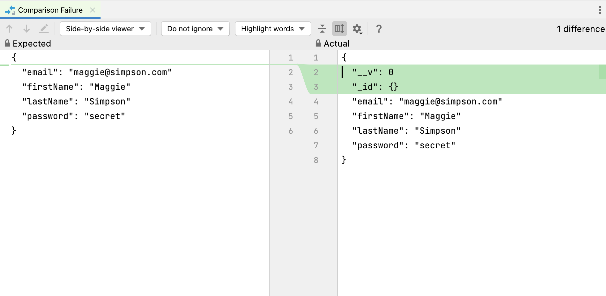

# User Tests

This should be the failure report:

Looking deeper:

The reason for the failure is this assertion:

~~~javascript
    assert.equal(newUser, maggie);
~~~

Mongo generated additional fields + the `_id` is structured differently.

We would still like to assert that the original fields are there, ignoring the additional fields, i.e. an assertion that test for a subset/superset relationship. This will allow us to continue to test the stores comprehensively - although we will need to modify some of the tests with this new assertion.

Here is a new module - with a new function to implement this type assertion:

#### test-utils.js

~~~javascript
export function assertSubset(subset, superset) {
  if (typeof superset !== "object" || superset === null || typeof subset !== "object" || subset === null) return false;

  if (superset instanceof Date || subset instanceof Date) return superset.valueOf() === subset.valueOf();

  return Object.keys(subset).every((key) => {
    // eslint-disable-next-line no-prototype-builtins
    if (!superset.propertyIsEnumerable(key)) return false;
    const subsetItem = subset[key];
    const supersetItem = superset[key];
    if (typeof subsetItem === "object" && subsetItem !== null ? !assertSubset(supersetItem, subsetItem) : supersetItem !== subsetItem) return false;

    return true;
  });
}
~~~

There is no need to understand the behaviour of this method for the moment.

### users-model-test.js

In the user mode tests, replace the assertion:

~~~javascript
    assert.equal(newUser, maggie);
~~~

with

~~~javascript
import { assertSubset } from "./test-utils.js";
...

    assertSubset(maggie, newUser);
~~~

The "create a new user" test should now pass.

### delete One User - success

The "delete One User - success" test fails because users in the `testUsers` fixture do not possess the `_id` attribute, causing `undefined` to be passed to the `deleteUserById` method instead of a valid user ID.

The test suite's `setup` function can be modified to set each user in the `testUsers` array to the object returned from the `addUser` method, which will include additional attributes generated by Mongo, including each user's `_id`:

~~~javascript
...
for (let i = 0; i < testUsers.length; i += 1) {
  // eslint-disable-next-line no-await-in-loop
  testUsers[i] = await db.userStore.addUser(testUsers[i]);
}
...
~~~

All user tests should now pass. This is the complete users test suite:

~~~javascript
import { assert } from "chai";
import { db } from "../src/models/db.js";
import { maggie, testUsers } from "./fixtures.js";
import { assertSubset } from "./test-utils.js";

suite("User Model tests", () => {

  setup(async () => {
    db.init("mongo");
    await db.userStore.deleteAll();
    for (let i = 0; i < testUsers.length; i += 1) {
      // eslint-disable-next-line no-await-in-loop
      testUsers[i] = await db.userStore.addUser(testUsers[i]);
    }
  });

  test("create a user", async () => {
    const newUser = await db.userStore.addUser(maggie);
    assertSubset(maggie, newUser);
  });

  test("delete all users", async () => {
    let returnedUsers = await db.userStore.getAllUsers();
    assert.equal(returnedUsers.length, 3);
    await db.userStore.deleteAll();
    returnedUsers = await db.userStore.getAllUsers();
    assert.equal(returnedUsers.length, 0);
  });

  test("get a user - success", async () => {
    const user = await db.userStore.addUser(maggie);
    const returnedUser1 = await db.userStore.getUserById(user._id);
    assert.deepEqual(user, returnedUser1);
    const returnedUser2 = await db.userStore.getUserByEmail(user.email);
    assert.deepEqual(user, returnedUser2);
  });

  test("delete One User - success", async () => {
    await db.userStore.deleteUserById(testUsers[0]._id);
    const returnedUsers = await db.userStore.getAllUsers();
    assert.equal(returnedUsers.length, testUsers.length - 1);
    const deletedUser = await db.userStore.getUserById(testUsers[0]._id);
    assert.isNull(deletedUser);
  });

  test("get a user - bad params", async () => {
    assert.isNull(await db.userStore.getUserByEmail(""));
    assert.isNull(await db.userStore.getUserById(""));
    assert.isNull(await db.userStore.getUserById());
  });

  test("delete One User - fail", async () => {
    await db.userStore.deleteUserById("bad-id");
    const allUsers = await db.userStore.getAllUsers();
    assert.equal(testUsers.length, allUsers.length);
  });
});
~~~

