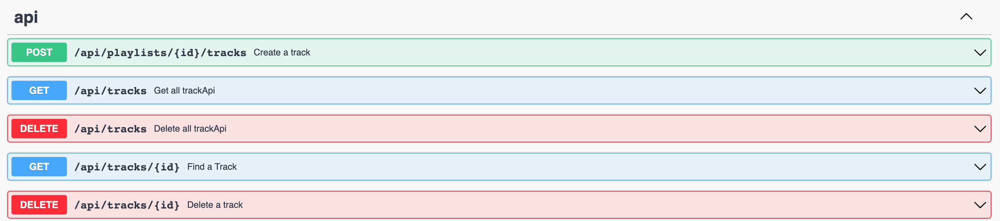
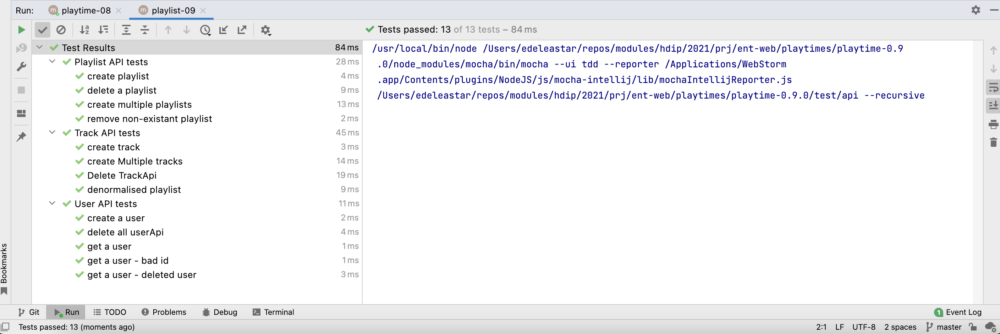

# Track & Playlist Schema

Applying the same approach we used for User with Track:

~~~javascript
export const TrackSpec = Joi.object()
  .keys({
    title: Joi.string().required().example("Piano Sonata No. 7"),
    artist: Joi.string().required().example("Beethoven"),
    duration: Joi.number().allow("").optional().example(12),
    playlistid: IdSpec,
  })
  .label("Track");

export const TrackSpecPlus = TrackSpec.keys({
  _id: IdSpec,
  __v: Joi.number(),
}).label("TrackPlus");

export const TrackArraySpec = Joi.array().items(TrackSpecPlus).label("TrackArray");
~~~

This is the annotated track API:

~~~javascript
import Boom from "@hapi/boom";
import { db } from "../models/db.js";
import { IdSpec, TrackSpec, TrackSpecPlus, TrackArraySpec } from "../models/joi-schemas.js";
import { validationError } from "./logger.js";

export const trackApi = {
  find: {
    auth: false,
    handler: async function (request, h) {
      try {
        const tracks = await db.trackStore.getAllTracks();
        return tracks;
      } catch (err) {
        return Boom.serverUnavailable("Database Error");
      }
    },
    tags: ["api"],
    response: { schema: TrackArraySpec, failAction: validationError },
    description: "Get all trackApi",
    notes: "Returns all trackApi",
  },

  findOne: {
    auth: false,
    async handler(request) {
      try {
        const track = await db.trackStore.getTrackById(request.params.id);
        if (!track) {
          return Boom.notFound("No track with this id");
        }
        return track;
      } catch (err) {
        return Boom.serverUnavailable("No track with this id");
      }
    },
    tags: ["api"],
    description: "Find a Track",
    notes: "Returns a track",
    validate: { params: { id: IdSpec }, failAction: validationError },
    response: { schema: TrackSpecPlus, failAction: validationError },
  },

  create: {
    auth: false,
    handler: async function (request, h) {
      try {
        const track = await db.trackStore.addTrack(request.params.id, request.payload);
        if (track) {
          return h.response(track).code(201);
        }
        return Boom.badImplementation("error creating track");
      } catch (err) {
        return Boom.serverUnavailable("Database Error");
      }
    },
    tags: ["api"],
    description: "Create a track",
    notes: "Returns the newly created track",
    validate: { payload: TrackSpec },
    response: { schema: TrackSpecPlus, failAction: validationError },
  },

  deleteAll: {
    auth: false,
    handler: async function (request, h) {
      try {
        await db.trackStore.deleteAllTracks();
        return h.response().code(204);
      } catch (err) {
        return Boom.serverUnavailable("Database Error");
      }
    },
    tags: ["api"],
    description: "Delete all trackApi",
  },

  deleteOne: {
    auth: false,
    handler: async function (request, h) {
      try {
        const track = await db.trackStore.getTrackById(request.params.id);
        if (!track) {
          return Boom.notFound("No Track with this id");
        }
        await db.trackStore.deleteTrack(track._id);
        return h.response().code(204);
      } catch (err) {
        return Boom.serverUnavailable("No Track with this id");
      }
    },
    tags: ["api"],
    description: "Delete a track",
    validate: { params: { id: IdSpec }, failAction: validationError },
  },
};
~~~

Check the documentation:

And the tests:

### Playlist

First the Joi schema updates:

~~~javascript
export const PlaylistSpec = Joi.object()
  .keys({
    title: Joi.string().required().example("Beethoven Sonatas"),
    userid: IdSpec,
    tracks: TrackArraySpec,
  })
  .label("Playlist");

export const PlaylistSpecPlus = PlaylistSpec.keys({
  _id: IdSpec,
  __v: Joi.number(),
}).label("PlaylistPlus");

export const PlaylistArraySpec = Joi.array().items(PlaylistSpecPlus).label("PlaylistArray");
~~~

This is the annotated api:

### playlist-api.js

~~~javascript
import Boom from "@hapi/boom";
import { IdSpec, PlaylistArraySpec, PlaylistSpec, PlaylistSpecPlus } from "../models/joi-schemas.js";
import { db } from "../models/db.js";
import { validationError } from "./logger.js";

export const playlistApi = {
  find: {
    auth: false,
    handler: async function (request, h) {
      try {
        const playlists = await db.playlistStore.getAllPlaylists();
        return playlists;
      } catch (err) {
        return Boom.serverUnavailable("Database Error");
      }
    },
    tags: ["api"],
    response: { schema: PlaylistArraySpec, failAction: validationError },
    description: "Get all playlists",
    notes: "Returns all playlists",
  },

  findOne: {
    auth: false,
    async handler(request) {
      try {
        const playlist = await db.playlistStore.getPlaylistById(request.params.id);
        if (!playlist) {
          return Boom.notFound("No Playlist with this id");
        }
        return playlist;
      } catch (err) {
        return Boom.serverUnavailable("No Playlist with this id");
      }
    },
    tags: ["api"],
    description: "Find a Playlist",
    notes: "Returns a playlist",
    validate: { params: { id: IdSpec }, failAction: validationError },
    response: { schema: PlaylistSpecPlus, failAction: validationError },
  },

  create: {
    auth: false,
    handler: async function (request, h) {
      try {
        const playlist = request.payload;
        const newPlaylist = await db.playlistStore.addPlaylist(playlist);
        if (newPlaylist) {
          return h.response(newPlaylist).code(201);
        }
        return Boom.badImplementation("error creating playlist");
      } catch (err) {
        return Boom.serverUnavailable("Database Error");
      }
    },
    tags: ["api"],
    description: "Create a Playlist",
    notes: "Returns the newly created playlist",
    validate: { payload: PlaylistSpec, failAction: validationError },
    response: { schema: PlaylistSpecPlus, failAction: validationError },
  },

  deleteOne: {
    auth: false,
    handler: async function (request, h) {
      try {
        const playlist = await db.playlistStore.getPlaylistById(request.params.id);
        if (!playlist) {
          return Boom.notFound("No Playlist with this id");
        }
        await db.playlistStore.deletePlaylistById(playlist._id);
        return h.response().code(204);
      } catch (err) {
        return Boom.serverUnavailable("No Playlist with this id");
      }
    },
    tags: ["api"],
    description: "Delete a playlist",
    validate: { params: { id: IdSpec }, failAction: validationError },
  },

  deleteAll: {
    auth: false,
    handler: async function (request, h) {
      try {
        await db.playlistStore.deleteAllPlaylists();
        return h.response().code(204);
      } catch (err) {
        return Boom.serverUnavailable("Database Error");
      }
    },
    tags: ["api"],
    description: "Delete all PlaylistApi",
  },
};
~~~

Verify that the documentation is generated - and that the tests continue to pass.