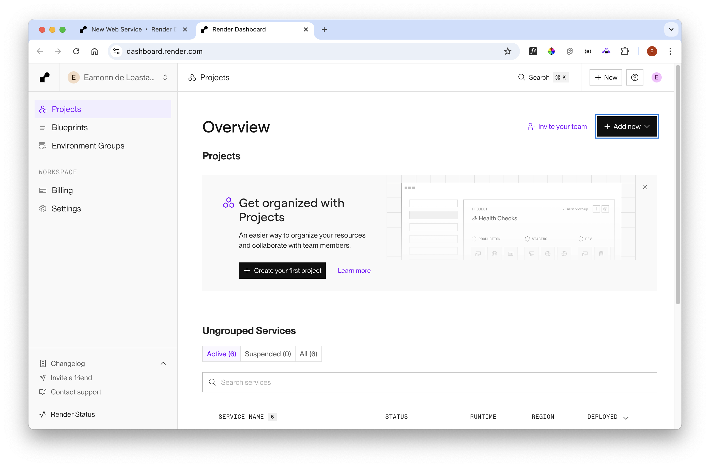
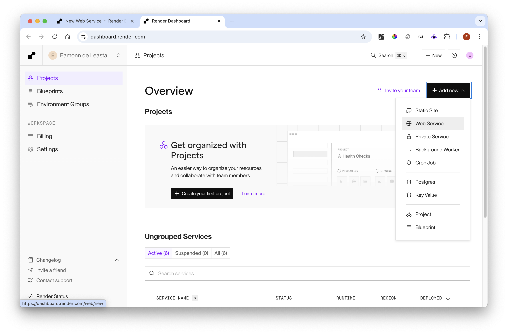
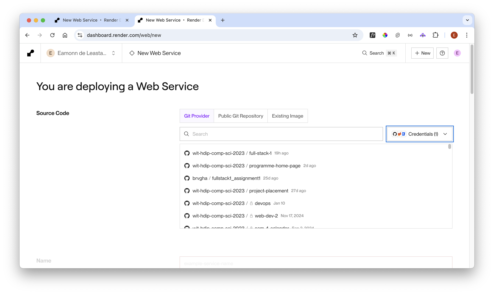
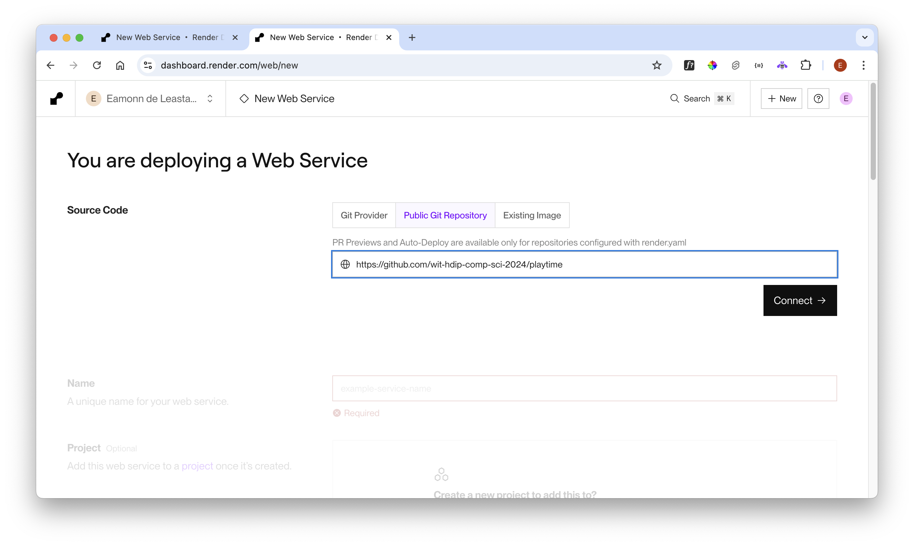
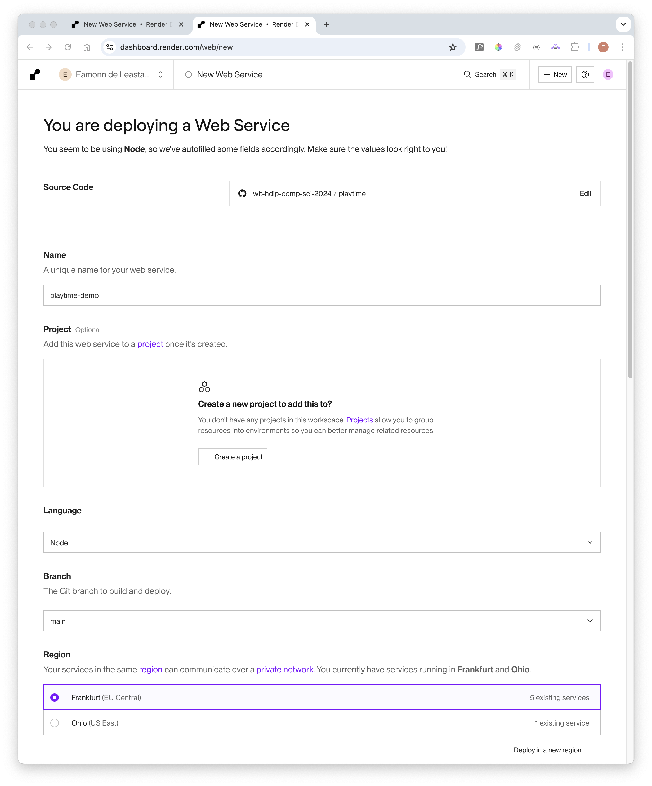
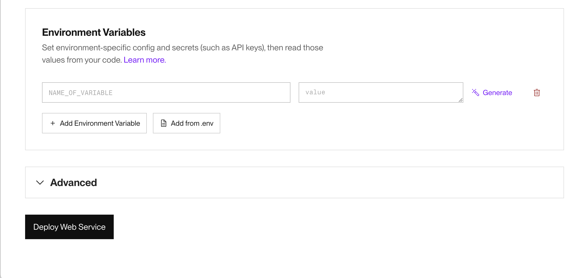

# Create the Application

In the render dashboard:

- <https://dashboard.render.com/>

Select +Add new - and select "Web Service":

You may see your GitHub account repos (you may be asked authorise to git). You will eventually see panel like this:

Locate the project via your GitHub account - use this public repo:

- <https://github.com/wit-hdip-comp-sci-2024/playtime>

This will make available a configuration screen. Make up a unique name:

Then change these commands on the form:

#### Build Command

~~~bash
npm install
~~~

### Start Command

~~~bash
npm run start
~~~

Then select the "Free" plan.

Next, set up the environment variables - selecting "Add from .env"

Paste in our values - make sure you are using the correct mongo connection string to the cloud database  - and then press 'Deploy Web Service'
