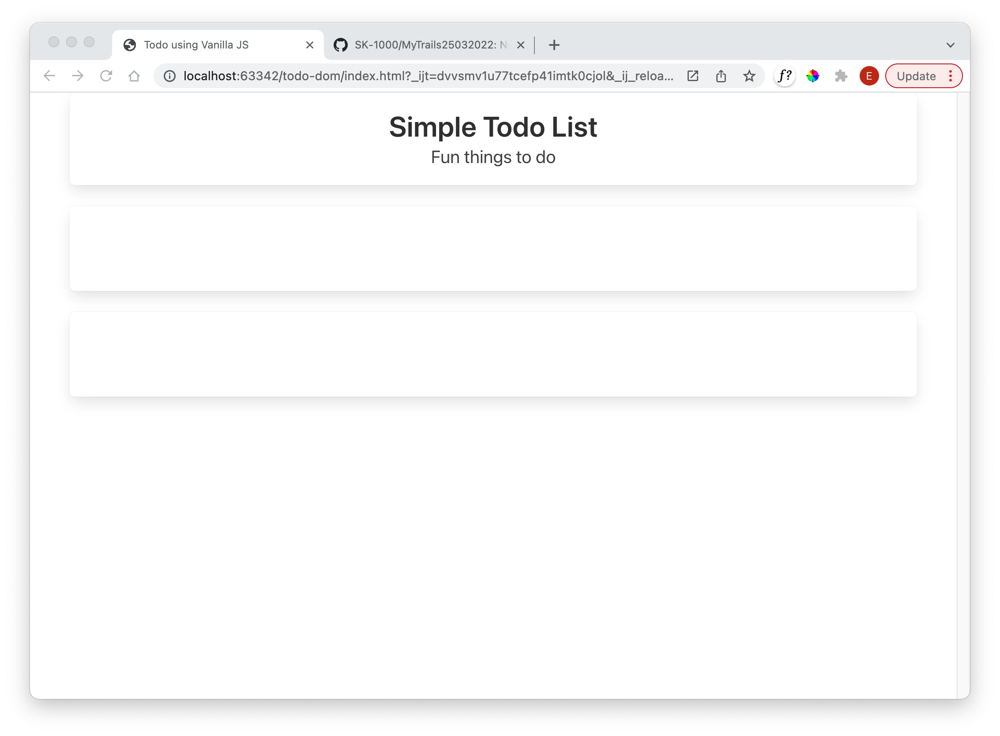
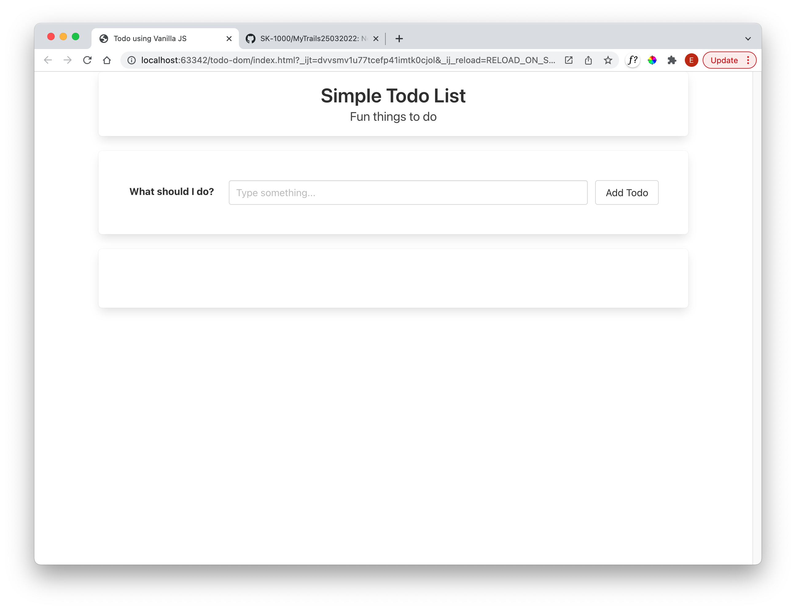

# Simple Header + Form

In the body of the html file, incorporate the following:

## index.html

~~~html
<!DOCTYPE html>
<html lang="en">
  <head>
    <meta charset='utf-8'>
    <meta name='viewport' content='width=device-width,initial-scale=1'>
    <title> Todo using Vanilla JS </title>
    <link rel="stylesheet" href="https://cdn.jsdelivr.net/npm/bulma@0.9.3/css/bulma.min.css">
  </head>
  <body>
    

      

        
 Simple Todo List

        
Fun things to do

      

      

      

      

      

    

    
  </body>
</html>
~~~

Which should render like this:

In the first **section box**, include 

### index.html

~~~html
      

        

          

            <label class="label">What should I do?</label>
          

          

            

              

                <input class="input" type="text" placeholder="Type something...">
              

            

            <button class="button">Add Todo</button>
          

        

      

~~~

This has introduced a simple form. The button, as yet, doesn't do anything.

